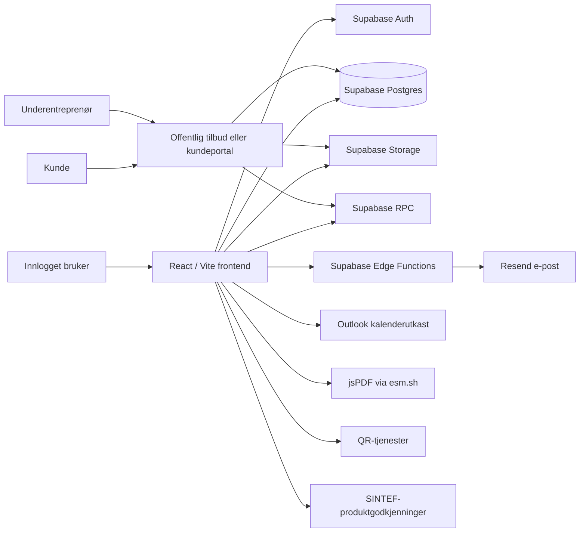
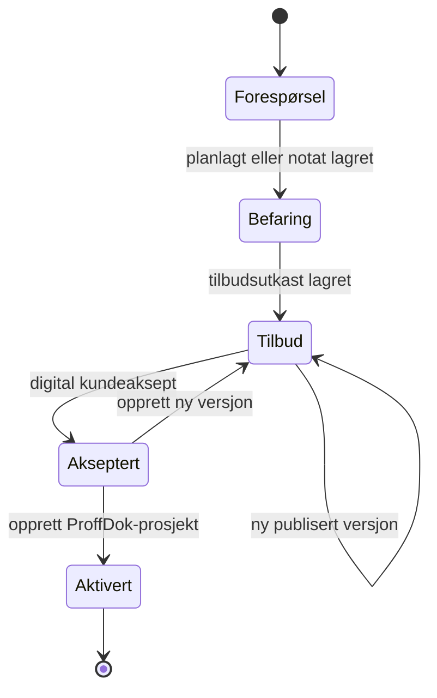
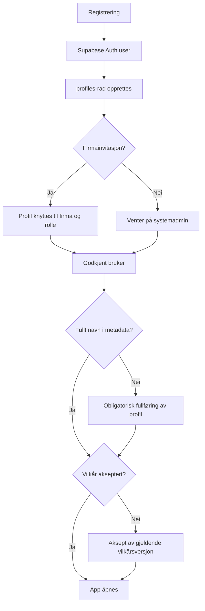
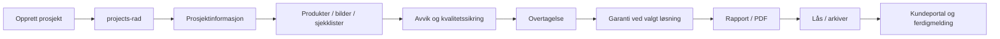
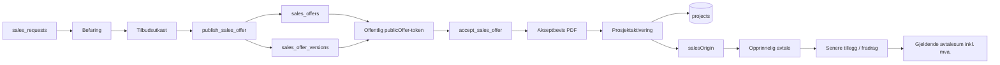
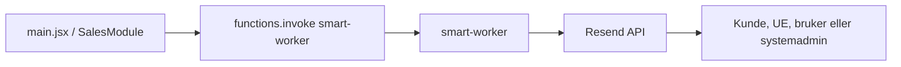
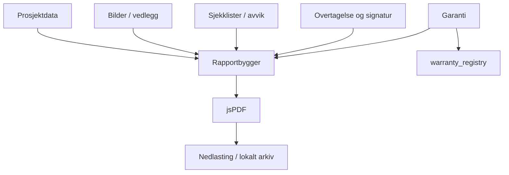

Expo ProffDok – arkitekturkart
Fase: 27 – Modulisert produksjonsarkitektur, runtime-sikkerhet, mobilforenkling og kontrollert reduksjon av main.jsx
Status: Oppdatert nå-arkitektur etter Fase 27D–27H
Dato: 17. august 2026
Branch: `fase27i-architecture-sync`
Plassering i repository: `docs/architecture/EXPO_PROFFDOK_ARCHITECTURE.md`
Produksjonsgrunnlag: Stabil `main` etter Fase 27H
Formål
Dette dokumentet er kartet for videre utvikling og modulisering av Expo ProffDok. Det opprinnelige arkitekturkartet ble etablert i Fase 23. Denne versjonen er oppdatert etter produksjonsendringene gjennom Fase 27C.
Dokumentet beskriver:
dagens faktiske frontendstruktur og grad av modulisering
ansvar og avhengigheter i `main.jsx`, `SalesModule.jsx` og utskilte moduler
datamodeller, Supabase-tabeller, RPC-er, Storage og Edge Functions
hovedflyter mellom brukergrensesnitt, database, filer, e-post og kundeportaler
Tilbud/kontrakt-modellen med opprinnelig avtale og senere avtaleendringer
teknisk gjeld og risikoområder
anbefalt målstruktur
trygg rekkefølge for videre modulisering
test- og godkjenningskrav for senere refaktoreringer
runtime-feilsikring og kritiske pre-build-kontroller
mobilnavigasjon og mobilspesifikk informasjonsprioritering
Dokumentet innfører ingen funksjonelle endringer, ingen databaseendringer og ingen endringer i produksjons-UI.
1.1 Styrende prinsipper
Produksjonsversjonen på `main` er kilde til sannhet.
Ingen funksjonalitet skal forsvinne.
UI og arbeidsflyt skal være identisk ved ren modulisering.
Én logisk endring gjennomføres om gangen.
Alle kodeendringer utføres i egen branch og testes i Vercel Preview.
Database, RLS, Storage og Edge Functions endres bare når det er nødvendig og eksplisitt avtalt.
Mobilvisning er en obligatorisk del av hver test.
Dataformatet i eksisterende prosjekter og salgssaker skal være bakoverkompatibelt.
Komplette filer leveres når en endring skal implementeres.
Branch, mappe og filnavn skal alltid oppgis før kode erstattes.
Aksepterte tilbudsversjoner er historikk og skal ikke overskrives av senere avtaleendringer.
Prosjekter uten tilbud registrert i Expo ProffDok er en normal og støttet tilstand.
2. Kildegrunnlag og avgrensning
Arkitekturkartet ble opprinnelig laget fra produksjonsnære filer og Supabase-oversikter i Fase 23 og er senere oppdatert mot de modulene og flytene som er endret gjennom Fase 24 og 25.
Sentrale produksjonsnære områder:
`src/main.jsx`
`src/style.css`
`src/modules/sales/SalesModule.jsx`
`src/modules/sales/sales.css`
`src/modules/help/helpTools.js`
`src/modules/app/AppErrorBoundary.jsx`
`src/modules/app/appRuntimeStyles.js`
`src/modules/warranty/warrantyViewTools.js`
`src/modules/company/companyViewTools.js`
`src/modules/portal/accessViewTools.js`
`src/modules/chat/chatViewTools.js`
`src/modules/report/reportViewTools.js`
`src/modules/contract/contractViewTools.js`
`src/modules/product/productViewTools.js`
`src/modules/surfaces/surfaceViewTools.js`
`src/modules/deviations/deviationViewTools.js`
`src/modules/installations/installationViewTools.js`
`src/modules/portal/portalTools.js`
`package.json`
`scripts/critical-build-check.mjs`
`vite.config.js`
`supabase/functions/smart-worker/index.ts`
`supabase/functions/delete-pending-user/index.ts`
Supabase Table Editor
Supabase Database Functions
Supabase Storage Buckets
Supabase Edge Functions
2.1 Historisk kodeomfang fra Fase 23
Følgende målinger er et historisk målepunkt fra før den videre moduliseringen og skal ikke tolkes som dagens linjetall:
Område	Fil	Historisk omfang	Observerte React-konstruksjoner
Hovedapp	`src/main.jsx`	13 826 linjer, ca. 941 KB	96 state-deklarasjoner, 23 effects, 34 memo-beregninger, 19 refs
Salgsmodul	`src/modules/sales/SalesModule.jsx`	6 228 linjer, ca. 241 KB	27 state-deklarasjoner, 10 effects, 6 memo-beregninger, 6 refs og 98 navngitte funksjoner
Global CSS	`src/style.css`	221 linjer	Globale elementselektorer og mobil-/printregler
Salgs-CSS	`src/modules/sales/sales.css`	1 684 linjer	Hovedsakelig `.sales-*`, men også globale selektorer
`main.jsx` har fortsatt et generert/transpilert preg med blant annet `import_react`, `import_jsx_runtime` og kall som `(0, import_react.useState)`. Filen behandles derfor fortsatt konservativt. Etter Fase 27H er `main.jsx` redusert til omtrent 7 154 linjer i den produksjonsnære filen som ble brukt i refaktoreringen. Linjetallet er kun et arbeidsmål og ikke et mål i seg selv. Fase 24–25 har flyttet flere visninger og hjelpeområder ut i egne moduler uten å omskrive hele appskallet.
2.2 Ikke fullt verifisert i dette kartet
Følgende er fortsatt ikke eksportert og detaljkontrollert linje for linje:
komplette SQL-definisjoner for tabeller
alle fremmednøkler og indekser
komplette RLS-policyer
Storage-policyenes SQL-innhold
SQL-koden i alle RPC-funksjoner
Vercel-miljøvariabler og produksjonsinnstillinger
innholdet i hele `api/`- og `public/`-mappene
låste versjoner i `package-lock.json`
eksakt komplett filinventar i alle nyere modulmapper
Der dokumentet bygger på observerte modulnavn eller funksjonsnavn uten fersk full repository-eksport, skal dette leses som produksjonsnær dokumentasjon og ikke som en komplett automatisk kodeinventering.
3. Repository – observert nåstruktur
Fase 24–27 har flyttet flere tydelige domenevisninger ut av `main.jsx` og lagt til et lite runtime-/build-sikkerhetsnett. Følgende struktur er observert i produksjonsarbeidet:
```text
expo-proffdok/
├── api/
├── public/
├── src/
│   ├── main.jsx
│   ├── style.css
│   ├── modules/
│   │   ├── app/
│   │   │   ├── AppErrorBoundary.jsx
│   │   │   └── appRuntimeStyles.js
│   │   ├── chat/
│   │   │   └── chatViewTools.js
│   │   ├── company/
│   │   │   └── companyViewTools.js
│   │   ├── checklist/
│   │   ├── config/
│   │   ├── contract/
│   │   │   └── contractViewTools.js
│   │   ├── deviations/
│   │   │   └── deviationViewTools.js
│   │   ├── help/
│   │   │   └── helpTools.js
│   │   ├── images/
│   │   ├── installations/
│   │   │   └── installationViewTools.js
│   │   ├── overtagelse/
│   │   ├── portal/
│   │   │   ├── portalTools.js
│   │   │   └── accessViewTools.js
│   │   ├── product/
│   │   │   └── productViewTools.js
│   │   ├── project/
│   │   ├── report/
│   │   │   └── reportViewTools.js
│   │   ├── sales/
│   │   │   ├── README.md
│   │   │   ├── SalesModule.jsx
│   │   │   ├── SalesPreview.jsx
│   │   │   └── sales.css
│   │   ├── surfaces/
│   │   │   └── surfaceViewTools.js
│   │   └── warranty/
│   │       └── warrantyViewTools.js
│   ├── [øvrige produksjonsfiler]
├── scripts/
│   └── critical-build-check.mjs
├── index.html
├── sales-preview.html
├── package.json
├── package-lock.json
└── vite.config.js
```
Dette er ikke ment som en komplett filinventering av hele repositoryet. Hovedpoenget er at domenevisninger som tidligere lå direkte i `main.jsx` nå i større grad ligger i egne modulmapper.
3.1 Vite-entrypunkter
```text
index.html          → ordinær Expo ProffDok-app
sales-preview.html  → isolert salgs-preview
```
Utgått `ai-transcript-test.html` og tilhørende React-testfil er fjernet. Vite-konfigurasjonen refererer ikke lenger til AI-testsiden.
3.2 Supabase Edge Functions
Aktive funksjoner:
```text
delete-pending-user
smart-worker
```
Fjernet som utgått og ubrukt:
```text
inspection-assistant
swift-processor
```
3.3 Modulisering og stabilisering gjennom Fase 24–27
Følgende områder er bekreftet flyttet eller koblet mot egne view-/verktøymoduler uten databaseskjemaendring:
Hjelp
Produkter
Overflater og innredning
Avvik
Fag, deler og utstyr
Tilbud/kontrakt
Rapport
Portalrelaterte hjelpefunksjoner
`main.jsx` er fortsatt den sentrale state- og integrasjonsorkestratoren. Moduliseringen har derfor redusert UI-omfanget, men har ikke flyttet hele prosjektpersistensen eller Supabase-tilgangen ut av hovedappen.
Fase 27B–27C har i tillegg lagt til:
`AppErrorBoundary.jsx` rundt hovedappen, slik at en React-renderfeil gir kontrollert feilmelding i stedet for blank skjerm
`scripts/critical-build-check.mjs`, som kjøres før Vite-build og kontrollerer enkelte kritiske kjente kontrakter
forenklet mobilnavigasjon med prioriterte hurtigvalg, egen Status-inngang og `Alle funksjoner`
komprimert mobilvisning for sjekklistefremdrift og flytende chatknapp
Dette er frontend-/build-endringer og har ikke endret database, RLS, Storage, Edge Functions eller prosjektdataformat.
Fase 27D–27H fortsatte med få, større og sammenhengende uttrekk:
Garanti-visningene ble flyttet til `src/modules/warranty/warrantyViewTools.js`
Firmaprofil og Firmaadministrasjon ble samlet i `src/modules/company/companyViewTools.js`
intern Tilgang og deling-visning ble flyttet til `src/modules/portal/accessViewTools.js`
prosjektchat og Interne notater ble samlet i `src/modules/chat/chatViewTools.js`
store inline runtime CSS-strenger ble flyttet til `src/modules/app/appRuntimeStyles.js`
For alle disse uttrekkene ligger forretningslogikk, prosjektpersistens, Supabase-kall, Storage, e-post og rolle-/tilgangslogikk fortsatt i eksisterende hovedlogikk eller tjenester. Uttrekkene er primært presentasjons- og oversiktsforbedringer.
4. Systemkontekst

4.1 Runtime-lag
Lag	Teknologi	Hovedansvar
Klient	React	UI, state, navigasjon og arbeidsflyt
Bygg	Vite + critical pre-build check	Kritisk kildekontroll før bundle, deretter Vite-build og multi-entry preview
Identitet	Supabase Auth	Innlogging, sesjon og user metadata
Data	Supabase Postgres	Profiler, prosjekter, salgssaker, tilbud, produktmaster og garanti
Filer	Supabase Storage	Prosjektbilder, dokumenter, chatbilder og befaringsbilder
Serverlogikk	Supabase RPC	Firmaavgrensning, publisering, offentlig tilbud og aksept
Integrasjoner	Edge Functions	Resend-e-post og sikker sletting av ventende brukere
Dokumenter	jsPDF	Sluttrapport, garantidokument og akseptbevis
Hovedappen – `src/main.jsx`
5.1 Hovedansvar
`main.jsx` er fortsatt applikasjonsskall, sentral state-container og integrasjonspunkt for store deler av Expo ProffDok, men flere presentasjonsområder er nå flyttet til egne moduler.
Hovedappen håndterer fortsatt blant annet:
app-branding, favicon og manifest
Supabase-klient og sentral prosjektpersistens
innlogging, registrering og passordgjenoppretting
obligatorisk fullføring av brukerprofil
profil, godkjenning, firma- og systemroller
brukervilkår og akseptlogg
startside og mobilmeny, inkludert prioriterte hurtigvalg og Status/Alle funksjoner på mobil
prosjektliste, søk og filter
opprettelse, åpning, kopiering og sletting av prosjekt
autolagring, manuell lagring og lokal nødkladd
prosjektstate og integrasjon mellom utskilte domenevisninger
overtagelse, garanti, prosjektchat og interne notater
kunde- og underentreprenørtilgang
firmaadministrasjon og systemadministrasjon
integrasjon mot `SalesModule`
Egne moduler eier nå hele eller deler av visningen for blant annet:
Hjelp
Produkter
Overflater og innredning
Avvik
Fag, deler og utstyr
Tilbud/kontrakt
Rapport
Garanti
Firmaprofil og Firmaadministrasjon
Tilgang og deling
Chat og Interne notater
portalverktøy
runtime-stiler
Arkitekturkonsekvensen er fortsatt høy kobling fordi state, normalisering og lagring i stor grad styres fra `main.jsx`. En modul kan være visuelt utskilt uten at datalaget er fullstendig frikoblet.
5.2 Komponent- og moduleierskap etter Fase 25
Det opprinnelige Fase 23-kartet listet mange komponenter som lå direkte i `main.jsx`. Flere av disse områdene er siden flyttet til egne moduler.
Bekreftede egne modulgrensesnitt inkluderer:
```text
src/modules/help/helpTools.js
src/modules/product/productViewTools.js
src/modules/surfaces/surfaceViewTools.js
src/modules/deviations/deviationViewTools.js
src/modules/installations/installationViewTools.js
src/modules/contract/contractViewTools.js
src/modules/report/reportViewTools.js
src/modules/portal/portalTools.js
src/modules/portal/accessViewTools.js
src/modules/warranty/warrantyViewTools.js
src/modules/company/companyViewTools.js
src/modules/chat/chatViewTools.js
src/modules/app/appRuntimeStyles.js
```
`main.jsx` beholder fortsatt en rekke delte UI-primitiver, stateobjekter, callbacks og persistensfunksjoner som sendes inn i modulene. Det er bevisst: Fase 24–25 har prioritert små, testbare uttrekk fremfor samtidig flytting av state og datatilgang.
En ny refaktorering skal derfor først kontrollere:
hvilket stateobjekt som eies av `main.jsx`
hvilke callbacks modulen mottar
hvilke rapport-/portalvisninger som leser samme data
hvordan eksisterende prosjektdata normaliseres
om eldre prosjekter mangler nyere JSON-felt
5.3 Intern fanestruktur
Observerte interne faner:
```text
Startside / prosjekt
Prosjektliste
Befaring / Tilbud / Aksept
Prosjektinformasjon
Prosjektering
Produkter
Overflater og innredning
Bilder
Installasjoner
Sjekklister
Avvik
Tilbud / kontrakt
Chat
Interne notater
Overtagelse
Garanti
Rapport
Firma
Systemadministrasjon / Admin
Hjelp
Innlogging
```
Kundeportalen har egen undernavigasjon med blant annet:
```text
Oversikt
Prosjektinformasjon
Dokumentasjon
Produkter
Bilder
Tilbud
Garanti
Rapport
Chat
```
5.4 URL- og inngangsruting
Frontend bruker query-parametere som enkel ruting:
Parameter	Bruk
`publicOffer=<token>`	Åpner offentlig kundetilbud direkte i `SalesModule` før ordinær innlogging
`project=<uuid>`	Åpner prosjekt eller portal
`access=admin`	Direkteåpning som innlogget administrator
`access=underleverandor`	Underentreprenørportal
`role=kunde`	Kundeportal
`tab=<id>`	Ønsket startfane, blant annet Chat
Dette er ikke en separat router. Ruting, autorisasjon og render-avgjørelser ligger i `main.jsx`.
5.5 State og lagring
Prosjektet holdes som flere parallelle state-objekter:
```text
company
user
project
checked
productDocs
manualProducts
other
surf
bathroomEquipment
photos
access
inst
files
checklist
tilbud
overtagelse
warranty
projectLog
internalNotes
```
Disse samles ved lagring til ett `data`-objekt i `projects`-tabellen.
Andre state-grupper håndterer blant annet:
autentisering og profil
vilkår
prosjektliste
firmaadministrasjon
systemadministrasjon
produktmaster
UI-/accordion-tilstand
autolagringsstatus
chat
portaltilgang
rapport-/PDF-status
5.5.1 Persistenslag
Hovedappen bruker flere lag samtidig:
React-state – aktiv arbeidskopi
`latestStateRef` – siste samlede snapshot
`localStorage` – nødkladd, aktiv fane, e-post og scroll-/navigasjonshjelp
Supabase `projects.data` – varig prosjektdata
Supabase Storage – binære filer
Dette er robust mot enkelte nettverks- og fanebytteproblemer, men øker risikoen for at state og database kommer ut av synk dersom lagringsfunksjoner endres isolert.
5.6 Prosjektdatastruktur
Observert radformat i `projects`:
```text
id
user_id
title
data
share_enabled
locked
locked_at
locked_by
updated_at
```
`data` inneholder en stor JSON-struktur:
```text
company
user
project
checked
productDocs
manualProducts
other
surf
bathroomEquipment
photos
access
inst
files
checklist
tilbud
overtagelse
warranty
projectLog
internalNotes
```
5.6.1 `project`
Viktige observerte felt:
```text
responsible
projectName
projectNumber              # Opprettes ved aktivering fra salgsmodul
address
postnr
city
customer
customerEmail
customerPhone
date
notes
projectDescription
projectInfoIncludeInReport
checklistPhotosNote
reportHeroPhotoId
isTemplate
fall
fallDusj
fallUtenfor
sluk
terskel
membran
prosjekteringKommentar
prosjekteringPunkter
customChecklistGroups
projectDeviations
locked
status
workflowStatus
lockedAt
lockedBy
salesOrigin                # Når prosjekt er aktivert fra tilbud
portalAccess / tilgangsdata # Lagres i prosjektobjektet gjennom hjelpefunksjoner
```
5.6.2 `tilbud`
Tilbud/kontrakt er valgfritt. Ikke alle prosjekter har et tilbud registrert i Expo ProffDok.
Nåværende prosjektstruktur støtter:
```text
enabled
files
changes
legacyTillegg
legacyFradrag
tillegg
fradrag
kommentar
```
`changes` er listen for strukturerte senere avtaleendringer:
```text
id
type                # "Tillegg" eller "Fradrag"
description
amountInclVat       # Beløp registrert inkl. mva.
comment
createdAt
```
`tillegg` og `fradrag` beholdes som bakoverkompatible tekstsammendrag slik at eksisterende rapport- og kundevisninger kan fungere sammen med eldre prosjektdata.
`legacyTillegg` og `legacyFradrag` brukes til å bevare eldre fritekst uten å anta at teksten inneholder et maskinlesbart beløp.
Når prosjektet er aktivert fra Befaring/Tilbud, ligger opprinnelig avtalehistorikk i `project.salesOrigin`. Akseptbevis og eventuell opplastet kontrakt kan ligge i `tilbud.files`.
Når prosjektet er opprettet direkte uten tilbud, kan `tilbud` være tomt. Systemet skal ikke konstruere en opprinnelig avtalesum for slike prosjekter.
5.6.3 `overtagelse`
```text
enabled
dato
kommentar
signUtførende
signKunde
signUtførendeImage
signKundeImage
```
Dato alene regnes ikke som fullført overtagelse. Eksisterende logikk krever aktiv registrering og signatur fra begge parter.
5.6.4 `warranty`
```text
enabled
issued
issuedAt
system
sintefApproval
durationYears
status
guaranteeNumber
reportGeneratedAt
reportGeneratedFileName
termsAccepted
termsAcceptedAt
termsAcceptedBy
termsReceiptName
termsReceiptRole
```
Støttede perioder er 10, 12 og 15 år. Garantiflyten er koblet mot valgt Sopro-system, sjekklister, bilder, avvik, overtagelse, rapport og `warranty_registry`.
5.6.5 `projectLog`
```text
enabled
draft
messages
lastReadByAdmin
lastReadByCustomer
```
Prosjektchat lagres som en del av `projects.data`, ikke i en egen chat-tabell.
5.7 Lagringsmønster og viktig konsekvens
Mange funksjoner følger dette mønsteret:
```text
1. Hent komplett projects-rad
2. Les og normaliser eksisterende data
3. Erstatt eller flett deler av data-objektet
4. Oppdater hele data-feltet
5. Oppdater updated_at
```
Dette brukes blant annet ved:
manuell prosjektlagring
generell autolagring
bilde-autolagring
sjekkliste-autolagring
chat og lest-status
tilgangskoder
garanti
produktmaster-synk
Arkitekturkonsekvens: To samtidige oppdateringer kan i prinsippet overskrive hverandres endringer dersom begge arbeider fra ulike snapshots. Refaktorering må derfor bevare dagens merge-/normaliseringslogikk nøyaktig. En egen, sentral `projectRepository` er et senere mål, men skal ikke innføres samtidig med første komponentuttrekk.
5.8 Runtime-sikkerhet og kritisk build-kontroll
Fase 27B innførte et lite sikkerhetsnett uten ny testplattform eller nye npm-avhengigheter.
Runtime:
```text
src/modules/app/AppErrorBoundary.jsx
```
`main.jsx` renderer hovedappen inne i `AppErrorBoundary`. Dersom en React-visning kaster en renderfeil, vises en kontrollert feilmelding med mulighet for å laste siden på nytt. Feilen logges fortsatt til nettleserkonsollen. Løsningen erstatter ikke feilretting, men reduserer risikoen for helt blank skjerm.
Build:
```text
scripts/critical-build-check.mjs
```
`package.json` kjører kontrollen før `vite build`. Kontrollen verifiserer et lite sett kjente kritiske kontrakter, blant annet at rapportvisningene initialiserer `agreementTotals` og at `AppErrorBoundary` fortsatt er koblet rundt hovedappen.
Dette er bevisst et smalt regresjonsvern. Det er ikke en full unit-/component-/end-to-end-testplattform.
5.9 Mobilnavigasjon etter Fase 27C
Desktopnavigasjonen er beholdt. På mobil er informasjonsmengden redusert og arbeidsoppgaver prioritert.
Når et prosjekt er åpent viser mobilmenyen først hurtigvalg til:
```text
Befaring/Tilbud
Bilder
Sjekklister
Fag/utstyr
```
I samme meny finnes:
```text
Status
Alle funksjoner
```
`Status` åpner den komplette prosjektstatusen og mangler-/fremdriftsvisningen ved behov. `Alle funksjoner` gir tilgang til øvrige faner. Ingen funksjoner er fjernet.
Sjekklistefremdriften er visuelt komprimert på mobil, og chatknappen er redusert i størrelse slik at kontrollpunkter og arbeidsinnhold kommer høyere opp på skjermen. Dette er presentasjonsendringer; sjekklistedata og lagringslogikk er uendret.
Befaring / Tilbud / Aksept – `SalesModule.jsx`
6.1 Integrasjon med hovedappen
Hovedappen importerer salgsmodulen fra:
```text
src/modules/sales/SalesModule.jsx
```
Intern bruk mottar:
```text
supabaseClient
authUser
profile
currentUserName
integrationMode="app"
startNewRequestSignal
```
Offentlig kundetilbud åpnes direkte ved `publicOffer`-token før ordinær innlogging og intern appnavigasjon.
6.2 Ansvar i dagens modul
`SalesModule` håndterer hele løpet:
```text
Forespørsel
→ Planlegg befaring
→ Befaringsbekreftelse
→ Befaringsnotat og bilder
→ Tilbudsutkast
→ Publisering av tilbudsversjon
→ Kundelenke / e-post
→ Kundeaksept og valgte opsjoner
→ Låst akseptbevis
→ Eventuell egen kontrakt
→ Aktivering som ordinært ProffDok-prosjekt
```
I tillegg håndterer modulen:
intern saksoversikt
redigering av forespørsel og befaring
prosjektansvarlig fra innlogget bruker
lokal navigasjonslagring
lokal og varig tilbudskladd
firmaprofil og firmalogo
offentlig kundevisning
ny tilbudsversjon etter aksept
historikk for aksepterte tilbudsversjoner
gjenoppretting av feilaktig aktivert sak uten eksisterende prosjekt
bildekomprimering og signerte befaringsbildelenker
PDF-generering av akseptbevis
opplasting og fjerning av kontrakt
overføring av bilder og dokumenter til prosjekt
e-post via `smart-worker`
Outlook-kalenderutkast
6.3 UI-moduser
Observerte `mode`-verdier:
```text
list
new
edit-request
detail
survey-plan
inspection-note
offer-builder
customer-offer
customer-accepted
project-activation
```
Én komponent velger og renderer alle disse visningene. Det er den viktigste årsaken til at `SalesModule` nå er vanskelig å teste og endre isolert.
6.4 Salgssak – logisk payload
`sales_requests.payload` inneholder hele arbeidskopien for saken. Viktige feltgrupper:
Kunde og forespørsel
```text
id / request_ref
title
customer
phone
email
address
source
note
responsible
status
statusClass
nextStep
iconName
```
Befaring
```text
surveyDate
surveyTime
surveyResponsible
surveyNote
surveyConfirmationSentAt
surveyConfirmationSentTo
inspectionCustomerWishes
inspectionExistingConditions
inspectionMeasurements
inspectionObservations
inspectionPhotos
```
Tilbud
```text
offerTitle
offerIntro
offerLines
offerOptions
offerReservations
offerIncluded
offerExcluded
offerCustomerSupplied
offerTerms
offerPaymentTerms
offerValidityDays
offerTotal
offerVersions
sentOfferVersionId
sentOfferVersionNumber
sentOfferAt
salesOfferId
publicToken
```
Aksept
```text
acceptedBy
acceptedAt
acceptedOfferVersionId
acceptedOfferVersionNumber
acceptedOfferLines
acceptedOptionIds
acceptedOptions
acceptedTotal
acceptedPayload
acceptedOfferHistory
acceptanceProofFile
```
Kontrakt og prosjektaktivering
```text
contractFile
projectId
projectName
projectNumber
projectResponsible
projectNote
projectActivatedAt
```
6.5 Salgssakstatus

6.6 Kladd og persistens
Salgsmodulen bruker:
React-state for aktiv sak og skjema
`localStorage` for:
aktiv salgsvisning
valgt sak
tilbudskladd per bruker og sak
befaringskladd
`sales_requests.payload` for varig lagring
`sales_offers` og `sales_offer_versions` for publiserte, versjonerte kundetilbud
Storage for bilder og dokumenter
Tilbudskladd lagres både lokalt og varig med debounce. Modulen har egne refs som hindrer at et tomt, uhydrert tilbudsskjema overskriver eksisterende linjer ved fanebytte.
Denne beskyttelsen er kritisk og skal beholdes nøyaktig ved modulisering.
6.7 Publisert tilbudssnapshot
`publish_sales_offer` mottar et payload med blant annet:
```text
offer_id
request_ref
customer_name
customer_email
customer_phone
customer_address
title
intro
lines
options
reservations
validity_days
total_ex_vat
```
`lines` inneholder også to interne metadataobjekter:
```text
__companyMeta       # Låst firmaprofil og logo
__offerTermsMeta    # Vilkår, betaling, inkludert/ikke inkludert og kundens leveranse
```
Dette er en bakoverkompatibel løsning som unngår databaseskjemaendring, men betyr at frontend og RPC må forstå metadataobjekter inne i samme liste som ordinære tilbudslinjer.
6.8 Kundeaksept
Offentlig kundevisning henter tilbud gjennom:
```text
get_sales_offer_by_token(token)
```
Aksept registreres gjennom:
```text
accept_sales_offer(token, accepted_name, selected_options)
```
Akseptert sum beregnes som aktiv tilbudsversjon pluss valgte opsjoner. Etter aksept opprettes et låst PDF-akseptbevis fra akseptert versjon og lagres i Storage.
6.9 Prosjektaktivering
Ved aktivering fra en akseptert salgssak:
kontrolleres det om lagret `projectId` faktisk finnes
det søkes etter mulig duplikat via `data.project.salesOrigin.requestRef`
befaringsbilder kopieres til `project-images`
prosjektbeskrivelsen bygges av forespørselsnotat og relevant befaringssammendrag
akseptert tilbud lagres ikke lenger som en stor fritekstkopi i prosjektbeskrivelsen eller som avtaleendringskommentar
opprinnelig akseptert tilbud knyttes til prosjektet gjennom `project.salesOrigin`
akseptbevis og eventuell kontrakt legges i prosjektets `tilbud.files`
`tilbud.changes` starter tomt for nye aktiverte prosjekter
ny rad opprettes i `projects`
salgssaken settes til `Aktivert` med prosjekt-ID
appen åpner det nye prosjektet direkte
Logisk kobling mellom salgssak og prosjekt:
```text
sales_requests.request_ref
        ↕
projects.data.project.salesOrigin.requestRef
```
`project.salesOrigin` kan blant annet inneholde:
```text
requestRef
publicToken
acceptedOfferVersionId
acceptedOfferVersionNumber
acceptedBy
acceptedAt
acceptedTotal
activatedAt
```
`acceptedTotal` er historisk lagret fra salgsflyten som beløp eks. mva. Den opprinnelige tilbudsversjonen og aksepten er historikk og skal ikke overskrives når prosjektet senere får tillegg eller fradrag.
Dette er en applikasjonskobling. Om det finnes en databasefremmednøkkel er ikke verifisert.
6.10 Tilbud/kontrakt etter prosjektaktivering
Prosjektfanen Tilbud/kontrakt skiller mellom:
```text
Opprinnelig avtale
Senere avtaleendringer
Vedlegg / avtaledokumenter
Gjeldende avtalesum
```
Prosjekt aktivert fra Befaring/Tilbud:
den opprinnelige aksepterte avtalen vises fra `salesOrigin`
senere tillegg/fradrag registreres som egne poster i `tilbud.changes`
den opprinnelige tilbudsversjonen endres ikke
Prosjekt opprettet direkte:
har ikke nødvendigvis `salesOrigin`
kan ha eksternt tilbud eller kontrakt som kun lastes opp som vedlegg
kan la hele fanen stå tom
får ingen automatisk beregnet grunnsum dersom opprinnelig avtalesum ikke finnes
Privatkundevisning:
beløp i Tilbud/kontrakt vises og registreres inkl. mva.
historisk `salesOrigin.acceptedTotal` konverteres i gjeldende implementasjon fra eks. mva. til inkl. mva.
strukturerte endringer lagres som `amountInclVat`
Beregning når opprinnelig grunnsum finnes:
```text
opprinnelig avtalesum inkl. mva.
+ strukturerte tillegg inkl. mva.
- strukturerte fradrag inkl. mva.
= gjeldende avtalesum inkl. mva.
```
Eldre fritekst for tillegg/fradrag beholdes som dokumentasjon, men tas ikke automatisk med i avtalesumberegningen.
7. Supabase – tabeller
7.1 Observert tabelloversikt
```text
companies
company_user_invites
fdv_register
product_document_master
product_master_checkpoints
profiles
projects
sales_company_memberships
sales_company_scopes
sales_offer_versions
sales_offers
sales_requests
user_terms_acceptance
warranty_registry
```
7.2 Bruksmatrise
Tabell	Domene	Direkte brukt i opplastet frontend	Bruk / kommentar
`profiles`	Bruker/firma	Ja	Godkjenning, roller, firma, kontaktdata og logo
`projects`	Prosjekt	Ja	Hovedrad med stor `data`-JSON
`company_user_invites`	Firma	Ja	Invitasjon og godkjenning inn i firma
`user_terms_acceptance`	Compliance	Ja	Versjonsstyrt aksept av brukervilkår
`product_document_master`	Produktmaster	Ja	Produktdata og dokumentlenker
`product_master_checkpoints`	Produktmaster/garanti	Ja	Produktstyrte kontrollpunkter
`fdv_register`	Dokumentregister	Ja	Historisk/administrativ FDV-kilde
`warranty_registry`	Garanti	Ja	Registrering av utstedt garantinummer
`sales_requests`	Salg	Ja	Intern firmascopet arbeidskopi av salgssak
`sales_offers`	Salg	Via RPC	Offentlig token, status og akseptdata
`sales_offer_versions`	Salg	Via RPC	Låste publiserte tilbudsversjoner
`sales_company_scopes`	Salg/firma	Via RPC/RLS	Stabil firmaavgrensning for salg
`sales_company_memberships`	Salg/firma	Via RPC/RLS	Medlemskap i salgsscope
`companies`	Firma	Ikke direkte observert	Sentral firmamodell; eksakt bruk må verifiseres
7.3 `sales_requests`
Observerte kolonner fra frontend:
```text
company_id
request_ref
status
archived_at
payload
updated_at
```
Upsert-nøkkel:
```text
company_id, request_ref
```
Modulen fjerner midlertidige `dataUrl`- og `previewUrl`-verdier før payload lagres.
7.4 `sales_offers` og `sales_offer_versions`
Frontend leser og skriver disse gjennom RPC-er. Observerte felt fra RPC-responsen:
`sales_offers`
```text
id
request_ref
customer_name
customer_email
customer_phone
customer_address
title
status
public_token
active_version_id
accepted_by
accepted_at
accepted_payload
```
`sales_offer_versions`
```text
id
offer_id
version_number
title
intro
lines
options
reservations
validity_days
total_ex_vat
```
Eksakt SQL-type, constraints og indeksstruktur må verifiseres gjennom schema-eksport før databaseendringer.
Supabase – databasefunksjoner / RPC
8.1 Salgsfunksjoner
Funksjon	Return	Direkte frontendbruk	Ansvar
`resolve_sales_company_scope()`	`uuid`	Ja	Finner stabil firmascopet ID for innlogget bruker
`current_sales_company_scope_id()`	`uuid`	Ikke direkte	Sannsynlig hjelpefunksjon for RLS/policy
`sales_normalize_company_name(value text)`	`text`	Ikke direkte	Normalisering av firmanavn
`publish_sales_offer(payload jsonb)`	`jsonb`	Ja	Oppretter/oppdaterer tilbud og ny låst versjon, returnerer token og versjonsdata
`get_sales_offer_by_token(token uuid)`	`jsonb`	Ja	Leser offentlig tilbud og aktiv versjon
`accept_sales_offer(...)`	`jsonb`	Ja	Registrerer digital aksept og valgte opsjoner
8.2 Rolle- og profilfunksjoner
```text
current_profile_company_name()
current_profile_is_firmaadmin()
current_profile_is_systemadmin()
```
Disse kalles ikke direkte fra opplastet frontend og er derfor sannsynligvis støtte for RLS eller andre databasefunksjoner. Dette må bekreftes mot SQL-definisjonene før de endres.
8.3 Prosjekt og vedlikehold
Funksjon	Bruk
`set_project_lock(...)`	Låsing/arkivering av prosjekt
`set_updated_at()`	Triggerfunksjon for tidsstempel
Supabase Storage
9.1 Buckets
Bucket	Tilgang observert	Begrensning	Bruk
`sales-inspection-photos`	Privat	8 MB, bildeformater	Befaringsbilder, signerte URL-er
`chat-images`	Offentlig	50 MB standard/ikke satt	Bilder i prosjektchat
`project-images`	Offentlig	50 MB standard/ikke satt	Prosjektbilder, vedlegg, kontrakter, akseptbevis og overførte befaringsbilder
9.2 Observerte filflyter
Befaringsbilder
```text
Nettleser
→ komprimering til JPEG
→ sales-inspection-photos/{companyId}/{requestRef}/...
→ signert URL i intern visning
→ ved prosjektaktivering lastes original ned
→ kopieres til project-images
```
Prosjektbilder og vedlegg
```text
Nettleser
→ project-images/{bruker/prosjekt/...}
→ public URL
→ URL og path lagres i projects.data
```
Chatbilder
```text
Nettleser
→ chat-images
→ public URL
→ metadata lagres i projectLog.messages
```
9.3 Kritisk sikkerhetsmerknad
`project-images` er offentlig og brukes ikke bare til ordinære prosjektbilder, men også til:
opplastede kontrakter
låste akseptbevis
andre prosjektvedlegg
Dette er et høyt prioritert sikkerhets- og personvernpunkt. Det skal ikke endres som en del av frontendmodulisering. En eventuell overgang til privat bucket krever egen migreringsplan, signerte URL-er, kontroll av rapport/PDF, kundeportal, eksisterende URL-er og historiske dokumenter.
Edge Functions
10.1 `smart-worker`
Hovedansvar: HTML-e-post og sending via Resend.
Observerte `direction`-verdier:
```text
to_customer
to_owner
access_kunde
access_underleverandor
project_completed_customer
new_user_signup_systemadmin_notice
user_access_approved
inspection_confirmation
sales_offer
```
E-postmalen støtter:
prosjekt- og kundeinformasjon
prosjektansvarlig
melding
knapp og fallback-lenke
utførende firmas logo
firmatekst i footer
Miljøvariabler som brukes:
```text
RESEND_API_KEY
CHAT_FROM_EMAIL
```
Funksjonen har CORS `*`. Koden utfører ikke egen bruker-/rollevalidering. Det må derfor verifiseres at Supabase-funksjonen er deployet med riktig JWT-verifisering, og at uvedkommende ikke kan bruke funksjonen som generell e-postsender.
10.2 `delete-pending-user`
Hovedansvar: Sikker, permanent sletting av ikke-godkjent bruker.
Sikkerhetskontroller i funksjonen:
krever gyldig innlogget bruker
verifiserer `system_role = systemadmin`
hindrer sletting av egen bruker
hindrer sletting av systemadministrator
hindrer sletting av godkjent bruker
hindrer sletting av deaktivert historikkbruker
kontrollerer at oppgitt e-post matcher profilen
Rydding:
```text
user_terms_acceptance
company_user_invites
profiles
Supabase Auth user
```
Miljøvariabler:
```text
SUPABASE_URL
SUPABASE_ANON_KEY
SUPABASE_SERVICE_ROLE_KEY
```
`SUPABASE_SERVICE_ROLE_KEY` skal aldri eksponeres til frontend eller dokumenteres med verdi.
Autentisering, roller og tilgang
11.1 Brukerflyt

11.2 Observerte roller
Systemnivå
```text
systemadmin
```
Firmanivå
```text
firmaadmin
ansatt
```
Prosjekt-/delingsnivå
```text
administrator / eier
kunde
underleverandør
kun lesetilgang
```
Den eksakte kombinasjonen av profilfelter, RLS og frontendkontroller må bevares. Frontendvisning alene er ikke en sikkerhetsgrense; RLS og serverfunksjoner må fortsatt håndheve tilgang.
11.3 Kunde- og underentreprenørportal
Portalene bruker:
prosjekt-ID i URL
rolle/access-parameter
separat tilgangskode per rolle
kode lagret i prosjektdata
lokal godkjenning i nettleser etter korrekt kode
statusbasert gyldighet, inkludert periode etter låsing/arkivering
Portalene leser samme `projects.data` som intern app, men med avgrenset UI og redigeringsmulighet.
Hovedflyter
12.1 Ordinært prosjekt

12.2 Salg til prosjekt

Den opprinnelige tilbudsversjonen ligger fast som historikk. Prosjektets senere avtaleendringer er en separat prosjektflyt og skal ikke skrive tilbake over den aksepterte tilbudsversjonen.
12.3 E-post

12.4 Rapport og garanti

---
Eksterne avhengigheter
13.1 NPM
```text
React
React DOM
Vite
@vitejs/plugin-react
lucide-react
@supabase/supabase-js
```
`package.json` bruker `latest` for flere sentrale pakker. `package-lock.json` beskytter dagens installasjon, men regenerering kan gi utilsiktede hovedversjonsoppgraderinger. Versjonspinning bør gjennomføres som en separat, testet teknisk oppgave – ikke under komponentuttrekk.
13.2 Runtime-integrasjoner
Integrasjon	Bruk	Risiko / hensyn
`esm.sh/jspdf@2.5.1`	Dynamisk PDF-verktøy	Runtime-avhengighet til ekstern CDN
Resend	E-post	Avhenger av Edge Function og secret
Outlook deeplink	Kalenderutkast	Nettleser-/kontoavhengig
QuickChart / QR-tjenester	QR i rapport	Ekstern nettverkstilgang ved generering
SINTEF Certification	Produkt-/systemlenker	Eksterne dokumentlenker
Supabase	Auth, DB, RPC, Storage, Edge	Kritisk plattformavhengighet
13.3 Supabase-klient
Hovedappen oppretter Supabase-klienten direkte med prosjekt-URL og anon key i kildekoden. Salgsmodulen har i tillegg støtte for `VITE_SUPABASE_URL` og `VITE_SUPABASE_ANON_KEY`, men mottar normalt klienten fra hovedappen.
Anon key er laget for klientbruk, men to konfigurasjonsmåter gir teknisk gjeld og risiko for miljøavvik. En felles klientmodul er et senere, avgrenset mål.
CSS-arkitektur
14.1 `style.css`
Global styling bruker brede selektorer som:
```text
body
header
nav
button
input
textarea
select
section
h2
h3
```
Mobil- og printreglene er også globale. DOM-struktur og elementtype påvirker derfor utseendet selv om klassene ikke endres.
Fase 27C la til mobilspesifikke regler for den nye mobilmenyen, komprimert sjekklistefremdrift og mindre flytende chatknapp. Desktopreglene er bevisst beholdt.
Fase 27H flyttet de store inline CSS-strengene ut av `main.jsx` til `src/modules/app/appRuntimeStyles.js`. Selve `<style>`-elementene står fortsatt på samme plass i render-treet, slik at cascade og rekkefølge bevares. Dette var et mekanisk uttrekk uten redesign.
14.2 `sales.css`
Mesteparten av salgsstilen er namespacet med `.sales-*`, men filen inneholder også globale regler for:
```text
:root
*
body
button
input
textarea
select
a
```
Når `SalesModule` importerer filen, lastes disse globalt i hele appen. Dagens UI fungerer, men dette skal registreres som en isolasjonsrisiko.
14.3 Regel ved komponentuttrekk
Ved ren modulisering skal følgende beholdes uendret:
samme CSS-filer
samme class names
samme DOM-hierarki så langt det er praktisk mulig
samme rekkefølge på elementer
samme breakpoint-oppførsel
CSS Modules, scoped CSS eller redesign skal være en separat fase etter at funksjonell modulisering er stabil.
Risikoregister
Prioritet	Risiko	Konsekvens	Tiltak
Kritisk	`project-images` er offentlig og inneholder kontrakter/akseptbevis	Dokumenter kan være tilgjengelige via kjent URL	Egen sikkerhetsfase med private filer, migrering og signerte URL-er
Høy	`main.jsx` har fortsatt mange ansvar og stort felles scope	Høy regresjonsfare ved små endringer	Små uttrekk, identisk API og full regresjonstest
Høy	`SalesModule.jsx` kombinerer UI, state, DB, Storage, e-post og PDF	Vanskelig å teste og endre sikkert	Splitt gradvis uten å flytte flere risikoområder samtidig
Høy	Hele `projects.data` oppdateres fra flere kodeveier	Mulig overskriving ved samtidige snapshots	Sentral repository/merge-strategi i senere egen fase
Høy	JSON-datamodell mangler eksplisitt schema-versjon	Historiske prosjekter kan avvike	Legg senere til normalisering og schemaVersion uten å bryte gamle data
Høy	`smart-worker` har ikke kodebasert rollevalidering	Misbruk dersom JWT/deploybeskyttelse er feil	Verifiser Edge Function JWT og eventuelt tillatte directions/mottakere
Høy	Offentlige prosjekt- og chatbilder	Personvern og delingsrisiko	Kartlegg policies og planlegg privat lagring separat
Middels	`salesOrigin.acceptedTotal` lagres eks. mva., mens nye avtaleendringer lagres inkl. mva.	Feil beregning hvis konverteringsforutsetningen endres	Dokumenter mva.-grunnlag og innfør senere eksplisitt pris-/mva.-modell dersom behovet øker
Middels	Gjeldende implementasjon bruker 25 % mva. ved konvertering av historisk tilbudssum	Kan bli feil ved annen mva.-sats eller annen kundetype	Ikke generaliser beregningen uten egen modell og migreringsplan
Middels	Eldre tillegg/fradrag kan finnes som ustrukturert fritekst	Kan ikke beregnes automatisk uten tolkning	Behold som dokumentasjon; migrer bare eksplisitt
Middels	Globale regler i `sales.css`	Salgsendring kan påvirke hovedappen	Behold uendret nå; namespace senere
Middels	Flere pakker bruker `latest`	Uforutsigbar installasjon ved ny lockfil	Pin versjoner i separat branch
Middels	jsPDF lastes fra ekstern CDN ved runtime	PDF kan feile ved CDN-/nettverksproblem	Flytt senere til låst npm-avhengighet
Middels	Doble Supabase-konfigurasjonsmønstre	Miljøavvik og vanskeligere testing	Felles klientmodul etter sikre uttrekk
Middels	Lokal kladd og databasekladd lever parallelt	Konflikt eller gammel kladd kan vinne	Bevar tidsstempel-/hydreringlogikk; test fanebytte nøye
Middels	Offentlig tilbud avhenger av RPC-sikkerhet	Token-/akseptdata kan eksponeres ved feil SQL	Revider SQL og grants før databaseendringer
Middels	Ingen full automatisk testpakke; kun smal critical-build-check	Regresjoner utenfor de kontrollerte kontraktene kan fortsatt oppdages sent	Bygg videre gradvis med smoke-/utility-/component-tester uten å kombinere med store funksjonsendringer
Lav	Test-/preview-entry finnes i produksjonsrepo	Kan bli feilaktig brukt eller glemt	Behold dokumentert; vurder senere separat opprydding
Anbefalt målarkitektur
Målbildet skal nås gradvis. Det er ikke en anbefaling om å flytte alt samtidig.
```text
src/
├── app/
│   ├── App.jsx
│   ├── AppRouter.jsx
│   ├── navigation/
│   └── providers/
├── config/
│   └── supabaseClient.js
├── features/
│   ├── auth/
│   │   ├── components/
│   │   ├── hooks/
│   │   └── services/
│   ├── projects/
│   │   ├── components/
│   │   ├── views/
│   │   ├── hooks/
│   │   ├── services/
│   │   ├── model/
│   │   └── utils/
│   ├── sales/
│   │   ├── SalesModule.jsx
│   │   ├── components/
│   │   ├── views/
│   │   ├── hooks/
│   │   ├── services/
│   │   ├── model/
│   │   └── utils/
│   ├── reports/
│   ├── warranty/
│   ├── chat/
│   ├── company-admin/
│   └── system-admin/
├── shared/
│   ├── components/
│   ├── hooks/
│   ├── services/
│   ├── utils/
│   └── constants/
├── main.jsx
└── style.css
```
16.1 Avhengighetsregler i målbildet
`views` skal primært rendre og delegere hendelser.
Supabase-kall skal etter hvert ligge i `services`/repositories, ikke direkte i presentasjonskomponenter.
Rene formatterings- og normaliseringsfunksjoner skal ligge i `utils` eller `model`.
Domeneområder skal ikke importere interne filer fra hverandre uten et eksplisitt offentlig grensesnitt.
Delt UI kan ligge i `shared/components`, men bare når minst to områder faktisk bruker det.
`main.jsx` skal til slutt kun starte appen og importere appskallet.
Ingen komponentuttrekk skal endre databasepayload eller CSS-kontrakt.
Anbefalt målstruktur for salgsmodulen
```text
src/modules/sales/
├── SalesModule.jsx                  # Orkestrering og valg av aktiv visning
├── sales.css                        # Beholdes uendret i første moduleringsrunde
├── components/
│   ├── SalesHeader.jsx
│   ├── SalesWorkflow.jsx
│   ├── SalesFeedback.jsx
│   ├── OfferLineEditor.jsx
│   ├── OfferOptionEditor.jsx
│   └── InspectionPhotoGrid.jsx
├── views/
│   ├── SalesListView.jsx
│   ├── RequestFormView.jsx
│   ├── RequestDetailView.jsx
│   ├── SurveyPlanningView.jsx
│   ├── InspectionNoteView.jsx
│   ├── OfferBuilderView.jsx
│   ├── CustomerOfferView.jsx
│   ├── CustomerAcceptedView.jsx
│   └── ProjectActivationView.jsx
├── hooks/
│   ├── useSalesRequests.js
│   ├── useOfferDraft.js
│   ├── useInspectionDraft.js
│   └── useCompanyProfile.js
├── services/
│   ├── salesRequestService.js
│   ├── salesOfferService.js
│   ├── salesStorageService.js
│   ├── salesEmailService.js
│   └── projectActivationService.js
├── model/
│   ├── salesDefaults.js
│   ├── salesStatus.js
│   └── salesSnapshots.js
└── utils/
    ├── salesFormatters.js
    ├── salesImages.js
    └── salesValidation.js
```
17.1 Eierforhold til state
I første fase skal `SalesModule` fortsatt eie all state. Utskilt view mottar data og callbacks som props. Dette gir minst risiko fordi:
persistenslogikken forblir på ett sted
kladdrefs og effects flyttes ikke samtidig
UI kan sammenlignes direkte før/etter
én view kan trekkes ut om gangen
Hooks og services innføres først etter at visningene er skilt ut og regresjonstestet.
Videre målstruktur for hovedappen
Fase 24–25 har vist at små view-uttrekk kan gjennomføres uten å bytte global state-arkitektur.
Bekreftet retning:
`main.jsx` beholder state og callbacks mens ett domene om gangen flyttes ut
nye domenevisninger får tydelig modulgrense
rapport-/portalbruk av samme data testes samtidig
legacy-prosjekter normaliseres uten automatisk masseendring av databaseinnhold
funksjonell videreutvikling og ren modulisering bør fortsatt holdes adskilt når det er mulig
Områder som allerede er helt eller delvis moduliserte:
```text
Hjelp
Produkter
Overflater og innredning
Avvik
Fag, deler og utstyr
Tilbud / kontrakt
Rapport / PDF
Portalverktøy
```
Naturlige videre kandidater må velges ut fra fersk `main` og faktisk avhengighetsflate – ikke bare etter den opprinnelige Fase 23-listen.
Før nye uttrekk bør dagens repositorystruktur og importgraf kontrolleres slik at det ikke opprettes dupliserte mapper eller feil `src/src/...`-stier.
19. Trygg videreutvikling etter Fase 27
Den opprinnelige Fase 23-planen var å starte med små, state-frie uttrekk. Denne strategien er videreført gjennom Fase 24 og 25.
19.1 Gjennomført retning gjennom Fase 27
Bekreftede prinsipper og leveranser:
arkitekturkart før større refaktorering
utgått AI-/lydopptaksfunksjonalitet fjernet
flere domenevisninger flyttet ut av `main.jsx`
rapportvisning flyttet til egen modul
Tilbud/kontrakt flyttet til egen modul
prosjektets tilbudsdata ryddet slik at opprinnelig avtale og senere endringer ikke blandes
strukturerte tillegg/fradrag innført uten SQL-endring
historiske fasekommentarer i toppen av `main.jsx` ryddet uten funksjonsendring
produksjon verifisert etter hver merge
runtime Error Boundary lagt rundt hovedappen
critical pre-build check innført uten nye npm-avhengigheter
mobilnavigasjon forenklet uten å fjerne funksjoner
prosjektstatus og sjekklistefremdrift nedprioritert visuelt på mobil, men fortsatt tilgjengelig ved behov
Garanti-visninger flyttet ut av `main.jsx`
Firmaprofil og Firmaadministrasjon samlet i egen firmamodul
Tilgang og deling flyttet til portalområdet
Chat og Interne notater samlet i egen kommunikasjonsmodul
ca. 959 linjer inline runtime CSS flyttet ut av `main.jsx` uten cascade-endring
19.2 Stoppregel for videre modulisering
Fase 27 har nå tatt ut de tydeligste lav- og moderat-risiko presentasjonsområdene. Videre uttrekk skal ikke gjøres kun for å redusere linjetallet i `main.jsx`.
Fersk vurdering etter Fase 27H:
`Systemadmin` er fortsatt en stor visningsblokk, men har høy kobling mot brukeradministrasjon, supportmodus, Produktmaster, prosjektsynk og mange callbacks/stateverdier.
`Prosjektering` og enkelte mindre faner er for små til at et nytt modulgrensesnitt gir tydelig netto gevinst nå.
store deler av gjenværende `main.jsx` er orkestrering, persistens, normalisering og integrasjonslogikk. Dette bør ikke flyttes mekanisk på samme måte som rene visningsblokker.
Konklusjon: neste kodeuttrekk skal bare gjennomføres dersom en ny konkret funksjonsendring eller vedlikeholdsoppgave viser en naturlig modulgrense. Systemadmin/Productmaster skal ikke trekkes ut bare for å gjøre `main.jsx` kortere.
19.3 Anbefalt videre rekkefølge
Trinn 1 – Hold dokumentasjonen synkron
Oppdater Hjelp og arkitekturkart når produksjonsflyt eller datamodell endres.
Trinn 2 – Fersk kartlegging før neste modul
Kontroller dagens `main.jsx`, modulmapper, imports og delte callbacks før neste uttrekk.
Trinn 3 – Ett domene om gangen
Trekk ut én visning eller én ren tjeneste i hver branch. Ikke kombiner med redesign, databaseendring eller sikkerhetsmigrering.
Trinn 4 – Automatisert minimumstest
Bygg videre på Vercel Preview og innfør etter hvert enkle automatiske smoke-/utility-tester for de mest kritiske normaliserings- og beregningsfunksjonene.
Trinn 5 – Data- og servicearkitektur
Først når UI-modulene er stabile:
felles Supabase-klient
`projectRepository`
normalisering av prosjektdata
sentral snapshot-/mergefunksjon
tydelig schema-versjon
Trinn 6 – Sikkerhet og lagring
Egen fase for:
private prosjektfiler
signerte URL-er
migrering av eksisterende dokumenter
Edge Function JWT og autorisasjon
RLS-/RPC-revisjon
Sikkerhetsarbeid skal ikke blandes med ordinær frontendmodulisering.
20. Teststrategi for hver refaktorering
20.1 Automatisk minimum
Før merge:
```text
npm install / npm ci
npm run check:critical
npm run build
```
`npm run build` kjører også critical-build-check før Vite-build.
Videre testutvikling:
```text
unit tests for rene utilities
component tests for utskilte views
smoke tests for kritiske flyter
```
Critical-build-check er et tillegg til, ikke en erstatning for, manuell Preview-test.
20.2 Obligatorisk manuell regresjon
Autentisering
innlogging
registrering
godkjenning
profilfullføring
brukervilkår
passordgjenoppretting
Roller
vanlig bruker
firmaadmin
systemadmin
supportmodus
kundeportal
underentreprenørportal
Prosjekt
opprett prosjekt
lagre og autolagre
bytt fane
last siden på nytt
åpne annet prosjekt med ulagrede endringer
kopier prosjekt
lås og åpne arkivert prosjekt
Dokumentasjon
produkter og dokumentlenker
bilder
sjekkpunktbilder
vedlegg
overflater og innredning
avvik
tilbud/kontrakt
overtagelse og signatur
garanti
rapport og PDF
Salg
ny forespørsel
rediger forespørsel
planlegg og rediger befaring
send befaringsbekreftelse
lagre befaringsnotat og bilder
opprett tilbud
Enter fra prisfelt til ny linje
opsjoner
bytt hovedfane og gjenopprett kladd
publiser kundetilbud
send tilbud på e-post
åpne kundelenke
kundeaksept med og uten opsjoner
akseptbevis
kontraktopplasting
ny tilbudsversjon etter aksept
aktiver som prosjekt
kontroller at prosjektdata, bilder og dokumenter er med
Responsivitet
mobilbredde ca. 375 px
liten mobil ca. 320 px
nettbrett
desktop
lange navn, adresser og tilbudstitler
norsk datoformat
20.3 Dataregresjon
Før merge skal det kontrolleres at følgende er identisk før og etter:
radformat i `projects`
JSON-nøkler i `projects.data`
radformat i `sales_requests`
publiseringspayload til `publish_sales_offer`
akseptpayload
Storage-paths
e-postpayload til `smart-worker`
URL-parametere og kundelenker
Branch- og mergepolicy etter Fase 27
Hver logiske endring skal fortsatt få egen branch.
Eksempler:
```text
fase27c3-help-update
fase27d-<avgrenset-område>
```
En branch skal ikke inneholde flere uavhengige refaktoreringer.
Dokumentasjonsbranch skal kun endre dokumentasjon eller Hjelp-innhold og ikke funksjonskode.
Mergekrav
Vercel Preview er Ready.
Build er grønn.
Avtalt testmatrise er gjennomført.
Relevant UI er kontrollert på desktop og mobil når endringen påvirker UI.
Ingen uventede database-, Storage- eller Edge-endringer.
Endringen er gjennomgått mot dette arkitekturkartet.
Merge til `main` skjer først etter uttrykkelig godkjenning.
Etter merge skal Production bli Ready og det gjennomføres en kort produksjonskontroll før branch slettes.
22. Beslutningslogg
Dato	Beslutning	Begrunnelse
06.08.2026	Produksjonsversjonen etter Fase 22 er nytt stabilt utgangspunkt	Befaring, tilbud, e-post, aksept og prosjektaktivering er produksjonssatt
06.08.2026	Arkitekturkart lages før videre kodeflytting	Reduserer risiko og synliggjør skjulte avhengigheter
06.08.2026	AI-/lydopptak på befaring er avsluttet	Funksjonen er ikke del av ønsket produktretning
06.08.2026	AI-testfiler og Vite-entry er fjernet	Utgått kode og mislykket preview-build ryddet
06.08.2026	`inspection-assistant` er slettet	Ingen aktiv bruk etter fjerning av AI-opptak
06.08.2026	`swift-processor` er slettet	Ingen kall i funksjonens levetid og unødvendig åpen URL-fetch
06.08.2026	`delete-pending-user` beholdes	Aktiv og sikker systemadminfunksjon
06.08.2026	`smart-worker` beholdes	Kritisk felles e-posttjeneste
06.08.2026	Første modulisering skal være liten og uten funksjonsendring	Produksjonsstabilitet prioriteres
12.08.2026	Flere prosjektvisninger er moduliserte gjennom Fase 24	Reduserer omfanget i `main.jsx` uten stor omskriving
12.08.2026	Opprinnelig akseptert tilbud skal ikke kopieres inn som senere avtaleendring	Skiller historisk avtale fra prosjektets senere endringer
13.08.2026	Tilbud/kontrakt er eksplisitt valgfritt	Ikke alle prosjekter har tilbud registrert i Expo ProffDok
13.08.2026	Tillegg og fradrag registreres som strukturerte endringsposter	Gir tydeligere historikk og muliggjør beregning av gjeldende avtalesum
13.08.2026	Priser i prosjektets privatkundeorienterte Tilbud/kontrakt-visning presenteres inkl. mva.	Privatkunder skal forholde seg til sluttpris inkl. mva.
13.08.2026	Akseptert tilbud beholdes låst; gjeldende avtalesum beregnes separat	Historikk skal ikke overskrives av senere endringer
13.08.2026	Ingen SQL-/RLS-endring for strukturerte avtaleendringer	Ny funksjon er lagt inn bakoverkompatibelt i eksisterende prosjekt-JSON
13.08.2026	210 historiske fasekommentarlinjer fjernet fra toppen av `main.jsx`	Ren kildekodeopprydding uten funksjonsendring; historikk finnes i Git
13.08.2026	Hjelp og arkitekturkart oppdateres etter Fase 25	Dokumentasjonen skal beskrive faktisk produksjonsflyt
17.08.2026	AppErrorBoundary legges rundt hovedappen	En React-renderfeil skal gi kontrollert feilmelding i stedet for blank skjerm
17.08.2026	Critical pre-build check innføres	Kjente kritiske regresjoner skal kunne stoppe Vercel-build før deploy
17.08.2026	Mobilnavigasjonen forenkles	Mobil brukes primært til operative oppgaver; viktige funksjoner prioriteres og status flyttes ut av hovedflyten
17.08.2026	Sjekklistefremdrift og chat komprimeres på mobil	Mer av arbeidsinnholdet skal være synlig uten unødvendig scrolling
17.08.2026	Garanti-visningene flyttes til egen modul	Naturlig sammenhengende UI-område uten flytting av garantilogikk eller persistens
17.08.2026	Firmaprofil og Firmaadministrasjon samles i én firmamodul	Gir bedre oversikt uten å splitte firmaområdet i småfiler
17.08.2026	Tilgang og deling flyttes til portalområdet	Presentasjonen kan skilles ut mens tilgangskoder, e-post og Supabase-logikk forblir urørt
17.08.2026	Chat og Interne notater samles som kommunikasjonsvisning	Sammenhengende prosjektkommunikasjon uten flytting av live-/lagringslogikk
17.08.2026	Inline runtime CSS flyttes ut av main.jsx	Stor reduksjon i visuell støy uten endring av DOM-plassering eller cascade
17.08.2026	Videre mekanisk modulisering settes på pause	Systemadmin har høy kobling, og mindre gjenværende blokker gir ikke nok vedlikeholdsgevinst i forhold til ny modulkompleksitet
23. Åpne verifikasjonspunkter
Disse skal avklares før relevant område endres, men blokkerer ikke ordinære små frontenduttrekk:
Eksporter komplett Supabase-schema til versjonskontroll.
Dokumenter RLS-policyer for alle tabeller.
Dokumenter Storage-policyer og tilgang til eksisterende filer.
Verifiser `verify_jwt` for aktive Edge Functions.
Dokumenter SQL for salgs-RPC-er og grants til `anon`/`authenticated`.
Kartlegg `companies`, `sales_company_scopes` og `sales_company_memberships` med kolonner og relasjoner.
Kartlegg innhold og bruk av `api/`.
Kartlegg statiske filer og dokumenter i `public/`.
Bekreft låste versjoner fra `package-lock.json`.
Dokumenter Vercel Preview-/Production-miljøvariabler uten å eksponere verdier.
Avklar langsiktig plan for offentlig `project-images`.
Avklar om `fdv_register` fortsatt er aktivt domene eller kun historisk kompatibilitet.
Ta en fersk komplett repository-inventering etter den videre Fase 24–25-moduliseringen.
Vurder senere om `salesOrigin.acceptedTotal` bør få eksplisitt mva.-metadata i stedet for implisitt 25 %-konvertering.
Avklar fremtidig strategi for eldre ustrukturerte tillegg/fradrag dersom de skal kunne inngå i maskinell avtalesumberegning.
24. Anbefalt neste kodeoppgave etter Fase 27H
Det anbefales ikke et nytt mekanisk view-uttrekk umiddelbart etter Fase 27H.
Neste kodeoppgave bør velges ut fra faktisk produktbehov, feilretting eller en konkret vedlikeholdsgevinst. Når et slikt behov oppstår:
```text
1. Hent dagens produksjonsfiler
2. Kartlegg bare området som faktisk skal endres
3. Vurder om eksisterende modul kan utvides før en ny modul opprettes
4. Opprett ny modul bare dersom den gir tydelig bedre oversikt eller testbarhet
5. Behold database-, lagrings- og sikkerhetskontrakter stabile
6. Preview-test
7. Merge først etter eksplisitt godkjenning
```
Systemadmin/Productmaster er ikke anbefalt som neste rent mekaniske uttrekk. Området skal først moduleres dersom det senere skal videreutvikles eller vedlikeholdes på en måte som gjør modulgrensen nyttig.
Konklusjon
Expo ProffDok har fortsatt en bred funksjonsflate og et sentralt `main.jsx`, men Fase 24–27 har redusert direkte UI-ansvar gjennom kontrollerte moduluttrekk, flyttet stor inline CSS-støy ut av hovedfilen og lagt til et lite runtime-/build-sikkerhetsnett.
Den viktigste arkitekturelle retningen er fortsatt:
```text
Kartlegg
→ gjør én avgrenset endring
→ behold state/datakontrakt stabil
→ test i Vercel Preview
→ test produksjon
→ dokumenter faktisk løsning
→ fortsett til neste område
```
Tilbud/kontrakt er nå et tydelig eksempel på denne modellen:
opprinnelig akseptert tilbud beholdes som historikk
prosjekter uten tilbud i appen støttes eksplisitt
senere tillegg/fradrag lagres separat
gjeldende avtalesum beregnes uten å overskrive opprinnelig avtale
privatkundeorienterte priser i denne prosjektvisningen presenteres inkl. mva.
legacy-data beholdes bakoverkompatibelt
Neste steg bør fortsatt være små og testbare. Store omskrivinger, databaseskjemaendringer og sikkerhetsmigreringer skal gjennomføres som egne faser med egen testplan.
