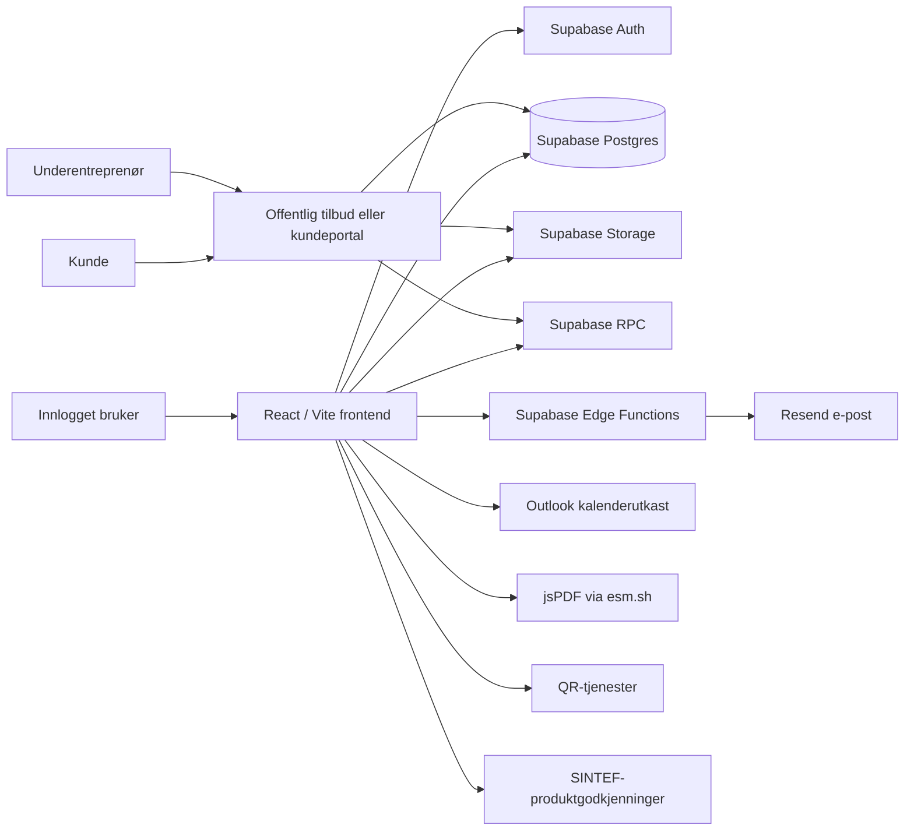
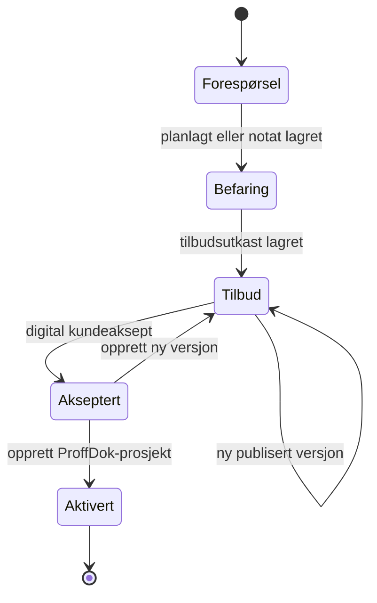
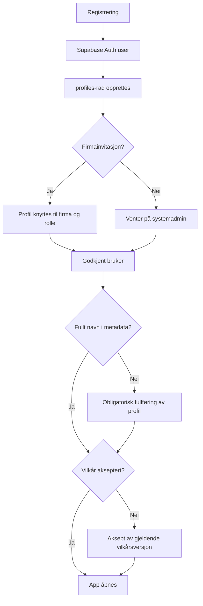
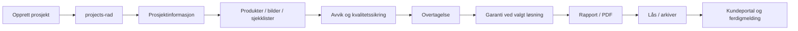
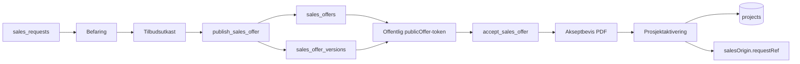
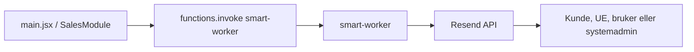
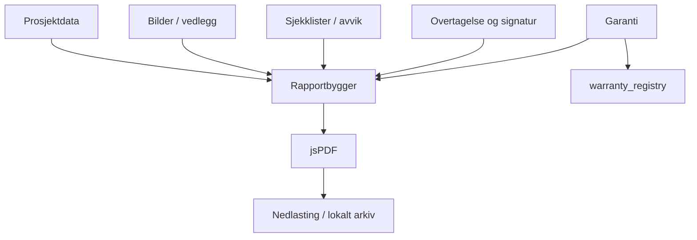

Expo ProffDok – arkitekturkart
Fase: 23 – Modulisering, videreutvikling og trygg produksjonsforvaltning  
Status: Nå-arkitektur og anbefalt målarkitektur  
Dato: 6. august 2026  
Branch: `feature/fase23-arkitekturkart`  
Plassering i repository: `docs/architecture/EXPO_PROFFDOK_ARCHITECTURE.md`  
Produksjonsgrunnlag: Stabil `main` etter Fase 22
---
1. Formål
Dette dokumentet er kartet for videre modulisering av Expo ProffDok. Det beskriver:
dagens faktiske frontendstruktur
ansvar og avhengigheter i `main.jsx` og `SalesModule.jsx`
datamodeller, Supabase-tabeller, RPC-er, Storage og Edge Functions
hovedflyter mellom brukergrensesnitt, database, filer, e-post og kundeportaler
teknisk gjeld og risikoområder
anbefalt målstruktur
trygg rekkefølge for moduliseringsarbeidet
test- og godkjenningskrav for hver senere refaktorering
Dokumentet innfører ingen funksjonelle endringer, ingen databaseendringer og ingen endringer i produksjons-UI.
1.1 Styrende prinsipper
Produksjonsversjonen på `main` er kilde til sannhet.
Ingen funksjonalitet skal forsvinne.
UI og arbeidsflyt skal være identisk ved ren modulisering.
Én logisk endring gjennomføres om gangen.
Alle kodeendringer utføres i egen branch og testes i Vercel Preview.
Database, RLS, Storage og Edge Functions endres bare når det er nødvendig og eksplisitt avtalt.
Mobilvisning er en obligatorisk del av hver test.
Dataformatet i eksisterende prosjekter og salgssaker skal være bakoverkompatibelt.
Komplette filer leveres når en endring skal implementeres.
Branch, mappe og filnavn skal alltid oppgis før kode erstattes.
---
2. Kildegrunnlag og avgrensning
Arkitekturkartet er laget fra følgende produksjonsnære filer og Supabase-oversikter:
`src/main.jsx`
`src/style.css`
`src/modules/sales/SalesModule.jsx`
`src/modules/sales/sales.css`
`package.json`
`vite.config.js`
`supabase/functions/smart-worker/index.ts`
`supabase/functions/delete-pending-user/index.ts`
Supabase Table Editor
Supabase Database Functions
Supabase Storage Buckets
Supabase Edge Functions
2.1 Oppmålt kodeomfang
Område	Fil	Omfang	Observerte React-konstruksjoner
Hovedapp	`src/main.jsx`	13 826 linjer, ca. 941 KB	96 state-deklarasjoner, 23 effects, 34 memo-beregninger, 19 refs
Salgsmodul	`src/modules/sales/SalesModule.jsx`	6 228 linjer, ca. 241 KB	27 state-deklarasjoner, 10 effects, 6 memo-beregninger, 6 refs og 98 navngitte funksjoner
Global CSS	`src/style.css`	221 linjer	Globale elementselektorer og mobil-/printregler
Salgs-CSS	`src/modules/sales/sales.css`	1 684 linjer	Hovedsakelig `.sales-*`, men også globale selektorer
`main.jsx` har et generert/transpilert preg med blant annet `import_react`, `import_jsx_runtime` og kall som `(0, import_react.useState)`. Filen må derfor behandles ekstra konservativt. En stor automatisk formattering eller full omskriving skal ikke kombineres med moduldeling.
2.2 Ikke fullt verifisert i dette kartet
Følgende er ikke eksportert og detaljkontrollert linje for linje:
komplette SQL-definisjoner for tabeller
alle fremmednøkler og indekser
komplette RLS-policyer
Storage-policyenes SQL-innhold
SQL-koden i alle RPC-funksjoner
Vercel-miljøvariabler og produksjonsinnstillinger
innholdet i hele `api/`- og `public/`-mappene
låste versjoner i `package-lock.json`
Der dokumentet bygger på tabellnavn eller funksjonsnavn uten SQL-eksport, er dette uttrykkelig merket som observert, logisk kobling eller må verifiseres.
---
3. Repository – observert nåstruktur
```text
expo-proffdok/
├── api/                              # Innhold ikke detaljkartlagt i denne leveransen
├── public/                           # Logoer, dokumenter og øvrige statiske filer
├── src/
│   ├── main.jsx                      # Hovedapp, auth, prosjekt, admin, portaler og rapport
│   ├── style.css                     # Global styling for hovedappen
│   ├── modules/
│   │   └── sales/
│   │       ├── README.md
│   │       ├── SalesModule.jsx       # Befaring / Tilbud / Aksept
│   │       ├── SalesPreview.jsx      # Separat salgs-preview
│   │       └── sales.css             # Styling for salgsmodulen
│   └── [utgått AI-test fjernet]
├── index.html                        # Ordinær app-entry
├── sales-preview.html                # Separat salgs-preview-entry
├── package.json
├── package-lock.json
└── vite.config.js
```
3.1 Vite-entrypunkter etter opprydding
```text
index.html          → ordinær Expo ProffDok-app
sales-preview.html  → isolert salgs-preview
```
Utgått `ai-transcript-test.html` og tilhørende React-testfil er fjernet. Vite-konfigurasjonen refererer ikke lenger til AI-testsiden.
3.2 Supabase Edge Functions etter opprydding
Aktive funksjoner:
```text
delete-pending-user
smart-worker
```
Fjernet som utgått og ubrukt:
```text
inspection-assistant
swift-processor
```
---
4. Systemkontekst

4.1 Runtime-lag
Lag	Teknologi	Hovedansvar
Klient	React	UI, state, navigasjon og arbeidsflyt
Bygg	Vite	Bundle og multi-entry preview
Identitet	Supabase Auth	Innlogging, sesjon og user metadata
Data	Supabase Postgres	Profiler, prosjekter, salgssaker, tilbud, produktmaster og garanti
Filer	Supabase Storage	Prosjektbilder, dokumenter, chatbilder og befaringsbilder
Serverlogikk	Supabase RPC	Firmaavgrensning, publisering, offentlig tilbud og aksept
Integrasjoner	Edge Functions	Resend-e-post og sikker sletting av ventende brukere
Dokumenter	jsPDF	Sluttrapport, garantidokument og akseptbevis
---
5. Hovedappen – `src/main.jsx`
5.1 Hovedansvar
`main.jsx` er i dag både applikasjonsskall, domene-/datatjeneste, state-container og UI for nesten hele Expo ProffDok.
Den håndterer blant annet:
app-branding, favicon og manifest
Supabase-klient
innlogging, registrering og passordgjenoppretting
obligatorisk fullføring av brukerprofil
profil, godkjenning, firma- og systemroller
brukervilkår og akseptlogg
startside og mobilmeny
prosjektliste, søk og filter
opprettelse, åpning, kopiering og sletting av prosjekt
autolagring, manuell lagring og lokal nødkladd
prosjektinformasjon og prosjektering
produkter og produktdokumentasjon
overflater og innredning
bilder og vedlegg
sjekklister og egne sjekkpunkter
avvikssentral
tilbud/kontrakt i prosjekt
overtagelse og signatur
dokumentert tetthetsgaranti
prosjektchat og e-postvarsling
kundeportal og underentreprenørportal
rapportvisning og PDF-generering
firmaadministrasjon
systemadministrasjon og supportmodus
produktmaster og garantikontrollpunkter
innebygd brukerveiledning
integrasjon mot `SalesModule`
Dette gir svært høy kobling: En liten endring i én del av filen kan påvirke state, lagring, portalvisning, rapport eller rollelogikk i en annen del.
5.2 Hovedkomponenter som allerede finnes i filen
Følgende navngitte React-komponenter er identifisert og er naturlige fremtidige uttrekkspunkter:
```text
App
Brand
ProjectWarrantySetup
WarrantyPanel
AppInstallGuide
HelpCenter
Section
CollapsibleBlock
Grid
ProductReportDocumentSelector
Input
Textarea
Select
PhotoGrid
ProjectInformationReadOnly
DeviationCenter
ChecklistEditor
ChecklistReportSection
BathroomEquipmentReportSection
Report
PdfSafeLink
InfoCard
SignatureCard
SignaturePad
CustomerReport
```
Komponentene ligger fortsatt i samme fil og deler mange variabler, hjelpefunksjoner og datastrukturer fra filens scope.
5.3 Intern fanestruktur
Observerte interne faner:
```text
Startside / prosjekt
Prosjektliste
Befaring / Tilbud / Aksept
Prosjektinformasjon
Prosjektering
Produkter
Overflater og innredning
Bilder
Installasjoner
Sjekklister
Avvik
Tilbud / kontrakt
Chat
Interne notater
Overtagelse
Garanti
Rapport
Firma
Systemadministrasjon / Admin
Hjelp
Innlogging
```
Kundeportalen har egen undernavigasjon med blant annet:
```text
Oversikt
Prosjektinformasjon
Dokumentasjon
Produkter
Bilder
Tilbud
Garanti
Rapport
Chat
```
5.4 URL- og inngangsruting
Frontend bruker query-parametere som enkel ruting:
Parameter	Bruk
`publicOffer=<token>`	Åpner offentlig kundetilbud direkte i `SalesModule` før ordinær innlogging
`project=<uuid>`	Åpner prosjekt eller portal
`access=admin`	Direkteåpning som innlogget administrator
`access=underleverandor`	Underentreprenørportal
`role=kunde`	Kundeportal
`tab=<id>`	Ønsket startfane, blant annet Chat
Dette er ikke en separat router. Ruting, autorisasjon og render-avgjørelser ligger i `main.jsx`.
5.5 State og lagring
Prosjektet holdes som flere parallelle state-objekter:
```text
company
user
project
checked
productDocs
manualProducts
other
surf
bathroomEquipment
photos
access
inst
files
checklist
tilbud
overtagelse
warranty
projectLog
internalNotes
```
Disse samles ved lagring til ett `data`-objekt i `projects`-tabellen.
Andre state-grupper håndterer blant annet:
autentisering og profil
vilkår
prosjektliste
firmaadministrasjon
systemadministrasjon
produktmaster
UI-/accordion-tilstand
autolagringsstatus
chat
portaltilgang
rapport-/PDF-status
5.5.1 Persistenslag
Hovedappen bruker flere lag samtidig:
React-state – aktiv arbeidskopi
`latestStateRef` – siste samlede snapshot
`localStorage` – nødkladd, aktiv fane, e-post og scroll-/navigasjonshjelp
Supabase `projects.data` – varig prosjektdata
Supabase Storage – binære filer
Dette er robust mot enkelte nettverks- og fanebytteproblemer, men øker risikoen for at state og database kommer ut av synk dersom lagringsfunksjoner endres isolert.
5.6 Prosjektdatastruktur
Observert radformat i `projects`:
```text
id
user_id
title
data
share_enabled
locked
locked_at
locked_by
updated_at
```
`data` inneholder en stor JSON-struktur:
```text
company
user
project
checked
productDocs
manualProducts
other
surf
bathroomEquipment
photos
access
inst
files
checklist
tilbud
overtagelse
warranty
projectLog
internalNotes
```
5.6.1 `project`
Viktige observerte felt:
```text
responsible
projectName
projectNumber              # Opprettes ved aktivering fra salgsmodul
address
postnr
city
customer
customerEmail
customerPhone
date
notes
projectDescription
projectInfoIncludeInReport
checklistPhotosNote
reportHeroPhotoId
isTemplate
fall
fallDusj
fallUtenfor
sluk
terskel
membran
prosjekteringKommentar
prosjekteringPunkter
customChecklistGroups
projectDeviations
locked
status
workflowStatus
lockedAt
lockedBy
salesOrigin                # Når prosjekt er aktivert fra tilbud
portalAccess / tilgangsdata # Lagres i prosjektobjektet gjennom hjelpefunksjoner
```
5.6.2 `tilbud`
```text
enabled
files
tillegg
fradrag
kommentar
```
Akseptbevis og eventuell opplastet kontrakt overføres hit ved prosjektaktivering fra salgsmodulen.
5.6.3 `overtagelse`
```text
enabled
dato
kommentar
signUtførende
signKunde
signUtførendeImage
signKundeImage
```
Dato alene regnes ikke som fullført overtagelse. Eksisterende logikk krever aktiv registrering og signatur fra begge parter.
5.6.4 `warranty`
```text
enabled
issued
issuedAt
system
sintefApproval
durationYears
status
guaranteeNumber
reportGeneratedAt
reportGeneratedFileName
termsAccepted
termsAcceptedAt
termsAcceptedBy
termsReceiptName
termsReceiptRole
```
Støttede perioder er 10, 12 og 15 år. Garantiflyten er koblet mot valgt Sopro-system, sjekklister, bilder, avvik, overtagelse, rapport og `warranty_registry`.
5.6.5 `projectLog`
```text
enabled
draft
messages
lastReadByAdmin
lastReadByCustomer
```
Prosjektchat lagres som en del av `projects.data`, ikke i en egen chat-tabell.
5.7 Lagringsmønster og viktig konsekvens
Mange funksjoner følger dette mønsteret:
```text
1. Hent komplett projects-rad
2. Les og normaliser eksisterende data
3. Erstatt eller flett deler av data-objektet
4. Oppdater hele data-feltet
5. Oppdater updated_at
```
Dette brukes blant annet ved:
manuell prosjektlagring
generell autolagring
bilde-autolagring
sjekkliste-autolagring
chat og lest-status
tilgangskoder
garanti
produktmaster-synk
Arkitekturkonsekvens: To samtidige oppdateringer kan i prinsippet overskrive hverandres endringer dersom begge arbeider fra ulike snapshots. Refaktorering må derfor bevare dagens merge-/normaliseringslogikk nøyaktig. En egen, sentral `projectRepository` er et senere mål, men skal ikke innføres samtidig med første komponentuttrekk.
---
6. Befaring / Tilbud / Aksept – `SalesModule.jsx`
6.1 Integrasjon med hovedappen
Hovedappen importerer salgsmodulen fra:
```text
src/modules/sales/SalesModule.jsx
```
Intern bruk mottar:
```text
supabaseClient
authUser
profile
currentUserName
integrationMode="app"
startNewRequestSignal
```
Offentlig kundetilbud åpnes direkte ved `publicOffer`-token før ordinær innlogging og intern appnavigasjon.
6.2 Ansvar i dagens modul
`SalesModule` håndterer hele løpet:
```text
Forespørsel
→ Planlegg befaring
→ Befaringsbekreftelse
→ Befaringsnotat og bilder
→ Tilbudsutkast
→ Publisering av tilbudsversjon
→ Kundelenke / e-post
→ Kundeaksept og valgte opsjoner
→ Låst akseptbevis
→ Eventuell egen kontrakt
→ Aktivering som ordinært ProffDok-prosjekt
```
I tillegg håndterer modulen:
intern saksoversikt
redigering av forespørsel og befaring
prosjektansvarlig fra innlogget bruker
lokal navigasjonslagring
lokal og varig tilbudskladd
firmaprofil og firmalogo
offentlig kundevisning
ny tilbudsversjon etter aksept
historikk for aksepterte tilbudsversjoner
gjenoppretting av feilaktig aktivert sak uten eksisterende prosjekt
bildekomprimering og signerte befaringsbildelenker
PDF-generering av akseptbevis
opplasting og fjerning av kontrakt
overføring av bilder og dokumenter til prosjekt
e-post via `smart-worker`
Outlook-kalenderutkast
6.3 UI-moduser
Observerte `mode`-verdier:
```text
list
new
edit-request
detail
survey-plan
inspection-note
offer-builder
customer-offer
customer-accepted
project-activation
```
Én komponent velger og renderer alle disse visningene. Det er den viktigste årsaken til at `SalesModule` nå er vanskelig å teste og endre isolert.
6.4 Salgssak – logisk payload
`sales_requests.payload` inneholder hele arbeidskopien for saken. Viktige feltgrupper:
Kunde og forespørsel
```text
id / request_ref
title
customer
phone
email
address
source
note
responsible
status
statusClass
nextStep
iconName
```
Befaring
```text
surveyDate
surveyTime
surveyResponsible
surveyNote
surveyConfirmationSentAt
surveyConfirmationSentTo
inspectionCustomerWishes
inspectionExistingConditions
inspectionMeasurements
inspectionObservations
inspectionPhotos
```
Tilbud
```text
offerTitle
offerIntro
offerLines
offerOptions
offerReservations
offerIncluded
offerExcluded
offerCustomerSupplied
offerTerms
offerPaymentTerms
offerValidityDays
offerTotal
offerVersions
sentOfferVersionId
sentOfferVersionNumber
sentOfferAt
salesOfferId
publicToken
```
Aksept
```text
acceptedBy
acceptedAt
acceptedOfferVersionId
acceptedOfferVersionNumber
acceptedOfferLines
acceptedOptionIds
acceptedOptions
acceptedTotal
acceptedPayload
acceptedOfferHistory
acceptanceProofFile
```
Kontrakt og prosjektaktivering
```text
contractFile
projectId
projectName
projectNumber
projectResponsible
projectNote
projectActivatedAt
```
6.5 Salgssakstatus

6.6 Kladd og persistens
Salgsmodulen bruker:
React-state for aktiv sak og skjema
`localStorage` for:
aktiv salgsvisning
valgt sak
tilbudskladd per bruker og sak
befaringskladd
`sales_requests.payload` for varig lagring
`sales_offers` og `sales_offer_versions` for publiserte, versjonerte kundetilbud
Storage for bilder og dokumenter
Tilbudskladd lagres både lokalt og varig med debounce. Modulen har egne refs som hindrer at et tomt, uhydrert tilbudsskjema overskriver eksisterende linjer ved fanebytte.
Denne beskyttelsen er kritisk og skal beholdes nøyaktig ved modulisering.
6.7 Publisert tilbudssnapshot
`publish_sales_offer` mottar et payload med blant annet:
```text
offer_id
request_ref
customer_name
customer_email
customer_phone
customer_address
title
intro
lines
options
reservations
validity_days
total_ex_vat
```
`lines` inneholder også to interne metadataobjekter:
```text
__companyMeta       # Låst firmaprofil og logo
__offerTermsMeta    # Vilkår, betaling, inkludert/ikke inkludert og kundens leveranse
```
Dette er en bakoverkompatibel løsning som unngår databaseskjemaendring, men betyr at frontend og RPC må forstå metadataobjekter inne i samme liste som ordinære tilbudslinjer.
6.8 Kundeaksept
Offentlig kundevisning henter tilbud gjennom:
```text
get_sales_offer_by_token(token)
```
Aksept registreres gjennom:
```text
accept_sales_offer(token, accepted_name, selected_options)
```
Akseptert sum beregnes som aktiv tilbudsversjon pluss valgte opsjoner. Etter aksept opprettes et låst PDF-akseptbevis fra akseptert versjon og lagres i Storage.
6.9 Prosjektaktivering
Ved aktivering:
Kontrolleres det om lagret `projectId` faktisk finnes.
Det søkes etter mulig duplikat via `data.project.salesOrigin.requestRef`.
Befaringsbilder kopieres til `project-images`.
Aksepterte linjer, opsjoner og summer bygges inn i prosjektbeskrivelsen.
Akseptbevis og kontrakt legges i prosjektets `tilbud.files`.
Ny rad opprettes i `projects`.
Salgssaken settes til `Aktivert` med prosjekt-ID.
Appen åpner det nye prosjektet direkte.
Logisk kobling mellom salgssak og prosjekt:
```text
sales_requests.request_ref
        ↕
projects.data.project.salesOrigin.requestRef
```
Dette er en applikasjonskobling. Om det finnes en databasefremmednøkkel er ikke verifisert.
---
7. Supabase – tabeller
7.1 Observert tabelloversikt
```text
companies
company_user_invites
fdv_register
product_document_master
product_master_checkpoints
profiles
projects
sales_company_memberships
sales_company_scopes
sales_offer_versions
sales_offers
sales_requests
user_terms_acceptance
warranty_registry
```
7.2 Bruksmatrise
Tabell	Domene	Direkte brukt i opplastet frontend	Bruk / kommentar
`profiles`	Bruker/firma	Ja	Godkjenning, roller, firma, kontaktdata og logo
`projects`	Prosjekt	Ja	Hovedrad med stor `data`-JSON
`company_user_invites`	Firma	Ja	Invitasjon og godkjenning inn i firma
`user_terms_acceptance`	Compliance	Ja	Versjonsstyrt aksept av brukervilkår
`product_document_master`	Produktmaster	Ja	Produktdata og dokumentlenker
`product_master_checkpoints`	Produktmaster/garanti	Ja	Produktstyrte kontrollpunkter
`fdv_register`	Dokumentregister	Ja	Historisk/administrativ FDV-kilde
`warranty_registry`	Garanti	Ja	Registrering av utstedt garantinummer
`sales_requests`	Salg	Ja	Intern firmascopet arbeidskopi av salgssak
`sales_offers`	Salg	Via RPC	Offentlig token, status og akseptdata
`sales_offer_versions`	Salg	Via RPC	Låste publiserte tilbudsversjoner
`sales_company_scopes`	Salg/firma	Via RPC/RLS	Stabil firmaavgrensning for salg
`sales_company_memberships`	Salg/firma	Via RPC/RLS	Medlemskap i salgsscope
`companies`	Firma	Ikke direkte observert	Sentral firmamodell; eksakt bruk må verifiseres
7.3 `sales_requests`
Observerte kolonner fra frontend:
```text
company_id
request_ref
status
archived_at
payload
updated_at
```
Upsert-nøkkel:
```text
company_id, request_ref
```
Modulen fjerner midlertidige `dataUrl`- og `previewUrl`-verdier før payload lagres.
7.4 `sales_offers` og `sales_offer_versions`
Frontend leser og skriver disse gjennom RPC-er. Observerte felt fra RPC-responsen:
`sales_offers`
```text
id
request_ref
customer_name
customer_email
customer_phone
customer_address
title
status
public_token
active_version_id
accepted_by
accepted_at
accepted_payload
```
`sales_offer_versions`
```text
id
offer_id
version_number
title
intro
lines
options
reservations
validity_days
total_ex_vat
```
Eksakt SQL-type, constraints og indeksstruktur må verifiseres gjennom schema-eksport før databaseendringer.
---
8. Supabase – databasefunksjoner / RPC
8.1 Salgsfunksjoner
Funksjon	Return	Direkte frontendbruk	Ansvar
`resolve_sales_company_scope()`	`uuid`	Ja	Finner stabil firmascopet ID for innlogget bruker
`current_sales_company_scope_id()`	`uuid`	Ikke direkte	Sannsynlig hjelpefunksjon for RLS/policy
`sales_normalize_company_name(value text)`	`text`	Ikke direkte	Normalisering av firmanavn
`publish_sales_offer(payload jsonb)`	`jsonb`	Ja	Oppretter/oppdaterer tilbud og ny låst versjon, returnerer token og versjonsdata
`get_sales_offer_by_token(token uuid)`	`jsonb`	Ja	Leser offentlig tilbud og aktiv versjon
`accept_sales_offer(...)`	`jsonb`	Ja	Registrerer digital aksept og valgte opsjoner
8.2 Rolle- og profilfunksjoner
```text
current_profile_company_name()
current_profile_is_firmaadmin()
current_profile_is_systemadmin()
```
Disse kalles ikke direkte fra opplastet frontend og er derfor sannsynligvis støtte for RLS eller andre databasefunksjoner. Dette må bekreftes mot SQL-definisjonene før de endres.
8.3 Prosjekt og vedlikehold
Funksjon	Bruk
`set_project_lock(...)`	Låsing/arkivering av prosjekt
`set_updated_at()`	Triggerfunksjon for tidsstempel
---
9. Supabase Storage
9.1 Buckets
Bucket	Tilgang observert	Begrensning	Bruk
`sales-inspection-photos`	Privat	8 MB, bildeformater	Befaringsbilder, signerte URL-er
`chat-images`	Offentlig	50 MB standard/ikke satt	Bilder i prosjektchat
`project-images`	Offentlig	50 MB standard/ikke satt	Prosjektbilder, vedlegg, kontrakter, akseptbevis og overførte befaringsbilder
9.2 Observerte filflyter
Befaringsbilder
```text
Nettleser
→ komprimering til JPEG
→ sales-inspection-photos/{companyId}/{requestRef}/...
→ signert URL i intern visning
→ ved prosjektaktivering lastes original ned
→ kopieres til project-images
```
Prosjektbilder og vedlegg
```text
Nettleser
→ project-images/{bruker/prosjekt/...}
→ public URL
→ URL og path lagres i projects.data
```
Chatbilder
```text
Nettleser
→ chat-images
→ public URL
→ metadata lagres i projectLog.messages
```
9.3 Kritisk sikkerhetsmerknad
`project-images` er offentlig og brukes ikke bare til ordinære prosjektbilder, men også til:
opplastede kontrakter
låste akseptbevis
andre prosjektvedlegg
Dette er et høyt prioritert sikkerhets- og personvernpunkt. Det skal ikke endres som en del av frontendmodulisering. En eventuell overgang til privat bucket krever egen migreringsplan, signerte URL-er, kontroll av rapport/PDF, kundeportal, eksisterende URL-er og historiske dokumenter.
---
10. Edge Functions
10.1 `smart-worker`
Hovedansvar: HTML-e-post og sending via Resend.
Observerte `direction`-verdier:
```text
to_customer
to_owner
access_kunde
access_underleverandor
project_completed_customer
new_user_signup_systemadmin_notice
user_access_approved
inspection_confirmation
sales_offer
```
E-postmalen støtter:
prosjekt- og kundeinformasjon
prosjektansvarlig
melding
knapp og fallback-lenke
utførende firmas logo
firmatekst i footer
Miljøvariabler som brukes:
```text
RESEND_API_KEY
CHAT_FROM_EMAIL
```
Funksjonen har CORS `*`. Koden utfører ikke egen bruker-/rollevalidering. Det må derfor verifiseres at Supabase-funksjonen er deployet med riktig JWT-verifisering, og at uvedkommende ikke kan bruke funksjonen som generell e-postsender.
10.2 `delete-pending-user`
Hovedansvar: Sikker, permanent sletting av ikke-godkjent bruker.
Sikkerhetskontroller i funksjonen:
krever gyldig innlogget bruker
verifiserer `system_role = systemadmin`
hindrer sletting av egen bruker
hindrer sletting av systemadministrator
hindrer sletting av godkjent bruker
hindrer sletting av deaktivert historikkbruker
kontrollerer at oppgitt e-post matcher profilen
Rydding:
```text
user_terms_acceptance
company_user_invites
profiles
Supabase Auth user
```
Miljøvariabler:
```text
SUPABASE_URL
SUPABASE_ANON_KEY
SUPABASE_SERVICE_ROLE_KEY
```
`SUPABASE_SERVICE_ROLE_KEY` skal aldri eksponeres til frontend eller dokumenteres med verdi.
---
11. Autentisering, roller og tilgang
11.1 Brukerflyt

11.2 Observerte roller
Systemnivå
```text
systemadmin
```
Firmanivå
```text
firmaadmin
ansatt
```
Prosjekt-/delingsnivå
```text
administrator / eier
kunde
underleverandør
kun lesetilgang
```
Den eksakte kombinasjonen av profilfelter, RLS og frontendkontroller må bevares. Frontendvisning alene er ikke en sikkerhetsgrense; RLS og serverfunksjoner må fortsatt håndheve tilgang.
11.3 Kunde- og underentreprenørportal
Portalene bruker:
prosjekt-ID i URL
rolle/access-parameter
separat tilgangskode per rolle
kode lagret i prosjektdata
lokal godkjenning i nettleser etter korrekt kode
statusbasert gyldighet, inkludert periode etter låsing/arkivering
Portalene leser samme `projects.data` som intern app, men med avgrenset UI og redigeringsmulighet.
---
12. Hovedflyter
12.1 Ordinært prosjekt

12.2 Salg til prosjekt

12.3 E-post

12.4 Rapport og garanti

---
13. Eksterne avhengigheter
13.1 NPM
```text
React
React DOM
Vite
@vitejs/plugin-react
lucide-react
@supabase/supabase-js
```
`package.json` bruker `latest` for flere sentrale pakker. `package-lock.json` beskytter dagens installasjon, men regenerering kan gi utilsiktede hovedversjonsoppgraderinger. Versjonspinning bør gjennomføres som en separat, testet teknisk oppgave – ikke under komponentuttrekk.
13.2 Runtime-integrasjoner
Integrasjon	Bruk	Risiko / hensyn
`esm.sh/jspdf@2.5.1`	Dynamisk PDF-verktøy	Runtime-avhengighet til ekstern CDN
Resend	E-post	Avhenger av Edge Function og secret
Outlook deeplink	Kalenderutkast	Nettleser-/kontoavhengig
QuickChart / QR-tjenester	QR i rapport	Ekstern nettverkstilgang ved generering
SINTEF Certification	Produkt-/systemlenker	Eksterne dokumentlenker
Supabase	Auth, DB, RPC, Storage, Edge	Kritisk plattformavhengighet
13.3 Supabase-klient
Hovedappen oppretter Supabase-klienten direkte med prosjekt-URL og anon key i kildekoden. Salgsmodulen har i tillegg støtte for `VITE_SUPABASE_URL` og `VITE_SUPABASE_ANON_KEY`, men mottar normalt klienten fra hovedappen.
Anon key er laget for klientbruk, men to konfigurasjonsmåter gir teknisk gjeld og risiko for miljøavvik. En felles klientmodul er et senere, avgrenset mål.
---
14. CSS-arkitektur
14.1 `style.css`
Global styling bruker brede selektorer som:
```text
body
header
nav
button
input
textarea
select
section
h2
h3
```
Mobil- og printreglene er også globale. DOM-struktur og elementtype påvirker derfor utseendet selv om klassene ikke endres.
14.2 `sales.css`
Mesteparten av salgsstilen er namespacet med `.sales-*`, men filen inneholder også globale regler for:
```text
:root
*
body
button
input
textarea
select
a
```
Når `SalesModule` importerer filen, lastes disse globalt i hele appen. Dagens UI fungerer, men dette skal registreres som en isolasjonsrisiko.
14.3 Regel ved komponentuttrekk
Ved ren modulisering skal følgende beholdes uendret:
samme CSS-filer
samme class names
samme DOM-hierarki så langt det er praktisk mulig
samme rekkefølge på elementer
samme breakpoint-oppførsel
CSS Modules, scoped CSS eller redesign skal være en separat fase etter at funksjonell modulisering er stabil.
---
15. Risikoregister
Prioritet	Risiko	Konsekvens	Tiltak
Kritisk	`project-images` er offentlig og inneholder kontrakter/akseptbevis	Dokumenter kan være tilgjengelige via kjent URL	Egen sikkerhetsfase med private filer, migrering og signerte URL-er
Høy	`main.jsx` har ekstremt mange ansvar og stort felles scope	Høy regresjonsfare ved små endringer	Små uttrekk, identisk API og full regresjonstest
Høy	`SalesModule.jsx` kombinerer UI, state, DB, Storage, e-post og PDF	Vanskelig å teste og endre sikkert	Splitt først rene utilities og presentasjonsvisninger
Høy	Hele `projects.data` oppdateres fra flere kodeveier	Mulig overskriving ved samtidige snapshots	Sentral repository/merge-strategi i senere egen fase
Høy	JSON-datamodell mangler eksplisitt schema-versjon	Historiske prosjekter kan avvike	Legg senere til normalisering og schemaVersion uten å bryte gamle data
Høy	`smart-worker` har ikke kodebasert rollevalidering	Misbruk dersom JWT/deploybeskyttelse er feil	Verifiser Edge Function JWT og eventuelt tillatte directions/mottakere
Høy	Offentlige prosjekt- og chatbilder	Personvern og delingsrisiko	Kartlegg policies og planlegg privat lagring separat
Middels	Globale regler i `sales.css`	Salgsendring kan påvirke hovedappen	Behold uendret nå; namespace senere
Middels	Flere pakker bruker `latest`	Uforutsigbar installasjon ved ny lockfil	Pin versjoner i separat branch
Middels	jsPDF lastes fra ekstern CDN ved runtime	PDF kan feile ved CDN-/nettverksproblem	Flytt senere til låst npm-avhengighet
Middels	Doble Supabase-konfigurasjonsmønstre	Miljøavvik og vanskeligere testing	Felles klientmodul etter første sikre uttrekk
Middels	Lokal kladd og databasekladd lever parallelt	Konflikt eller gammel kladd kan vinne	Bevar tidsstempel-/hydreringlogikk; test fanebytte nøye
Middels	Offentlig tilbud avhenger av RPC-sikkerhet	Token-/akseptdata kan eksponeres ved feil SQL	Revider SQL og grants før databaseendringer
Middels	Ingen observerte test-/lint-scripts i `package.json`	Regresjon oppdages sent	Innfør tester gradvis uten å blokkere første dokumenterte uttrekk
Lav	Test-/preview-entry finnes i produksjonsrepo	Kan bli feilaktig brukt eller glemt	Behold dokumentert; vurder senere separat opprydding
---
16. Anbefalt målarkitektur
Målbildet skal nås gradvis. Det er ikke en anbefaling om å flytte alt samtidig.
```text
src/
├── app/
│   ├── App.jsx
│   ├── AppRouter.jsx
│   ├── navigation/
│   └── providers/
├── config/
│   └── supabaseClient.js
├── features/
│   ├── auth/
│   │   ├── components/
│   │   ├── hooks/
│   │   └── services/
│   ├── projects/
│   │   ├── components/
│   │   ├── views/
│   │   ├── hooks/
│   │   ├── services/
│   │   ├── model/
│   │   └── utils/
│   ├── sales/
│   │   ├── SalesModule.jsx
│   │   ├── components/
│   │   ├── views/
│   │   ├── hooks/
│   │   ├── services/
│   │   ├── model/
│   │   └── utils/
│   ├── reports/
│   ├── warranty/
│   ├── chat/
│   ├── company-admin/
│   └── system-admin/
├── shared/
│   ├── components/
│   ├── hooks/
│   ├── services/
│   ├── utils/
│   └── constants/
├── main.jsx
└── style.css
```
16.1 Avhengighetsregler i målbildet
`views` skal primært rendre og delegere hendelser.
Supabase-kall skal etter hvert ligge i `services`/repositories, ikke direkte i presentasjonskomponenter.
Rene formatterings- og normaliseringsfunksjoner skal ligge i `utils` eller `model`.
Domeneområder skal ikke importere interne filer fra hverandre uten et eksplisitt offentlig grensesnitt.
Delt UI kan ligge i `shared/components`, men bare når minst to områder faktisk bruker det.
`main.jsx` skal til slutt kun starte appen og importere appskallet.
Ingen komponentuttrekk skal endre databasepayload eller CSS-kontrakt.
---
17. Anbefalt målstruktur for salgsmodulen
```text
src/modules/sales/
├── SalesModule.jsx                  # Orkestrering og valg av aktiv visning
├── sales.css                        # Beholdes uendret i første moduleringsrunde
├── components/
│   ├── SalesHeader.jsx
│   ├── SalesWorkflow.jsx
│   ├── SalesFeedback.jsx
│   ├── OfferLineEditor.jsx
│   ├── OfferOptionEditor.jsx
│   └── InspectionPhotoGrid.jsx
├── views/
│   ├── SalesListView.jsx
│   ├── RequestFormView.jsx
│   ├── RequestDetailView.jsx
│   ├── SurveyPlanningView.jsx
│   ├── InspectionNoteView.jsx
│   ├── OfferBuilderView.jsx
│   ├── CustomerOfferView.jsx
│   ├── CustomerAcceptedView.jsx
│   └── ProjectActivationView.jsx
├── hooks/
│   ├── useSalesRequests.js
│   ├── useOfferDraft.js
│   ├── useInspectionDraft.js
│   └── useCompanyProfile.js
├── services/
│   ├── salesRequestService.js
│   ├── salesOfferService.js
│   ├── salesStorageService.js
│   ├── salesEmailService.js
│   └── projectActivationService.js
├── model/
│   ├── salesDefaults.js
│   ├── salesStatus.js
│   └── salesSnapshots.js
└── utils/
    ├── salesFormatters.js
    ├── salesImages.js
    └── salesValidation.js
```
17.1 Eierforhold til state
I første fase skal `SalesModule` fortsatt eie all state. Utskilt view mottar data og callbacks som props. Dette gir minst risiko fordi:
persistenslogikken forblir på ett sted
kladdrefs og effects flyttes ikke samtidig
UI kan sammenlignes direkte før/etter
én view kan trekkes ut om gangen
Hooks og services innføres først etter at visningene er skilt ut og regresjonstestet.
---
18. Anbefalt målstruktur for hovedappen
Første prioritet er ikke å bygge en ny global state-løsning. Hovedappen skal først deles etter tydelige domener med eksisterende state og callbacks beholdt i `App`.
Naturlige områder:
```text
Auth og profil
Startside og prosjektliste
Prosjektinformasjon
Prosjektering
Produkter og produktmaster
Overflater og innredning
Bilder og vedlegg
Sjekklister
Avvik
Tilbud / kontrakt
Chat
Overtagelse
Garanti
Rapport / PDF
Kundeportal
Underentreprenørportal
Firmaadministrasjon
Systemadministrasjon
Hjelp
```
Eksisterende navngitte komponenter nederst i `main.jsx` er gode kandidater, men hver enkelt må analyseres for skjulte avhengigheter før flytting.
---
19. Trygg modulisering – anbefalt rekkefølge
Trinn 0 – Arkitekturkart og opprydding
Status:
arkitekturkart opprettet
utgått AI-test fjernet
`inspection-assistant` fjernet
`swift-processor` fjernet
Vite-preview reparert
produksjon urørt
Trinn 1 – Rene salgsverktøy
Første kodebranch etter arkitekturkartet bør kun flytte rene, state-frie hjelpefunksjoner fra `SalesModule.jsx`.
Eksempler:
```text
sanitizeStoragePart
formatInspectionDateTime
isEmailLike
firstNonEmailName
getOfferTotal
formatNok
getWorkflowSteps
```
Krav:
samme funksjonssignatur
ingen UI-endring
ingen state/effect flyttes
ingen Supabase-kall flyttes
produksjonsbuild og salgsflyt testes
Trinn 2 – Presentasjonskomponenter i salg
Trekk ut én visning om gangen, anbefalt start:
```text
SalesListView
```
Deretter:
```text
RequestFormView
SurveyPlanningView
InspectionNoteView
OfferBuilderView
CustomerOfferView
ProjectActivationView
```
`SalesModule` beholder state og handlers.
Trinn 3 – Salgstjenester
Når visningene er stabile:
flytt databasekall til servicefiler
flytt Storage-kall til egen service
flytt e-postpayload til egen service
flytt publiseringsmapping til model/service
Ingen databaseendring skal kombineres med dette trinnet.
Trinn 4 – Hovedappens rene komponenter
Start med komponenter som allerede er navngitt og har liten avhengighetsflate, for eksempel:
```text
Brand
Section
CollapsibleBlock
Grid
Input
Textarea
Select
InfoCard
PdfSafeLink
```
Felleskomponenter trekkes ut uten redesign.
Trinn 5 – Hovedappens domenevisninger
Én fane om gangen. `App` beholder state og callbacks til visningen er stabil.
Trinn 6 – Data- og servicearkitektur
Først etter at UI er delt:
felles Supabase-klient
`projectRepository`
normalisering av prosjektdata
sentral snapshot-/mergefunksjon
tydelig schema-versjon
Dette er høyere risiko og skal ha egen branch og utvidet dataintegritetstest.
Trinn 7 – Sikkerhet og lagring
Egen fase for:
private prosjektfiler
signerte URL-er
migrering av eksisterende dokumenter
Edge Function JWT og autorisasjon
RLS-/RPC-revisjon
Skal ikke blandes med frontendmodulisering.
---
20. Teststrategi for hver refaktorering
20.1 Automatisk minimum
Før merge:
```text
npm install / npm ci
npm run build
```
Når testverktøy er innført:
```text
unit tests for rene utilities
component tests for utskilte views
smoke tests for kritiske flyter
```
20.2 Obligatorisk manuell regresjon
Autentisering
innlogging
registrering
godkjenning
profilfullføring
brukervilkår
passordgjenoppretting
Roller
vanlig bruker
firmaadmin
systemadmin
supportmodus
kundeportal
underentreprenørportal
Prosjekt
opprett prosjekt
lagre og autolagre
bytt fane
last siden på nytt
åpne annet prosjekt med ulagrede endringer
kopier prosjekt
lås og åpne arkivert prosjekt
Dokumentasjon
produkter og dokumentlenker
bilder
sjekkpunktbilder
vedlegg
overflater og innredning
avvik
tilbud/kontrakt
overtagelse og signatur
garanti
rapport og PDF
Salg
ny forespørsel
rediger forespørsel
planlegg og rediger befaring
send befaringsbekreftelse
lagre befaringsnotat og bilder
opprett tilbud
Enter fra prisfelt til ny linje
opsjoner
bytt hovedfane og gjenopprett kladd
publiser kundetilbud
send tilbud på e-post
åpne kundelenke
kundeaksept med og uten opsjoner
akseptbevis
kontraktopplasting
ny tilbudsversjon etter aksept
aktiver som prosjekt
kontroller at prosjektdata, bilder og dokumenter er med
Responsivitet
mobilbredde ca. 375 px
liten mobil ca. 320 px
nettbrett
desktop
lange navn, adresser og tilbudstitler
norsk datoformat
20.3 Dataregresjon
Før merge skal det kontrolleres at følgende er identisk før og etter:
radformat i `projects`
JSON-nøkler i `projects.data`
radformat i `sales_requests`
publiseringspayload til `publish_sales_offer`
akseptpayload
Storage-paths
e-postpayload til `smart-worker`
URL-parametere og kundelenker
---
21. Branch- og mergepolicy for Fase 23
Arkitekturkart
```text
Branch: feature/fase23-arkitekturkart
Mappe: docs/architecture
Fil: EXPO_PROFFDOK_ARCHITECTURE.md
```
Denne branchen skal bare inneholde:
dokumentasjon
allerede godkjent sletting av utgåtte AI-testfiler
allerede godkjent fjerning av utgått Vite-entry
Senere modulisering
Hver logiske endring får egen branch, eksempel:
```text
feature/fase23-sales-utils
feature/fase23-sales-list-view
feature/fase23-sales-request-form
feature/fase23-shared-ui-primitives
```
En branch skal ikke inneholde flere uavhengige refaktoreringer.
Mergekrav
Vercel Preview er grønn.
Build er grønn.
Avtalt testmatrise er gjennomført.
UI er sammenlignet på mobil og desktop.
Ingen uventede database-, Storage- eller Edge-endringer.
Endringen er gjennomgått mot dette arkitekturkartet.
Merge til `main` skjer først etter uttrykkelig godkjenning.
---
22. Beslutningslogg
Dato	Beslutning	Begrunnelse
06.08.2026	Produksjonsversjonen etter Fase 22 er nytt stabilt utgangspunkt	Befaring, tilbud, e-post, aksept og prosjektaktivering er produksjonssatt
06.08.2026	Arkitekturkart lages før videre kodeflytting	Reduserer risiko og synliggjør skjulte avhengigheter
06.08.2026	AI-/lydopptak på befaring er avsluttet	Funksjonen er ikke del av ønsket produktretning
06.08.2026	AI-testfiler og Vite-entry er fjernet	Utgått kode og mislykket preview-build ryddet
06.08.2026	`inspection-assistant` er slettet	Ingen aktiv bruk etter fjerning av AI-opptak
06.08.2026	`swift-processor` er slettet	Ingen kall i funksjonens levetid og unødvendig åpen URL-fetch
06.08.2026	`delete-pending-user` beholdes	Aktiv og sikker systemadminfunksjon
06.08.2026	`smart-worker` beholdes	Kritisk felles e-posttjeneste
06.08.2026	Første modulisering skal være liten og uten funksjonsendring	Produksjonsstabilitet prioriteres
---
23. Åpne verifikasjonspunkter
Disse skal avklares før relevant område endres, men blokkerer ikke første rene frontenduttrekk:
Eksporter komplett Supabase-schema til versjonskontroll.
Dokumenter RLS-policyer for alle tabeller.
Dokumenter Storage-policyer og tilgang til eksisterende filer.
Verifiser `verify_jwt` for aktive Edge Functions.
Dokumenter SQL for salgs-RPC-er og grants til `anon`/`authenticated`.
Kartlegg `companies`, `sales_company_scopes` og `sales_company_memberships` med kolonner og relasjoner.
Kartlegg innhold og bruk av `api/`.
Kartlegg statiske filer og dokumenter i `public/`.
Bekreft låste versjoner fra `package-lock.json`.
Dokumenter Vercel Preview-/Production-miljøvariabler uten å eksponere verdier.
Avklar langsiktig plan for offentlig `project-images`.
Avklar om `fdv_register` fortsatt er aktivt domene eller kun historisk kompatibilitet.
---
24. Anbefalt neste kodeoppgave etter godkjent arkitekturkart
Én ren og lavrisiko endring: flytt state-frie salgsverktøy til en egen utility-fil.
Foreslått senere branch:
```text
feature/fase23-sales-utils
```
Foreslått fil:
```text
src/modules/sales/utils/salesFormatters.js
```
Før endringen skal den eksakte listen over funksjoner og alle kallsteder kvalitetssikres. Ingen state, effect, Supabase-kall, Storage-kall, CSS eller UI skal flyttes i samme leveranse.
---
25. Konklusjon
Expo ProffDok har en bred og moden funksjonsflate, men teknisk er hovedappen og salgsmodulen blitt store orkestreringsfiler med mange delte avhengigheter. Den sikreste veien videre er ikke en stor omskriving, men en kontrollert serie av små, målbare uttrekk.
Arkitekturen skal utvikles etter denne rekkefølgen:
```text
Kartlegg
→ trekk ut rene funksjoner
→ trekk ut presentasjonsvisninger
→ stabiliser og test
→ trekk ut tjenester
→ samle datatilgang
→ styrk automatiske tester
→ gjennomfør sikkerhetsmigreringer separat
```
Dette bevarer produksjonen samtidig som Expo ProffDok gradvis blir enklere å teste, tryggere å endre og raskere å videreutvikle.
