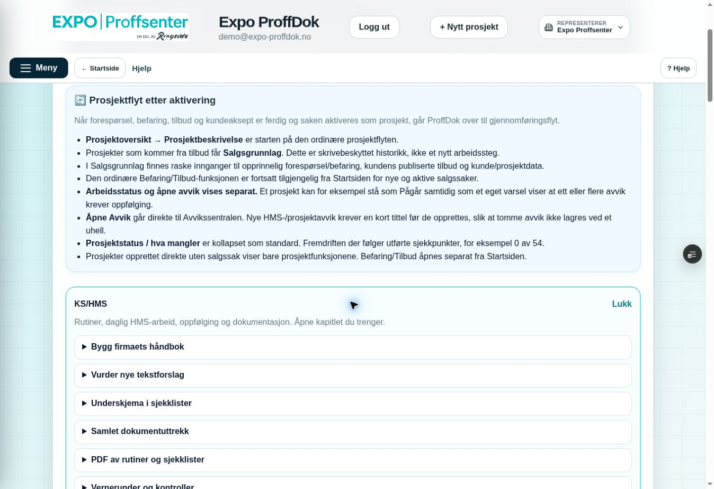
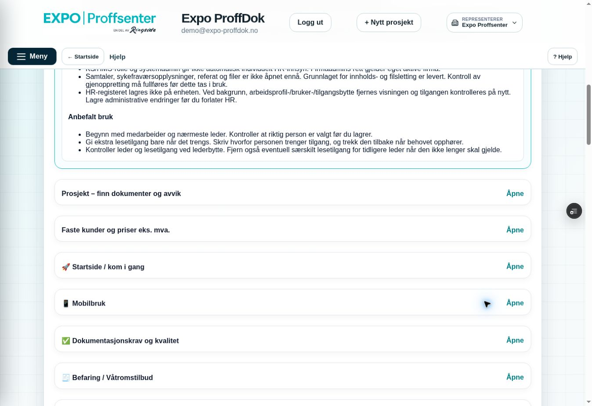

# Hjelp: håndbok først og anbefalt HR-bruk – 9. oktober 2026

Miljømål **BEGGE**, bare feature/Preview mot eksisterende Sandbox, draft PR #216. Faktisk remote før kode: `2778e12f5b0021a1b33fd5c0432f50a68e473bd4`, tree `e82ecabc011098399369366f83b224c536a7efbc`; main `155f6c4ac01f126c1db0c65da385cfd9305587d5`. Lokalt tree identisk, commit-historikken annerledes.

Kenneth ba om «Bygg firmaets håndbok» først under KS/HMS i Hjelp og innhold i tom «Anbefalt bruk» under HR. Scope før kode: Hjelp-innholdet i `helpToolsCore.js`, eksisterende `hr-register-react-check.mjs` og denne statusdokumentasjonen. Ingen ny HR-funksjon, meny-/tilgangs-/SQL-/Storage-/e-postendring. HR-innhold fortsatt stengt; uavhengig slettemanifest/full isolert restore er neste HR-scope.

Håndbokkapittelet flyttes fremst i den eksisterende innholdslisten. Alle øvrige KS/HMS-kapitler beholder rekkefølge og innhold. Ett KS/HMS-punkt med 11 kapitler og ett HR-punkt beholdes. HR har tre konkrete råd: riktig medarbeider/leder før lagring, nødvendig begrunnet lesetilgang med tilbakekalling, og kontroll av gammel leders særskilte tilgang ved lederbytte.

Faktisk React/Vite/JSDOM PASS: håndbok først og åpning av riktig håndboktekst; tekstforslagskapittelet finnes fortsatt og åpner samme veiledning; HR-kapittelet åpnes og har en ikke-tom anbefalingsliste. Bytte/lukking og eksisterende tilbudsveiledning beholdes i prøven. Den gamle «første kapittel er kildeforslag»-forutsetningen er uttrykkelig endret etter brukerens nye rekkefølge; selve kildeforslagsprøven er beholdt. Eksisterende HR/Hjelp-critical PASS. Ingen databaseprøver eller eldre B/C/PDF/ZIP-brukertester gjentatt for disse innholdsendringene.

Kort visuell prøve: **Hjelp → KS/HMS** viser **Bygg firmaets håndbok** først. **Hjelp → HR → Medarbeidere og tilgang** viser tre råd under **Anbefalt bruk**. Faktisk ny browserkontroll og eksakt kode-SHA/CI/Preview dokumenteres etter publisering. Tidligere Kenneth TEST OK beholdes; ingen merge/Production-release eller e-postsending.

## Faktisk innlogget sluttkontroll

Kode-SHA **`5b6bcfa793f5fea4e4202057aa119bdc2a768d2b`**, tree **`2c14d1818d67a4506a6a0dfd9e01b09f05665704`**. PR Core Safety **37986453053**, jobb **114009533221** SUCCESS; scope isolation og full critical build grønne. Vercel **`dpl_EV4CySfApys2RqoFbJ7wVVPLeZG4` READY Preview**, eksakt feature-SHA/riktig prosjekt/fast alias og direkte branch-env **EXPO_BACKEND_TARGET=sandbox**.

Én eksisterende innlogget Skynett-fane, ordinær reload uten ny innlogging. Hjelp → KS/HMS viser **Bygg firmaets håndbok** først og åpner riktig håndbokinnhold. Alle 11 kapitler beholdt. Bytte til HR lukker KS/HMS. HR → **Medarbeidere og tilgang** viser tre faktiske punkter under **Anbefalt bruk**. Begge rettelsene er visuelt kontrollert; HR-detaljene lukket etter prøven. Ingen HR-data eller innstillinger endret. Originale viewport-opptak nedenfor. Dette er desktop-Hjelp-bevis, ikke nye mobil-, fil-, restore- eller bruker-TEST OK-bevis.

Siste sluttføringscommit lagrer bare dokumentasjon og to skjermbilder. Endelig head/tree/CI/READY føres i draft PR #216. Main er fortsatt `155f6c4ac01f126c1db0c65da385cfd9305587d5`; ingen Production, merge eller e-postsending.

