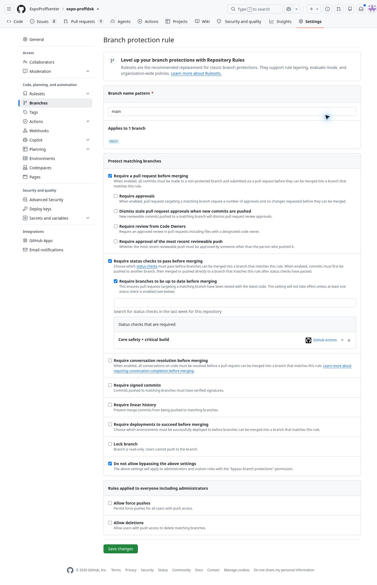
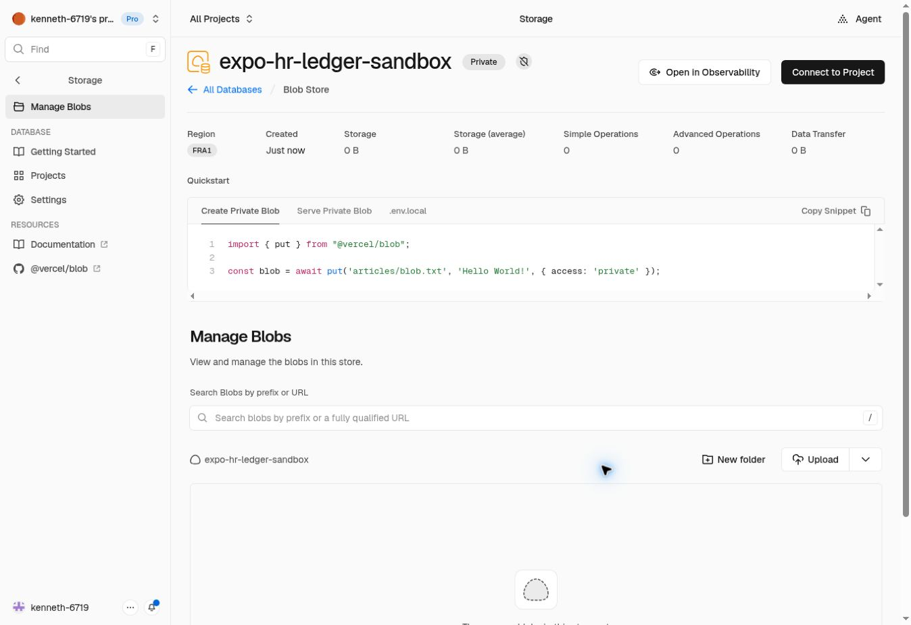

## Kontrollprosjekt opprettet og første tekniske QA levert – 10. oktober 2026 ca. 22:47 Europe/Oslo

Kenneth fullførte opprettelsen av **expo-hr-control / amduqhmgmeetaatwlmmt**, ACTIVE_HEALTHY, Micro, eu-west-1, samme godkjente organisasjon og $10/måned-grunnramme uten betalte tillegg. Ett prosjekt til senere Production-vern; ingen permanent kursjobb. Privat checkpoint/lås og fire service-only RPC-er er installert bare der via separate ops/hr-control-migrasjoner (live 20261010204017/20261010204144). Etter rollback: 0 checkpoints/aktive bindinger/låser/Edge Functions. 37 faktiske PostgreSQL-assertions PASS i kontrollprosjektet og PGlite; 21 faktiske adapterfeilscenarioer PASS med syntetiske transporter. Eksisterende filoperator/20 tester uendret PASS; full EXPO_BACKEND_TARGET=sandbox critical/build PASS. Ny adapter krever ISOLATED_QA, avviser aktive miljøer som kilde, kontrollerer varig readback/skyread før ack og beholder lås ved ukjent utfall. Ingen automatisk takeover/bootstrap. Ny sjekk lagt til Core Safety uten å svekke eksisterende tester. Supabase-standard auto-RLS-eventtrigger fikk offentlig kjørerett tilbakekalt; faktisk rollback-DDL bekreftet fortsatt auto-RLS. Advisor: ingen WARN/ERROR, én tilsiktet INFO for RLS uten offentlig policy.

Begrenset Blob-token og faktisk resource-ID/token-ID/origin/SDK-binding, betrodd bootstrap, Edge/runtime, skytester, scheduler/varsling og full isolert database/Auth/Storage-byte-restore gjenstår. Ingen betrodd produksjonsanker eller full sky-/restore-PASS. Ingen restore av aktive miljøer/kontrollprosjekt. Main c3d873e0 og demo 11f1b45d uendret; begge private HR-porter false/quarantined=true. PR #217 draft, ingen merge/Production-ack-tabell/appendring. Tidligere TEST OK og testmailens dokumenterte mottak beholdes. Tidligere status om ikke opprettet prosjekt er historikk. [Gjeldende kontrollprosjekt/drift](../../ops/hr-control/README.md), [ressurs og bildebevis](HR_SUPABASE_CONTROL_20261010.md).

# H5b driftsklargjøring – 10. oktober 2026

Miljømål **SANDBOX/DEMO** for operator-/restorekontroll. Ingen endring av Production, permanent kursdemo, appkode, SQL-migrasjoner, tester eller privat HR-port. Dette er en klargjort driftsoppskrift, **ikke utført sky-/restore-PASS**. Autorisert testmail er allerede sendt én gang; Kenneths skjermbilde dokumenterer mottak. Ingen ny mail sendes som del av denne klargjøringen.

## Main beskyttet og Supabase-alternativ klargjort ca. 22:05 Europe/Oslo

Kenneth autoriserte neste arbeid. Faktisk GitHub-eierøkt opprettet én klassisk branch-regel for **main**, ID **84605695**. Lagret regel er gjenåpnet og kontrollert: Require a pull request before merging; obligatorisk **Core safety + critical build** fra **GitHub Actions**; branches up to date; Do not allow bypassing (også administratorer); force-push og sletting ikke tillatt. Ingen obligatorisk ekstra GitHub-reviewer er satt, for å bevare eksisterende enkeltbruker-/TEST OK-flyt uten selvreview-deadlock. Brukerens relevante Preview/TEST OK er fortsatt påkrevd før agentmerge; regelen erstatter ikke dette. Lock branch er av. Ingen appkode, main-commit, deploy, rettighetsutvidelse eller betalt GitHub-plan endret.

Faktisk branch API bekrefter **protected=true**, enforcement **everyone**, context `Core safety + critical build`, app_id **15368**; main fortsatt `c3d873e0`. UI-beviset viser alle øvrige lagrede valg. Detaljadmin-API var tidligere 403 og brukes ikke som bevis for feltene det ikke eksponerer. [Lagret regel](https://github.com/ExpoProffsenter/expo-proffdok/settings/branch_protection_rules/84605695).



Supabase kan være serverløs operatorvert; egen VPS er ikke et absolutt krav. Et **separat kontrollprosjekt** med varig transaksjonelt kontrollpunkt/lås og Edge/pg_cron er foreslått. Dagens filoperator kan ikke bare flyttes til midlertidig Edge `/tmp`; kontrakten må tilpasses og faktisk testes uten å svekke eksisterende H5b. Organisasjonen er bekreftet Pro; offentlig ekstrakostnad fra $10/måned er bare listepris, ikke bekreftet kontopris/utgiftsgodkjenning. Ingen nytt prosjekt/adapter/scheduler/nøkkel eller sky-/restore-PASS. [Konkret scope, restoregrense, låsekontrakt og kostnad](HR_SUPABASE_CONTROL_20261010.md).

Lesende etterkontroll: main/Production `c3d873e0`, READY `dpl_BHpnnv8bnyo8wU3oLUE9NEsgixd5`; demo `11f1b45d`, READY `dpl_3uegJLq87zotYZFvFQQpfLM5vEsw`; PR #217 før denne dokumentasjonspubliseringen `bdd0b83c`, open/draft, Core Safety 38081733839 SUCCESS, READY `dpl_58A2cfghU9Ti1waM4WjM734ahoAW`. Funksjonskode fortsatt `ecd700ac`. Ingen Production/demo-deploy eller HR-åpning. Påminnelsen om branch-opprydding 11. oktober består, ingen branch slettet. Vercel-retention er ikke endret. De følgende kontrollene er historikk.

## Historisk Git-sikkerhet, opprydding og Vercel-varsel ca. 21:56 Europe/Oslo

Kenneth ba om videre arbeid, branch-påminnelse og vurdering av vedlagt GitHub-varsel/Vercel-e-post. Vedlegget ble faktisk åpnet fra scratch. GitHub branch API bekrefter **main protected=false**, og repo-rulesets returnerte []; detaljoppslag på branch-protection fikk **403 Resource not accessible by integration**. Varslet gjelder manglende branch-beskyttelse, ikke bevist angrep eller tapt data. Før neste release bør main ha PR-krav, obligatorisk faktisk Core Safety-jobb og vern mot force-push/sletting, også uten rutinemessig adminbypass. Vern for permanent demo må bevare kontrollert main → demo. Ingen beskyttelsesregel, rettighet, retention eller branch er endret i denne kontrollen. Ikke kall grønn CI en serverhåndhevet merge-sperre når main fortsatt er ubeskyttet.

Faktisk remote-sammenligning: merged PR #216 har head `acc99da8`, merge/main `c3d873e0`; `feat-kshms-foundation...main` er ahead=1/behind=0 og files=0. Foundation-branchen er kandidat til opprydding etter levert Production/demo. `main...checkpoint-kshms-recovery-20261006` er diverged, ahead=2/behind=129; `main...test-kshms-handbook-ui` er diverged, ahead=16/behind=141. Disse har unik commit-historikk og skal bevares til arkiv-/innholdskontroll, ikke blindt slettes. Behold main, permanent demo og aktiv feature/hr-ledger-ack-gate-20261010/PR #217. Kenneth får én branch-oppryddingspåminnelse 11. oktober morgen; påminnelsen utfører ingen sletting.

Faktisk innlogget Vercel Usage i team ringside, billingperiode 7. oktober–7. november: **Deployment Storage 14,26 GB**, **Functions Storage 429,72 kB**. Dette er Total size akkurat nå, ikke målt GB-month eller prognose for endelig faktura. Listepris $0,10 per GB-month per metrikk gir omtrent **$1,43 per hel måned dersom dagens størrelse består**, før inkludert kreditt og avgifter. Vanlig Usage viste $0,02 av $20 inkludert forbrukskreditt brukt hittil og $20 Pro-abonnement; ingen garanti for gjenværende kreditt senere. Teamet og prosjektet expo-proffdok viser retention **Canceled 30 dager, Errored 90 dager, Pre-Production 180 dager, Production 1 år**, og varsel om reduksjon av alle lengre perioder til 30 dager **23. oktober 2026**. Knappen Keep retention and enable paid storage er ikke trykket; Save er ikke brukt. Ingen kostnads-/retentionendring gjort.

Kontrollerte offisielle kilder bekrefter e-postens saklige innhold: [Vercel kunngjøring 9. oktober](https://vercel.com/changelog/deployment-storage-pricing-expands-to-existing-teams), [Deployment Storage/pris/metrikk](https://vercel.com/docs/deployment-storage), [retention og unntak](https://vercel.com/docs/deployment-retention), [GitHub branch protection](https://docs.github.com/en/repositories/configuring-branches-and-merges-in-your-repository/managing-protected-branches/about-protected-branches). Supabase forretningsdata og HR Blob er separate fra Vercels lagrede bygg/funksjonspakker. Policyen bevarer bl.a. deploys med Production-alias, non-production custom alias og siste Preview for aktiv branch/åpen PR; kontroller faktiske aliaser før opprydding, særlig permanent kursdemo. Eldre slettede deploys kan ikke brukes direkte til rollback; Git-historikk er ikke en ferdig deploy eller databasebackup. Sletting av Git-branch alene sletter ikke nødvendigvis lagrede Vercel-deploys.

H5b får ingen ny sky-/restore-PASS av denne kontrollen. Begrenset token må fortsatt sikkert provisioneres på en faktisk varig operatorvert; ingen slik vert er tilgjengelig eller avklart i nåværende tilkoblinger. Ingen ny betalt vertsressurs, tokenuttrekk, scheduler, binding eller privat HR-åpning er utført. Tidligere konkrete restore-/downloadblokkeringer består. Dokumentasjon publiseres bare på draft PR #217, fra faktisk remote forelder.

## Ny faktisk lagertilgang ca. 21:48 Europe/Oslo

Kenneth opplyste at han hadde Vercel-engangskode. Sikker browserAuth-handoff endte med user_took_over; etterkontroll viste faktisk innlogging som **kenneth-6719** i team **ringside**. Ingen kode eller innloggingshemmelighet hentet i chat, git eller intern auth-state. Samme fane ble brukt; opprettelsesdialogen er lukket etter handlingen.

Eierøkten opprettet **expo-hr-ledger-sandbox**, ID **store_feUEeykOyyvZVMca**, **Private**, **FRA1**. Første lengre foreslåtte navn ble avvist av skjemaets 32-tegnsgrense før opprettelse; kortere navn ble brukt. Lageret er synlig og tomt (0 B/0 operasjoner), uten prosjekttilkobling eller automatisk env-kopiering. Dette er faktisk ressursoppretting gjennom ny eiertilgang; det tidligere 403-avviste connector-opprettelseskallet ble ikke gjentatt. [Verifisert lageroversikt](https://vercel.com/ringside/~/stores/blob/store_feUEeykOyyvZVMca/manage-blobs).



**Fortsatt konkrete blokkeringer:** Lagerbegrenset token er ikke hentet eller sikkert provisionert på en varig operatorvert. Privat origin/tokenbinding er ikke verifisert. Et lesende connector-oppslag på eksakt lager-ID og riktig team returnerte **404 not_found: Blob not found**; dette opphever ikke synlig UI-opprettelse og er ikke ny opprettelsesautorisasjon. Ingen tokenvisning/kopiering, credential-uttrekk eller blind retry. Varig vert/anker/nøkkel, bootstrap, faktisk anonym avvisning mot et eksisterende privat objekt, skriv/readback/konflikt/recovery, ekstern scheduler/varsling og full isolert database/Auth/Storage-byte-restore gjenstår. Et tomt lager beviser ikke disse prøvene. Supabase kostnadsoppslag og native artifact-download er fortsatt blokkert som dokumentert nedenfor.

Fersk lesende etterkontroll: remote main/Production `c3d873e0`, READY `dpl_BHpnnv8bnyo8wU3oLUE9NEsgixd5`; demo `11f1b45d`, READY `dpl_3uegJLq87zotYZFvFQQpfLM5vEsw`. PR #217 open/draft, head før denne dokumentasjonspubliseringen `4de4fe7fa3d031f4d72a8c2de7ba962851919566`. Production content=false/quarantined=true/ingen ack-tabell; Sandbox content=false/quarantined=true/ledger disabled/1 medarbeider/0 receipts/acks/artifacts/filer/jobber. Ingen endring av aktive data eller HR-port. Eldre status nedenfor beholdes som historikk.

## Historisk kontroll ca. 21:17–21:33 Europe/Oslo

- Remote main/Production `c3d873e0`, READY `dpl_BHpnnv8bnyo8wU3oLUE9NEsgixd5`. Remote demo `11f1b45d`, fast alias READY `dpl_3uegJLq87zotYZFvFQQpfLM5vEsw`. PR #217 open/draft, head før denne dokumentasjonsoppdateringen `f057da4d720f7e9416c0694ac80b3338571f90c7`; funksjonskode fortsatt `ecd700ac`. Ingen merge/deploy til Production/demo.
- Vercel team `team_Yvcnc6KRYfVB1W2LQjCffZGT`, slug `ringside`, har én bekreftet OWNER, Kenneth. Eierrollen beviser ikke endrede connectorrettigheter. Det tidligere 403-avviste opprettelseskallet ble **ikke gjentatt**. Ingen nytt lager/token; lageroversikten ble ikke tilgjengelig.
- Én eksisterende cloud-fane ble brukt til lageroversikten. Vercel ba om innlogging; Kenneth valgte GitHub gjennom browserAuth. Første device-kode ble avvist. Etter Kenneths uttrykkelige beskjed om å prøve på nytt ble én ny kode sendt fra GitHub til den registrerte, maskerte e-postadressen og verifikasjonen kom videre til Vercels eget 2FA-steg. Vercel krevde autentiseringsapp eller eksisterende recovery-kode; sikker forespørsel ble avbrutt. Kenneth opplyste at koden ikke finnes i hans autentiseringsapp. Ingen ny automatisk retry, passord/2FA-endring eller omgåelse. Ingen credentials/cookies/JWT/auth-state hentet eller rekonstruert. Ingen ny guard-feil eller browserprosess-restart attestert.
- Supabase viser bare eksisterende `expo-proffdok` i `ExpoProffsenter's Org` (`oolmxqndmldzpylahcjl`) og dens eksisterende `demo-sandbox`-branch. Ingen isolert skyinstans opprettet. Begge `get_cost`-oppslag (branch/prosjekt) returnerte **UNAVAILABLE: MCP tool get_cost was not returned by tools/list**. Ingen pris, kostnadsbekreftelse eller ressursopprettelse påstås.
- Ny lokal vei undersøkt: offisiell Supabase CLI **2.120.0**, pinnet/installert utenfor apprepoet; faktisk `--help` bekreftet eksperimentell `stack start --runtime native`. Native krever ikke Docker. Første oppstart avviste systembrukeren nobody; én korrigert oppstart med eksisterende ikke-root-bruker oai kom til artifact preparation. Deretter **ExperimentalStackStartError**: `getaddrinfo ETIMEOUT` mot både `github.com` og `supabase-cli-artifacts.s3.us-east-1.amazonaws.com` for PostgreSQL **17.11.0.004-r1**. Ingen database/Auth/Storage/restore startet. Bare ufullført lokal stackregistrering finnes; målrettet stop returnerte unavailable, ikke en påstand om stopp av kjørende tjenester. Ingen nettverksomgåelse eller eskalering.
- Fersk direkte SQL-etterkontroll: Production `content_enabled=false`, `restore_quarantined=true`, ingen H5b-ack-tabell. Sandbox samme portstatus, ledger enabled=false; **1 medarbeider, 0 receipts/acks/artifacts/filer/filjobber**. Ingen endring i aktive miljøer.

## Ressurser som må være konkrete før skyprøven

| Ressurs | Konkret klargjøring |
| --- | --- |
| Privat Blob | Faktisk opprettet `expo-hr-ledger-sandbox`, ID `store_feUEeykOyyvZVMca`, region fra1, access private, team ringside. Tomt; ingen prosjekttilkobling eller automatisk env-kopiering. Ikke opprett en kopi gjennom den avviste connectoren. |
| Store-token | Begrenset til det separate lageret; server-only hemmelighet på operatorverten. Store-ID og privat origin skal verifiseres mot tokenbindingen uten å logge token. Ingen token i chat/git/VITE/browser. |
| Operatorvert | Varig separat vert og beskyttet volum utenfor database-/Storage-/apprestore. Scratch og Vercel Functions midlertidige filer er ikke et varig anker. Eier, tilgang og backup-/restoregrenser må registreres. |
| Anker/nøkkel | Absolutt operatorroot 0700; anchor.json 0600 og uavhengig 32-byte HMAC-nøkkel. Gjenoppretting av applikasjonen må aldri gjenopprette nøkkel/anker til eldre tidspunkt. |
| Restorekilde/-mål | Bare nye isolerte miljøer med syntetiske brukere/filer. Ingen backup med reelle Production-/kursdata. Aldri restore aktiv Sandbox eller Production. Native runtime kan undersøkes igjen først etter at offisielle artifact-downloads faktisk er tilgjengelige. |

## Serverkonfigurasjon for eksisterende operator

| Variabel | Verifisert kontrakt |
| --- | --- |
| HR_LEDGER_RUN_MODE | SANDBOX |
| HR_LEDGER_PROJECT | ppvircenkjizeiqdxphj; CLI er uttrykkelig låst til denne Sandbox |
| HR_LEDGER_STORE_ID | Faktisk privat store_ID |
| HR_LEDGER_BLOB_ORIGIN | Faktisk `https://ID.private.blob.vercel-storage.com`; samme ID som token/lager |
| HR_LEDGER_BLOB_TOKEN | Lagerbegrenset server-only hemmelighet |
| HR_LEDGER_HMAC_KEY | Uavhengig kryptografisk nøkkel, 64 hextegn; ikke logget |
| HR_LEDGER_ANCHOR_ROOT | Absolutt privat varig root utenfor alle restorevolumer |
| HR_LEDGER_BLOB_SDK_ROOT | Absolutt installasjon av eksakt @vercel/blob 2.8.1 utenfor apprepoet |
| HR_LEDGER_SUPABASE_SERVER_KEY | Sandbox servernøkkel, sikkert provisionert på operatorverten; aldri brukes til browserinnlogging |

Eksisterende kjøring, først etter faktisk bootstrap/lagerkontroll:

```sh
node scripts/hr-cloud-deletion-ledger.mjs verify /absolutt/privat/anchor.json
node scripts/hr-ledger-run-once.mjs
```

`sync`/`verify` oppretter ikke manglende skylager/manifest. Bootstrap er et eget eksplisitt steg med signert generation=0, receipts=[]; opprinnelig tomt objekt og anker må bindes, lagres holdbart og leses tilbake før DB-binding. Ingen blind «nytt anker» når et eksisterende objekt/anker er borte eller gammelt. Bootstrap er ikke utført og skal ikke erstattes av syntetisk SDK-transport. CLI skal ikke retargetes til Production eller en restoreinstans ved å svekke Sandbox-sperren.

## Faktisk sky-QA og drift

1. Verifiser anonym avvisning av det private objektet og riktig project/store/origin-binding. Deretter faktisk signert skriv/ukachet readback og samsvar med varig anker.
2. Bevis stale ETag-konflikt uten overskriving, feil før/etter sky-skriv, feil ved ankerpublisering og kontrollert recovery fra gjenværende lås. Cloud-resultat skal holdes adskilt fra eksisterende 20 syntetiske scenarios.
3. Aktiver binding bare i Sandbox etter bevisene, med privat innholdsport fortsatt stengt. Kjør full minimal snapshot → skyunion → varig anker → fersk readback → service-only ack. Manglende/feil/gammel kvittering skal aldri gi complete.
4. Etabler ekstern scheduler på operatorverten, foreslått hvert femte minutt, ingen samtidige kjøringer. Ikke blind retry etter krasj/lås. Varsling for feilkjøring og uteblitt/forsinket vellykket kjøring skal testes med avklart mottaker og uten HR-innhold/nøkler i meldingen. Scheduler, intervall og alerttransport er **ikke installert**. En ChatGPT-påminnelse erstatter ikke operatorjobben.

## Isolert restoreprotokoll

1. Registrer eksplisitt kilde-/målidentitet og avvis både Production- og aktive Sandbox-ref før noen backup/restore. Bruk syntetisk firma, medarbeider, leder, ekstra leser, uvedkommende og separate reelle Auth-identiteter.
2. Installer verifisert faktisk applikasjonsskjema og uendrede relevante migrasjoner; ingen syntetiske Auth/Storage/Vault-adaptere som erstatning for ekte plattformbevis. Portene skal være stengt før restore og under tilgangsprøvene. Ikke slå på privat HR i aktive miljøer for å få fixtures.
3. Ta ekte database/Auth-backup samt separat Storage-bytebackup med navn/lengde/SHA-256. Registrer konfigurasjon og eventuell krypteringsrot etter plattformens restoremetode. Backup av metadata alene er utilstrekkelig.
4. Slett bare de uttrykkelig syntetiske innholdsfamiliene/filene i isolert kilde. La annen medarbeider og dennes fil bestå. Bevar nyere ekstern signert union og varig anker utenfor backupen.
5. Restore gammel database/Auth og bytefiler til isolert mål. Bevis at gamle syntetiske rader og filer fysisk kom tilbake, mens det uavhengige ankeret/unionen beholdt nyere sletting. Ingen bruker skal få lese tilbakeført HR-innhold før avstemming.
6. Kjør eksisterende reconcile-SQL fra ferskt eksternt verifisert manifest med fail-stop ved SQL-feil. Kjør faktisk Storage-API-worker, kontroller bytefravær og nye ack-krav. Prøv fil-only restore der medarbeiderraden allerede mangler, tapt respons/retry og stale anker.
7. Bruk ekte isolerte Auth-økter for medarbeider/leder/leser/uvedkommende, firmabytte og revokering. Kontroller beskyttet filtilgang, bevart annen medarbeider/fil og fysisk purge. Registrer faktisk resultat per trinn. Plattformlokal PASS er fortsatt ikke en Supabase-cloud-backup/PITR-PASS.

Ingen HR-åpning eller PR #217-merge før faktisk uavhengig drift og hele nødvendige restorekjeden er dokumentert. Første hindring er nå sikker serverprovisionering av lagerbegrenset token til en varig operatorvert, samt en vert med tillatte leverandørnedlastinger eller godkjent isolert skyressurs med faktisk kostnadsavklaring. Selve tomme private Vercel-lageret er opprettet. Appkode skal ikke endres for å kompensere for tilgangs-/nettverksfeil.

Kontrollerte primærkilder: [Supabase native runtime](https://supabase.com/docs/guides/local-development/docker-and-native-runtimes), [flere lokale prosjekter](https://supabase.com/docs/guides/local-development/running-multiple-local-projects), [database/Auth/Storage restore](https://supabase.com/docs/guides/platform/migrating-within-supabase/backup-restore). Kildeinnhold og CLI-help ble kontrollert i denne sesjonen; eksperimentelle flagg skal kontrolleres på nytt ved senere installasjon.
