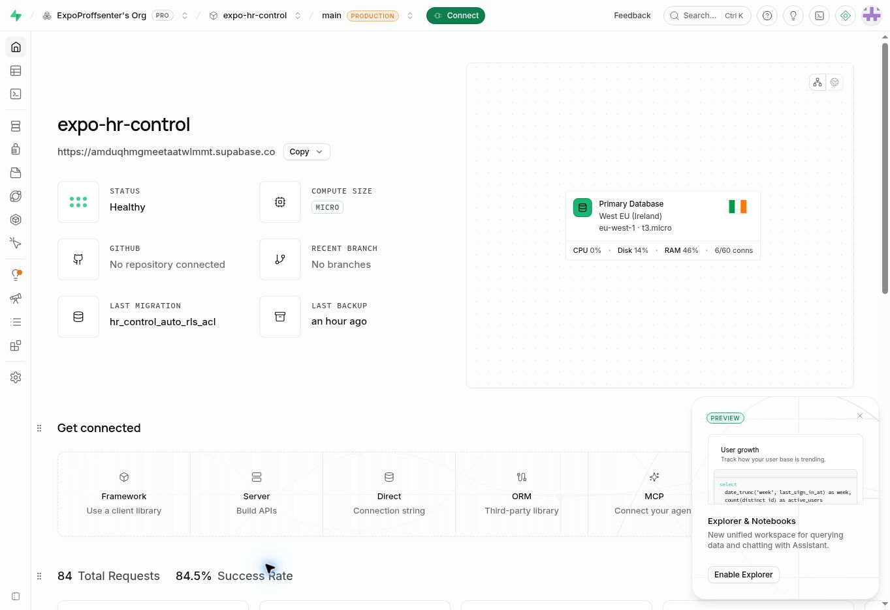
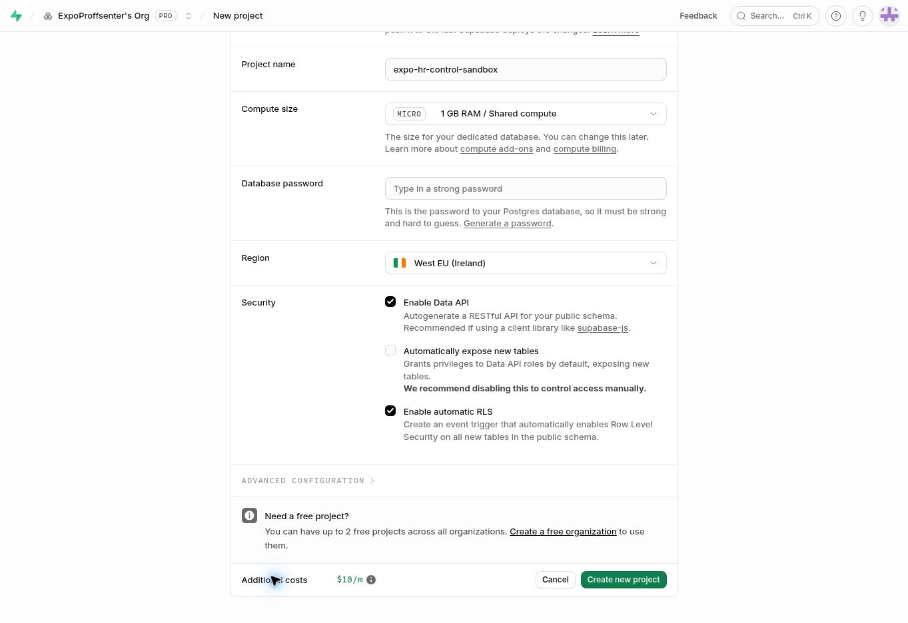

## Navngitt nøkkel og alle ni faktiske skyprøver PASS – 11. oktober 2026 ca. 00:40 Europe/Oslo

Kenneths faktiske brukerrespons fra kontrollfunksjonen viser **ok:true / ISOLATED_CLOUD_QA**, runId **7d3853e3-c6d3-40c0-a208-24a8e3d7a71b**, alle ni passed og **cleaned:true**. Navngitt hr_cloud_probe-auth og faktisk Edge/private-Blob-flyt er dermed bestått i denne brukerprøven. Responsen er lagret uten headers/nøkkelverdier som **HR_CONTROL_CLOUD_PASS_20261011.json**. HTTP-status er ikke gitt separat. Dette er faktisk skybevis, ikke en syntetisk transportprøve eller full H5b-browserattest.

Bestått: privat skriving/fersk lesing, faktisk anonym avvisning, signert skyunion/readback, faktisk stale-ETag-konflikt med bekreftet konkurrerende vinner, bevaring ved tom kilde, faktisk skriving med injisert tapt respons som nekter success, avvisning av gammelt anker, skyrecovery med kjent syntetisk minneanker, og sletting/fersk kontroll av egen testfil som borte. cleaned:true gjelder bare denne kjøringen; den tidligere syntetiske restfilen fra avbrutt historisk kjøring er fortsatt ikke slettet.

Kontrollprosjektets faktisk installerte **hr-cloud-probe v8 ACTIVE**, bundle SHA256 **34c386676f46f0ba3fbc2c25b4d9fb01021aabd5a49773f228f4fe5c571152b7**, ble hentet etter resultatet: alle fem filer matcher forventet kilde eksakt. Kontrolltabellen fortsatt **0 checkpoints/aktive bindinger/låser**. Ingen varig bootstrap/anker, permanent signing key, kilde/DB-ack, scheduler eller restorekjøring er opprettet. Resultatets **productionAnchor:false, databaseAck:false, byteRestore:false** er uttrykkelige grenser; faktisk database/Auth/Storage-byte-restore og etterfølgende tilgangs-/fil-/purgeprøver gjenstår på eget isolert miljø.

Neste konkrete sikkerhetsoppgave: fullfør den allerede godkjente manuelle utskiftingen ved å tilbakekalle bare kontrollprosjektets gamle **default** servernøkkel og beholde **hr_cloud_probe**. Ny nøkkel og faktisk skyflyt er nå verifisert; den gamle default er ennå ikke dokumentert tilbakekalt. Blob-token og Production-/Sandbox-nøkler skal ikke røres. Nettleservernets manuelle stopp beholdes; ingen nye browserforsøk, reset, credentiallesing eller alternativ innloggingsomvei. Denne skyprøven skal ikke gjentas som generell bruker-TEST OK uten en konkret regresjon.

Miljømål **SANDBOX/DEMO**, kun dokumentasjon og sikker responsevidens. Før denne oppdateringen er PR #217 fortsatt open/draft, faktisk head **be3572b762e19ecbfe45a9974d79461b2159e893**, tree **1c47619d6a4120ca471a71fa88af080dd8d5d73b**, Core Safety **38092088073 SUCCESS**, eksakt READY Preview **dpl_HKUypk7QDsbAMwP9tb84K8mngykc**. Eksisterende **52 scenarioer**, streng faktisk SDK/simulert HTTP-kontrakt og full Sandbox critical/build PASS beholdes; dokumentasjonssteget endrer ingen kode og utløser ikke ny lokal build eller nye manuelle appprøver. Main/demo/Production, aktive data, HR-porter, migrasjoner, tester og driftsbindinger er uendret. Ingen merge eller HR-åpning.

## Tre faktiske skyprøver består; konflikt skjulte opprinnelig feil – 11. oktober 2026 ca. 00:35 Europe/Oslo

Kenneth sendte responsen fra **hr-cloud-probe v7**, runId **f420e625-7e0c-4675-9646-a3e4468c0b9e**: **ok:false, stage:conflict, errorCode:probe_check_rejected, created:true, cleaned:true**. Faktisk brukerrespons bekrefter tre beståtte skytrinn: private_write_fresh_read, anonymous_read_denied og signed_union_fresh_readback. Nøkkel/body/lagerbinding er godkjent. Ingen HTTP-status er gitt. Testfilen er kontrollert borte etter opprydding av denne kjøringen; dette sier ikke at hele lageret er tomt. Responsen er lagret som **HR_CONTROL_CONFLICT_FAILED_20261011.json**, uten credentials/private data. Konflikt, recovery, varig anker, DB-ack og byte-restore er **ikke PASS**.

Konkret feil i prøveflyten: konflikt-catch svelget alle andre feil og rapporterte generell probe_check_rejected. Dermed er Vercels faktiske opprinnelige feil fortsatt ukjent; resultatet beviser ikke at ifMatch ble ignorert. Miljømål **SANDBOX/DEMO**: bare kontrollprobe, probe-critical, SDK-kontraktscheck, ops-README, statusnotater og sikker resultatevidens. v8 lar uventede feil nå eksisterende faste errorCode-klassifisering, viser separat konfliktfase og nekter success hvis en gammel oppdatering aksepteres. En konkurrerende oppdatering må nå først være signert/ferskt lest, deretter må nettopp den gamle skrivingen gi BlobPreconditionFailedError, og vinnerens generasjon/signatur/kvitteringer må være ferskt verifisert før actual_stale_etag_conflict legges i passed. En precondition-feil på første/konkurrerende skriving teller aldri som bestått konflikt. Ingen løsere aksept av andre error-typer, ingen providertekst eller hemmeligheter.

Alle tidligere 45 handler-scenarioer beholdt; sju ekstra feil ved konkurrerende skriv/les, feil på stale-skriv, akseptert stale-skriv og manglende vinner-readback: **52 scenarioer PASS med syntetiske transporter**. Den faktiske pinnede SDK 2.8.1-kontrakten er styrket fra generisk rejects til eksakt BlobPreconditionFailedError for simulert HTTP 412; alle eksisterende token/private/identity/ifMatch/readback-assertions beholdt, ekstern nettverking sperret: **PASS**. Full **EXPO_BACKEND_TARGET=sandbox npm run build PASS**. Dette er ikke bevis på faktisk Vercel-konflikt.

Bare **expo-hr-control / amduqhmgmeetaatwlmmt** fikk **hr-cloud-probe v8 ACTIVE**, bundle SHA256 **34c386676f46f0ba3fbc2c25b4d9fb01021aabd5a49773f228f4fe5c571152b7**; alle fem installerte filer matcher eksakt. GET uten apikey/Authorization/cookies og uten curl-konfigurasjon fikk faktisk **HTTP 403 / service_only**. Ingen autentisert v8-kjøring er gjort. Neste konkrete prøve er én Send Request i samme testpanel med eksisterende nøkkel/body, for å hente den opprinnelige faste feilklassen eller et fullstendig skyresultat. Ingen ny nøkkel eller innlogging.

Før endringen var faktisk PR #217 open/draft head **09b46d4e15de8cca6cba813551d33cb1ab6e2722**, tree **cb94a06772e5acda3d490f783c33ac5b6e2405c3**, Core Safety **38091557536 SUCCESS**, eksakt READY Preview **dpl_6uN5sGA5UAAGBTvkPFk7JwYT74gt**. Remote main **c3d873e0** og demo **11f1b45d** fortsatt uendret READY. Begge HR-porter content_enabled=false/restore_quarantined=true, Production uten ack-tabell, kontroll **0 checkpoints/aktive bindinger/låser**. Ingen appkode, shared ledger-algoritme, migration, bootstrap, scheduler, ack, merge eller HR-åpning. Nettleservernets manuelle stopp beholdt; ingen browserforsøk eller credential-omvei.

Default-nøkkelen er fortsatt ikke tilbakekalt. Historisk ni-trinns v3-sky-PASS beholdes som historikk, ikke nytt v8-bevis. Én tidligere syntetisk restfil, varig betrodd bootstrap/anker, isolert kilde/kontroll-ack, scheduler/varsling og full isolert database/Auth/Storage-byte-restore gjenstår.

## Ny nøkkel passerer auth; første skyfase feilet – 11. oktober 2026 ca. 00:28 Europe/Oslo

Kenneths brukerbilde etter manuell kopiering fra hr_cloud_probe viser **ok:false, mode:ISOLATED_CLOUD_QA, stage:create, passed:[], cleaned:true**. Bare venstre headernavn og responsdelen ble inspisert; nøkkelverdifeltet ble ikke lest og originalbildet publiseres ikke. Responsutsnittet lagres som **HR_CONTROL_INITIAL_READ_FAILED_20261011.png**. Det viser ikke HTTP-status og hele runId er avklippet. Faktisk v6-kilde er hentet og matcher alle fem forventede filer. I denne koden kan responsen bare nås etter korrekt navngitt auth, body og Blob-binding. cleaned:true på denne feilstien betyr at skrivingen fullførte og oppryddingen kontrollerte egen fil som borte. stage:create omfatter også metadata og første ferske readback; dermed er årsaken ikke bevist som en skrivefeil. Ny nøkkel er akseptert i brukerprøven, men **ingen nye skyscenarioer PASS**. En smal metadataforespørsel i unified logs viste bare v6 Boot i tidsvinduet, ikke en uavhengig bekreftet respons eller rotårsak.

Miljømål **SANDBOX/DEMO**: kun kontrollprobe, tilhørende critical-check, ops-README, kontinuitetsnotater og sikker responsevidens. v7 skiller skrivefasen create, initial_write_metadata og initial_fresh_read, og returnerer bare en fast allowlist av errorCode-klasser samt created-flagget ved feil. Ingen providertekst, stack, URL, token, header, signatur eller private data returneres/logges. Ingen endring i auth, skytransport, signatur/CAS/readback, cleanup, appkode eller migrasjoner. Alle tidligere 38 scenarioer beholdt; sju presise skrive-/metadata-/readback-/providerfeil med lekkasje- og oppryddingsassertions: **45 syntetiske scenarioer PASS**. Full **EXPO_BACKEND_TARGET=sandbox npm run build PASS**. Tester er ikke faktisk skybevis.

Bare **expo-hr-control / amduqhmgmeetaatwlmmt** fikk **hr-cloud-probe v7 ACTIVE**, bundle SHA256 **cb4d94d88c3cfc1723b4eaddd3c5ef102f995d3a7f6926cff305063722f97247**; alle fem installerte filer samsvarer eksakt. Faktisk GET uten apikey/Authorization/cookies, med curl-konfigurasjon deaktivert, ga **HTTP 403 / service_only** også etter v7. Ingen ny autentisert v7-skyprøve er gjort. Neste konkrete prøve er én Send Request med samme manuelt innlagte nøkkel/body for å lese presis fase/feilkode; ikke flere nøkler eller generell gjentakelse av gamle TEST OK.

Før endringen er faktisk PR #217 fortsatt open/draft, head **982da99ddcdded8a1c8aeed7b8d1d26e4216573d**, tree **e39532a5019dd1e149eba6747b3c12b0919ef92a**, Core Safety **38090703675 SUCCESS**, READY Preview **dpl_6FRudhzvwgogaAanfjQFVp8BYjHB**. Main **c3d873e0** / READY **dpl_BHpnnv8bnyo8wU3oLUE9NEsgixd5** og demo **11f1b45d** / READY **dpl_3uegJLq87zotYZFvFQQpfLM5vEsw** kontrollert uendret. Begge private HR-porter content_enabled=false/restore_quarantined=true; Production uten ack-tabell; kontrollprosjekt **0 checkpoints/aktive bindinger/låser**. Nettleservernets manuelle stopp beholdes; ingen ny automatisk nettleserhandling eller credential-omvei.

Default-nøkkelen er fortsatt ikke tilbakekalt; manuell utskifting må fullføres. Den tidligere ni-punkts sky-PASS med syntetisk minneanker er historisk, ikke et nytt v7-resultat. Restfil fra avbrutt historisk kjøring, betrodd bootstrap/varig anker, kontroll-ack, scheduler/varsling og full isolert database/Auth/Storage-byte-restore gjenstår. Ingen merge, HR-åpning eller Production-overføring.

## Kontrollnøkkel finnes i faktisk runtime; avvisning uten nøkkel verifisert – 11. oktober 2026 ca. 00:15 Europe/Oslo

Kenneths neste bilde ble kun inspisert som et venstreutsnitt for headernavn: **én apikey-rad**, ikke flere. Originalbildet er ikke lest i full bredde eller publisert, fordi det kan inneholde nøkkelfelt. En ekstra header-rad er dermed ikke dokumentert som årsak til den tidligere service_only-avvisningen.

Miljømål **SANDBOX/DEMO**: bare isolert kontrollverktøy, tester og driftsnotater. Kontrollfunksjonen skiller nå mellom manglende/ugyldig hr_cloud_probe-binding (**403 / control_key_not_configured**) og avvist request (**403 / service_only**). Samme eksakte navngitte nøkkel, prefix-/lengdekrav og konstant-tid-sammenligning før skyoperasjoner; ingen nøkkelfallback, verdi, nøkkelliste eller requestheader returneres/logges. Alle tidligere 31 scenarioer beholdt; sju nye kontroller for manglende/feil konfigurasjon, gammel nøkkel og kombinerte apikey-headere: **38 PASS**. Full **EXPO_BACKEND_TARGET=sandbox npm run build PASS**, PR-scope-/release-guards og diff-check PASS.

Bare **expo-hr-control / amduqhmgmeetaatwlmmt** fikk **hr-cloud-probe v6 ACTIVE**, bundle SHA256 **9dfeaad7b2e76594abb18b4403e7b142592813c915cd4edcf5cba6c880f4cc25**. Faktisk HTTPS GET til kontrollfunksjonen, uten apikey/Authorization/cookies og med curl-konfigurasjon deaktivert, fikk **HTTP 403 / {ok:false,code:service_only}**. Med v6-kontrollen betyr dette at den navngitte runtime-bindingen er gyldig konfigurert, mens forespørselen uten nøkkel avvises før noen skyoperasjon. Ingen hemmelig verdi ble lest. Dette er **ikke** vellykket autentisering med Kenneths kopierte nøkkel eller nye Blob-/ack-/restoreprøver.

Neste konkrete handling: Kenneth kopierer nøkkelverdien på nytt fra kopierikonet ved **hr_cloud_probe** i kontrollprosjektets Secret keys, erstatter verdien i den eneste apikey-raden og sender eksisterende isolerte testbody. Dette er en konkret feilsøking av faktisk tilgangsavvisning, ikke gjentakelse av tidligere app-TEST OK. Den gamle default-nøkkelen forblir urørt frem til ny-nøkkel-resultatet er kontrollert. Nettleservernets tidligere manuelle handoff/stopp beholdes; ingen nye automatiske browserforsøk, reset eller loginomvei.

Faktisk main **c3d873e0** og demo **11f1b45d** kontrollert uendret. PR #217 fortsatt open/draft; før endringen head **21eed46ad815e77deef1df04a3ec4aa91114b4eb**, tree **1ab373861c8683b752e4e2cb963a80b5bfb4b778**, Core Safety **38090195722 SUCCESS**, eksakt READY Preview **dpl_68KExxMHhcnBpSkXwDq7uBqNSkqx**. Ingen appkjerne, migration, aktiv DB-binding, bootstrap, scheduler, merge, Production-ack eller HR-åpning. Tidligere faktisk sky-PASS med kjent syntetisk minneanker står som historikk; varig anker/ack/full isolert byte-restore gjenstår.

## Ny manuell tilgangsprøve avvist; nettleservern begrenser kontroll – 11. oktober 2026 ca. 00:08 Europe/Oslo

Kenneth meldte «test sendt» og vedla bare responsdelen. Bildet **HR_CONTROL_AUTH_DENIED_20261011.png** viser `ok:false` og `code:"service_only"`. Det viser ikke HTTP-status, målprosjekt, nøkkelheader eller kjørings-ID. Dermed er faktisk autentisering med den nye nøkkelen **IKKE PASS**; bildet beviser ikke hvilken nøkkel som ble sendt. Denne avvisningen skjer før skyoperasjonene. Ingen ny vellykket Blob-/ack-/restoreprøve hevdes.

Supabase-connectorens faktisk installerte **hr-cloud-probe v5** ble hentet som kildefiler og sammenlignet med alle fem forventede deployfiler: **eksakt likhet**, inkludert bindingen til **hr_cloud_probe**. Bundle fortsatt **a3ef9becdf845ce02c141395bbb41d8f738988cec517335e015dbd49ba3b7a2b**. Ingen funksjonsendring, ny deploy, nøkkellesing eller svekket auth. Den tidligere default-nøkkelen er ikke fjernet; manuell utskifting er fortsatt ufullført. Neste konkrete kontroll er én apikey-rad med brukerens manuelt kopierte verdi fra hr_cloud_probe, før eventuell ny prøve. Ingen nøkkelverdier skal sendes i chat eller bilder.

Nettleservernet meldte retained_data_restricted og instruerte én ny fane. Ny fane på funksjonsoversikten virket; gammel fane ble lukket. Påfølgende klikking og loggoppdatering ble igjen begrenset av credential_observation_restricted. Dokumentert navigasjon til nytt dokument ga kjørehistorikk, men siste synlige rad var bare **10. oktober 23:52:51 / 403**, ikke en verifisert ny kjøring. Refresh ble blokkert; dokumentert manuell overtakelse ble utført, og automatiske nettleserhandlinger stoppet. Ingen reset-, innloggings- eller nyfaneløkke. Nåværende fane er kontrollprosjektets invocations-side.

Før dette dokumentasjonssteget var PR #217 **open/draft**, head **769557fdf3a9d55f7cbde979d40a87aa082dbb17**, tree **ae4b80ee4ba6b8050e49e5d999fa1a9242e38982**, Core Safety **38089447651 SUCCESS**, eksakt READY Preview **dpl_ACHTadvYuRZ85CPzg9xQYTb8UUJW**. Main/demo/Production/kursdata og private HR-porter er ikke endret. Ingen merge, bootstrap, scheduler, Production-ack eller HR-åpning. Innlagt QA-bilde inneholder bare sikker respons, ingen headers/nøkler.

## Navngitt kontrollnøkkel opprettet; default avvist – 10. oktober 2026 ca. 23:56 Europe/Oslo

Kenneth godkjente manuell utskifting av kontrollprosjektets servernøkkel og opprettet **hr_cloud_probe**. Navnet og riktig prosjekt **expo-hr-control / amduqhmgmeetaatwlmmt** er verifisert med målrettet DOM uten å lese nøkkelverdien. Bindestreker i første foreslåtte navn ble avvist av UI; korrekt navn bruker understrek. Den tidligere default-nøkkelen er fortsatt aktiv i Supabase og **ikke tilbakekalt**. Blob-tokenen er ikke lest eller endret.

Kontrollfunksjonen **hr-cloud-probe v5 ACTIVE**, bundle SHA256 **a3ef9becdf845ce02c141395bbb41d8f738988cec517335e015dbd49ba3b7a2b**, godtar nå bare `SUPABASE_SECRET_KEYS.hr_cloud_probe` på apikey med samme konstant-tid-sammenligning. Ingen generell aksept av alle servernøkler. Eksisterende assertions er bevart; to nye regresjonsprøver avviser default-only-oppsett og den gamle default-verdien når begge navngitte nøkler finnes. **31 handler-/isolasjons-/feilscenarioer PASS**, faktisk pinnet SDK-kontrakt PASS med syntetisk HTTP og ekstern nettverking sperret, full **EXPO_BACKEND_TARGET=sandbox npm run build PASS**.

Supabases automatiske **Add secret key** setter fortsatt default i testpanelet. Faktisk POST med isolert testbody fikk **HTTP 403 / service_only** etter bindingen ble endret. Kun responsdelen ble observert og fotografert; ingen full AX/header-screenshot. Dette beviser avvisning av den automatiske gamle nøkkelen, **ikke** vellykket autentisering eller skyprøve med den nye. Faktisk ny nøkkel må legges inn manuelt av Kenneth og kontrolleres før default fjernes. Hele utskiftingen er derfor **ikke ferdig**. Den tidligere faktiske ni-punkts Blob-kjøringen med d51b7230 er historisk gyldig bevis; ingen ny full sky-/ack-/restore-PASS hevdes.

Faktisk remote main **c3d873e0**, demo **11f1b45d**, PR #217 open/draft head **19630a88** og eksakt READY Preview **dpl_3GskR2C6QCrawwdDAPNYGDmtAkay** ble kontrollert før endringen. App-/migrasjons-/schedulerkode er ikke endret. Privat HR skal fortsatt være stengt. Én tidligere syntetisk restfil og betrodd bootstrap, varig anker, isolert kontroll-ack, scheduler/varsling og database/Auth/Storage-byte-restore gjenstår. Ingen merge eller Production-overføring.

# H5b med separat Supabase-kontrollprosjekt

## Faktiske skyprøver PASS; kontrollnøkkel må byttes manuelt – 10. oktober 2026 ca. 23:27 Europe/Oslo

Kenneth lagret HR_LEDGER_BLOB_TOKEN manuelt. Registrert navn og prosjekt **expo-hr-control / amduqhmgmeetaatwlmmt** ble kontrollert uten å lese Blob-tokenen. **hr-cloud-probe** er installert bare i kontrollprosjektet, v3 ACTIVE, bundle SHA256 **40c66c4ef33c8a1db5899c31e67a23588314a0f5b2492c28ac7030eb4e8d40b4**. Eksisterende appdatabase, ack og bootstrap er ikke koblet til. Supabases dokumenterte default server-secret på apikey kontrolleres med konstant-tid-sammenligning før skyoperasjoner; verify_jwt=false gjelder denne server-only QA-funksjonen, ikke offentlig/anon tilgang. Faktisk klientforsøk fikk service_only-avvisning.

En reell Edge-feil i Deno/Undici BrotliDecompress ga først HTTP 503 uten respons: **IKKE PASS**. Avgrenset Edge-transport ber nå om identity-komprimering og tillater bare Vercel API og det eksakte private lagerets origin. Auth/TLS/signatur/CAS beholdes; det faktiske SDK-kontraktchecket har alle tidligere assertions og nye identity-assertions, med ekstern nettverking sperret. **29 handler-/isolasjons-/feilscenarioer PASS** med syntetiske transporter; eksisterende 40 skyadapter-, 21 kontrolladapter- og 20 filoperatorscenarioer PASS. Full EXPO_BACKEND_TARGET=sandbox npm run build PASS.

**Faktisk Edge → privat Vercel Blob HTTP 200 / ok=true**, kjøring **d51b7230-933e-4bd8-abc2-f40d0903f47a**: privat skriv/fersk lesing, anonym 401/403-avvisning, signert union/readback, faktisk stale-ETag-konflikt, bevaring ved tom syntetisk kilde, faktisk skriving med injisert tapt respons som nekter success, gammel ankeravvisning, fersk skyrecovery med kjent syntetisk minneanker, og sletting/404 av egen testfil. **cleaned=true gjelder bare denne kjøringen**. Eier-UI fant én syntetisk rest fra den avbrutte kjøringen: **hr-ledger-qa/c798691e-4249-4670-934b-3eb40bc183d8/ledger.json**. Den er ikke slettet eller behandlet som reelle data; ingen påstand om totalt tomt Blob-lager. Ingen private referater/svar/diagnoser eksportert. Dette er **ikke** varig anker, DB-ack, isolert database/Auth/Storage-byte-restore eller full H5b browser-PASS.

Ved lukking av testpanelet returnerte nettleserverktøyet dessverre kontrollprosjektets default servernøkkel i AX-tekst før panelet var borte. Verdien er ikke kopiert til repo, dokumentasjon eller bevisbilder; Blob-tokenen er ikke lest. Kontrollnøkkelen bør byttes av brukeren via manuell overtakelse før videre serverdrift. Bruk kun målrettede DOM-observasjoner mens slike testpaneler finnes; ingen full AX/screenshot av nøkkelfeltene. Ingen nøkkel er byttet/rotert eller offentliggjort i repoet.

Main **c3d873e0** og demo **11f1b45d** er kontrollert uendret READY; private HR-porter **false/quarantined=true** i begge aktive backender. Kontrollprosjektets siste SQL viser **0 checkpoints/aktive bindinger/låser**. Betrodd bootstrap, permanent signing key, kontroll-ack-integrasjon mot isolert appkilde, scheduler/varsling og full isolert restore gjenstår. Ingen merge, Production-migrasjon eller HR-åpning.

## Konkret lager-ID-regresjon kontrollert og rettet

Ny lesende eier-UI-kontroll bekreftet katalog-ID **store_feUEeykOyyvZVMca** og faktisk privat Base URL **https://feueeykoyyvzvmca.private.blob.vercel-storage.com**, fortsatt tomt lager uten prosjekttilkobling. Ingen token eller credentials ble vist/lest/rotert. Faktisk installert, pinnet SDK 2.8.1-kilde henter lageridentifikator fra tokenen. Den gamle validatoren godtok bare små bokstaver i token-ID og ville avvise faktisk mixed-case-identifikator. Avgrenset retting normaliserer denne sammenligningen mot kanonisk DB-/ankerbinding **store_feueeykoyyvzvmca**; feil lager/origin avvises fortsatt før nettverkskall. Ingen endring av eksisterende appmigrasjoner eller aktive DB-bindinger.

To nye konkrete regresjonsprøver er lagt til, uten fjerning/svekkelse av de eksisterende 38 skyadapterprøvene: **40 PASS**. Faktisk **@vercel/blob 2.8.1** med mixed-case syntetisk token bestod ukachet privat lesing, token-/ifMatch-headere, fersk readback og 412-avvisning med ekstern nettverking sperret. Kontrolladapterens 21 og filoperatorens 20 scenarioer består fortsatt. Dette er faktisk kilde-/SDK-kontrakt, **ikke autentisert skylager-/token-/restore-PASS**. Betrodd bootstrap, Edge/runtime, ekte skyprøver, scheduler/varsling og isolert byte-restore gjenstår. [Gjeldende kontrakt](../../ops/hr-control/README.md).

## Faktisk opprettet og første kontrollgrunnlag levert ca. 22:43 Europe/Oslo

Kenneth fullførte opprettelsen. API og oppdatert eier-UI viser **expo-hr-control / amduqhmgmeetaatwlmmt**, organisasjon `oolmxqndmldzpylahcjl`, **ACTIVE_HEALTHY**, **Micro**, **eu-west-1 / West EU Ireland**, ingen GitHub-kobling. Dette er ett separat prosjekt til senere produksjonsvern, ingen permanent kontrolljobb for kursdemoen. Avtalt ekstra grunnkostnad er $10/måned uten betalte tillegg. Ingen passord, JWT, token eller intern auth-state er lest eller publisert.

Varig privat kontrollpunkt og kjøringslås er implementert separat i `ops/hr-control/supabase/migrations`, aldri i appens migrasjonsmappe, og installert **bare i kontrollprosjektet**. CLI-kanoniske migrasjoner `20261010203756_hr_control_checkpoint.sql` og `20261010204058_hr_control_auto_rls_acl.sql` er faktisk installert som `20261010204017` og `20261010204144`. Ingen seed/aktivering/automatisk bootstrap. Etterkontroll: **0 checkpoints, 0 enabled bindings, 0 locks, 0 Edge Functions**.

**37 PostgreSQL-assertions PASS**, både PGlite og faktisk kontrollprosjekt, med alle syntetiske bindinger rullet tilbake. Ny faktisk adapter `scripts/lib/hr-control-ack-cycle.mjs` har **21 feil-/rekkefølge-/samtidighetsscenarioer PASS med syntetiske transporter**. Den krever ISOLATED_QA og avviser aktive Production/kurs-Sandbox/kontrollprosjekt som appkilde. Eksisterende filoperator og dens 20 feilscenarioer er uendret og PASS. Full Sandbox critical/build PASS; ny cycle-check er lagt til PR Core Safety uten å fjerne eller svekke eksisterende sjekker.

Supabase Security Advisor fant offentlig kjørerett på dashboardets `public.rls_auto_enable()`-eventtrigger. Den er eksplisitt tilbakekalt bare her; faktisk rollback-tabellprøve bekreftet automatisk RLS fortsatt på. Ingen WARN/ERROR etter kontrollen. Én forventet INFO gjenstår: privat checkpoint med RLS uten offentlig policy, tilsiktet deny-all. Ingen anon/authenticated/service_role-tabell-/schemaadgang; fire avgrensede service-only RPC-er med tomt search_path. [Eksakt operatørkontrakt, QA og advisor-lenke](../../ops/hr-control/README.md).

Skjermens «main PRODUCTION» gjelder kontrollprosjektets egen primærdatabase, ikke Expo ProffDoks appbranch/main eller en H5b-produksjonsrelease. Privat HR er fortsatt false/quarantined=true i begge aktive appmiljøer, og main/demo-SHA er uendret. Ingen appkode, aktive data, Production-ack-tabell eller demo-overlay endret. PR #217 forblir draft.

Begrenset Blob-token og faktisk origin/SDK-binding, betrodd bootstrap, Edge-inngang/runtime, scheduler/varsling, ekte skytester og full isolert database/Auth/Storage-byte-restore gjenstår. Kontrolltabellen er et installert grunnlag, **ikke et etablert betrodd produksjonsanker eller full sky-/restore-PASS**. Eksisterende lagerets mixed-case ressurs-ID må ikke blindt likestilles med tokenavledet SDK-ID/origin eller omgås ved svekket validator. Tidligere avsnitt om «ikke opprettet» er historikk.

## Gjeldende formål: produksjonsvern, ikke permanent kursressurs

Kenneth presiserte at Sandbox brukes til kurs. Den varige kontrolltjenesten trengs før **Production** kan åpne private HR-samtaler, svar og sykefraværssaker. Kursdemoen trenger ingen egen permanent kontrolljobb så lenge privat HR forblir stengt. Main er kodegrenen, Production er den aktive appen/backend med reelle data, og demo/Sandbox er kursmiljøet.

Tidligere navn `expo-hr-control-sandbox` og beskrivelse av Sandbox som varig miljømål var uklare og er erstattet av forslag om **ett selvstendig `expo-hr-control`**, beregnet for senere produksjonsdrift. Eksisterende godkjente organisasjon, Micro/EU og ramme opptil $10/måned uten betalte tillegg beholdes. Et nytt list_projects-oppslag etter avklaringen viser bare eksisterende Production-prosjekt; kontrollprosjektet er fortsatt **ikke opprettet**. Det klargjorte skjemaet er satt på vent; agenten har ikke lest eller endret et eventuelt påbegynt manuelt passordsteg.

Før drift må kontrolladapteren verifiseres mot isolerte syntetiske testdata med egne prosjekt-/lagerbindinger, nøkler og kontrollpunkter. Testtilstand skal aldri godtas som produksjonsanker. Full database/Auth/Storage-byte-restore skal skje i eget isolert testmiljø, aldri aktiv kurs-Sandbox, Production eller kontrollprosjektet. En eventuell ekstra betalt restoretestressurs inngår ikke automatisk i kontrollprosjektets kostnadsramme.

Dette er en presisering av fremtidig driftsformål, ingen Production-installering, automatisk ombinding av eksisterende Sandbox-operator eller tillatelse til merge av PR #217/åpning av privat HR. Eksisterende private Blob med sandbox-navn er en testressurs uten token/sky-PASS; navnet alene gjør den ikke produksjonsklar. Produksjonsbinding, avgrenset token, bootstrap og eget betrodd anker krever konkret verifikasjon før bruk. Tidligere QA og Kenneth TEST OK beholdes. Tekniske sky-/restoreprøver er utviklerens ansvar.

## Faktisk kontokontroll og klargjort opprettelse ca. 22:22 Europe/Oslo

Kenneth bekreftet valgt eksisterende organisasjon og opptil **10 USD/måned i ekstra grunnkostnad**, uten betalte tillegg. Sikker GitHub-innlogging til Supabase i samme cloud-fane gav faktisk eierøkt. Team-/fakturakontroll stemmer med Kenneths oppgitte Ringside-fakturakonto; arbeidsområdenavnet **ExpoProffsenter's Org** er ikke fakturamottakerens selskapsnavn. Ingen fakturanavn, adresse, MVA-nummer, betalingsmiddel, eierrolle eller spend cap er endret. Private faktura-/betalingsdetaljer og fakturabilder publiseres ikke i repoet.

Faktisk opprettelsesskjema for organisasjon `oolmxqndmldzpylahcjl` viser **Additional costs $10/m** med **Micro / 1 GB Shared compute**. Navn **expo-hr-control-sandbox**, konkret region **West EU (Ireland) / eu-west-1**, ingen GitHub-kobling, Enable Data API på, Automatically expose new tables av og Enable automatic RLS på. Nytt passord er ikke angitt, generert, lest eller lagret av agenten. Create new project er ikke trykket. Dette er ikke et opprettet prosjekt, kontrollanker eller operator-PASS. Seneste list_projects viser fortsatt bare eksisterende Production-prosjekt; aktiv Sandbox er dets eksisterende branch.

Det tidligere utilgjengelige get_cost ble ikke blindt gjentatt. Et nytt, separat `confirm_cost`-kall med den faktisk kontobekreftede prisen 10 USD/month/project fikk **UNAVAILABLE: MCP tool confirm_cost was not returned by tools/list**. Ingen gyldig confirm_cost_id finnes; create_project-API kalles ikke med oppdiktet ID. Nettleserskjemaet er ferdig klargjort for manuell overtakelse, fordi nye databasecredentials må angis av brukeren selv etter nettleserens credential-regel. Kenneth trenger å angi/generere og beholde databasepassordet i sin egen passordbehandling, deretter fullføre Create new project i dette skjemaet. Ingen hemmelighet i chat, git, clipboard-uttrekk eller intern auth-state.

Etter opprettelse må faktisk ny project-ref, organisasjon, region/compute, sikkerhetsvalg og ACTIVE_HEALTHY verifiseres før noen kontrollprosjekt-SQL/Edge-jobb. Bootstrap, Blob-token/originbinding, adapter, scheduler/varsling og isolert database/Auth/Storage-byte-restore gjenstår. Privat HR holdes fortsatt stengt; ingen Production/demo-appkode eller data endres. Tidligere pris-/scopeavsnitt nedenfor er historikk.

Status 10. oktober 2026 ca. 22:05 Europe/Oslo. Miljømål **SANDBOX/DEMO**. Kenneth ba om videre arbeid og spurte om Supabase kan brukes i stedet for egen server. Dette er et konkret driftsforslag, **ikke implementert eller skytestet**. Eksisterende H5b-operator, app, migrasjoner og tester er uendret. Ingen ressurs, nøkkel, scheduler eller HR-port er opprettet/aktivert av denne avklaringen.

## Enkel forklaring

Supabase kan kjøre den automatiske kontrolljobben. Et separat prosjekt lagrer siste godkjente kontrollpunkt og hindrer samtidige kjøringer. Vercel Blob beholder den signerte sletteloggen. Dagens Supabase beholder appdataene. Dermed kan en gammel appbackup ikke rulle tilbake kontrollpunktet og få slettet innhold til å fremstå som gyldig igjen. Egen driftet server er ett alternativ, ikke et nødvendig plattformkrav.

## Foreslått ressurs og gjenopprettingsgrense

| Del | Mål og kontrakt |
| --- | --- |
| App | Eksisterende Production `dqffxflaoyarbxyiyhop` og aktiv Sandbox `ppvircenkjizeiqdxphj`; ingen restore eller ny kode her i dette steget. |
| Signert slettelogg | Eksisterende private Vercel Blob `store_feUEeykOyyvZVMca`, FRA1, team ringside. Ingen private referater/svar/diagnoser. |
| Kontrollprosjekt | Foreslått ett selvstendig `expo-hr-control`, Micro, EU/Ireland (`eu-west-1`), til senere produksjonsvern. Eksisterende organisasjon og faktisk $10/m-pris er kontrollert og kostnadsrammen godkjent; prosjektet er ikke opprettet. Ingen separat permanent kursressurs eller PITR-/domene-/loggtillegg foreslås. |
| Varig kontrollpunkt | Privat Postgres-tabell i kontrollprosjektet, med eksplisitt project/store/origin-binding, revisjon, generasjon og HMAC. Utenfor alle applikasjonens database/Auth/Storage-backuper og restorekommandoer. |
| Kjøring | Edge Function i kontrollprosjektet, kalt av samme kontrollprosjekts pg_cron/pg_net; foreslått hvert femte minutt etter reell QA. Autentisert serverkall og egne hemmeligheter, ingen offentlig kjøreknapp eller browsernøkkel. |
| Restoreprøve | Eget isolert testmiljø med syntetiske Auth-brukere og Storage-bytes. Kontrollprosjektet skal aldri brukes som restoretestmål. Ressurs/pris for dette miljøet er separat og uavklart. |

Et separat prosjekt gir en eksplisitt restoregrense; det er ikke en garanti mot felles leverandør-/organisasjonsfeil. Kontrollprosjektets egne backuper skal aldri blindt rulles tilbake og deretter godtas som ferskt anker. Tap/tilbakerulling av kontrollpunkt eller signeringsnøkkel sperrer kvittering til særskilt, dokumentert recovery har etablert et uavhengig betrodd utgangspunkt. Appens restoreverktøy skal avvise både kontrollprosjektet og aktive Production/Sandbox som mål.

## Avgrenset operatortilpasning

Eksisterende `scripts/lib/hr-ledger-ack-cycle.mjs` krever privat absolutt katalog, `wx`-lås, `O_NOFOLLOW`, fil-/katalog-fsync og atomisk ankerpublisering. Den kan ikke kjøres uendret med anker i Edge `/tmp`, som nullstilles ved hver invokasjon. Supabase støtter også S3-montert lagring, men dokumentasjonen alene beviser ikke de nødvendige låse-/fsync-/rename-/samtidighetskontraktene. Ikke godkjenn et slikt bytte uten reelle prøver.

Foreslått neste kodearbeid er en separat kontrollprosjektadapter og Edge-inngang. Gjenbruk eksisterende normalisering, HMAC, Blob-CAS og minimal snapshot/ack-kontrakt. Behold filoperatoren og dens 20 feilscenarioer. Ikke endre Sales, navigasjon, HR-brukerflate eller innholdsport. Kontrollprosjekt-SQL må pakkes separat fra appens `supabase/migrations`, slik at normal appdeploy ikke installerer kontrolltilstand i Production/Sandbox.

Følgende må gjennomføres og testes før drift:

1. Service-only tabeller/funksjoner: ingen anon/authenticated-lesing, skriving eller kjøring; tomt search_path og minste nødvendige rettigheter. Hemmeligheter server-only, aldri i frontend, git, chat eller logger. Separate syntetiske test- og fremtidige Production-bindinger, nøkler, lagerområder og kontrollpunkter. Ingen permanent jobb for kursdemoen i dette omfanget.
2. Varig kjøringslås med unik kjørings-ID og kontrollpunktsrevisjon. Start/oppdatering/avslutning skal kontrolleres transaksjonelt. Ingen automatisk låsovertakelse etter timeout: en forsinket gammel operatør må ikke kunne kvittere etter at en ny har tatt over. Recovery krever kontroll av kjøring og sky-/ankertilstand; en eventuell senere lease-modell krever bevist sperre også ved selve DB-ack.
3. Bevar full eksport → signert ekstern union → varig kontrollpunktscommit → fersk ukachet Blob-readback → service-only ack. Kontrollpunktsoppdatering skal sammenligne forventet revisjon, binding og innhold, og skal aldri gå bakover. Etter commit må en ny lesing bevises, ikke bare stol på SQL-svar eller egen cache.
4. Tapt respons, ukjent commitutfall, samtidighet, gammel revisjon, filjobb ikke ferdig, feil før/etter Blob-skriv og feil før/etter kontrollpunktscommit skal sperre utrygg ack. Ny instans må ikke automatisk bootstrappe når kontrollpunktet mangler. Fysiske Storage-jobber må fortsatt fullføres før «Slettet».
5. Pinnet Blob SDK `2.8.1` og Node-kompatibilitet må faktisk prøves i Supabase Edge-runtime. Plattformgrensene er 256 MB, 2 s CPU per request, betalt worker opptil 400 s og request idle timeout 150 s. Eksisterende eksportgrense på 40 MB er ikke et kapasitetsbevis. Ved grensefeil: stans og varsle; ingen delvis snapshot/kvittering eller svekket sikkerhetsgrense.
6. Reell privat skylagerprøve, anonym avvisning mot et eksisterende objekt, konflikt/recovery og full isolert database/Auth/Storage-byte-restore gjenstår. Varig scheduler og varsling må få faktiske kjørings-/feil-/uteblitt-jobb-bevis før privat HR kan vurderes åpnet.

## Kostnad og faktisk tilgang

Lesende Supabase-organisasjonsoppslag bekreftet 10. oktober `oolmxqndmldzpylahcjl`, **ExpoProffsenter's Org**, plan **pro / tier_pro**. Offisiell listepris: ekstra Pro-prosjekter fra **10 USD/måned**; compute faktureres per time, og eksisterende organisasjonskreditt og forbruk påvirker fakturaen. Dette er ikke et bindende kontospesifikt tilbud eller et godkjent utgiftsbudsjett. To tidligere `get_cost`-forsøk var UNAVAILABLE; ingen blind gjentakelse eller falsk kostnadsbekreftelse. Opprettelse krever valgt organisasjon, faktisk pris og kostnadsbekreftelse. Ingen nytt prosjekt er opprettet.

Primærkilder lest: [planlagt Edge-kjøring](https://supabase.com/docs/guides/functions/schedule-functions), [midlertidig/varig fillagring](https://supabase.com/docs/guides/functions/ephemeral-storage), [Edge-grenser](https://supabase.com/docs/guides/functions/limits), [prising](https://supabase.com/pricing), [compute](https://supabase.com/docs/guides/platform/manage-your-usage/compute), [backup](https://supabase.com/docs/guides/platform/backups). Databasebackup omfatter ikke Storage-bytes; full restoreprøve består derfor fortsatt av begge deler. Supabase-changelog må kontrolleres før faktisk ny runtime-/SDK-implementering; tidligere markdown-oppslag ble avvist av leserverktøyets innholdstype, ikke dokumentert leverandørfeil.

Privat HR er fortsatt stengt i begge aktive miljøer. PR #217 er draft og skal ikke merges på grunnlag av dette forslaget.
