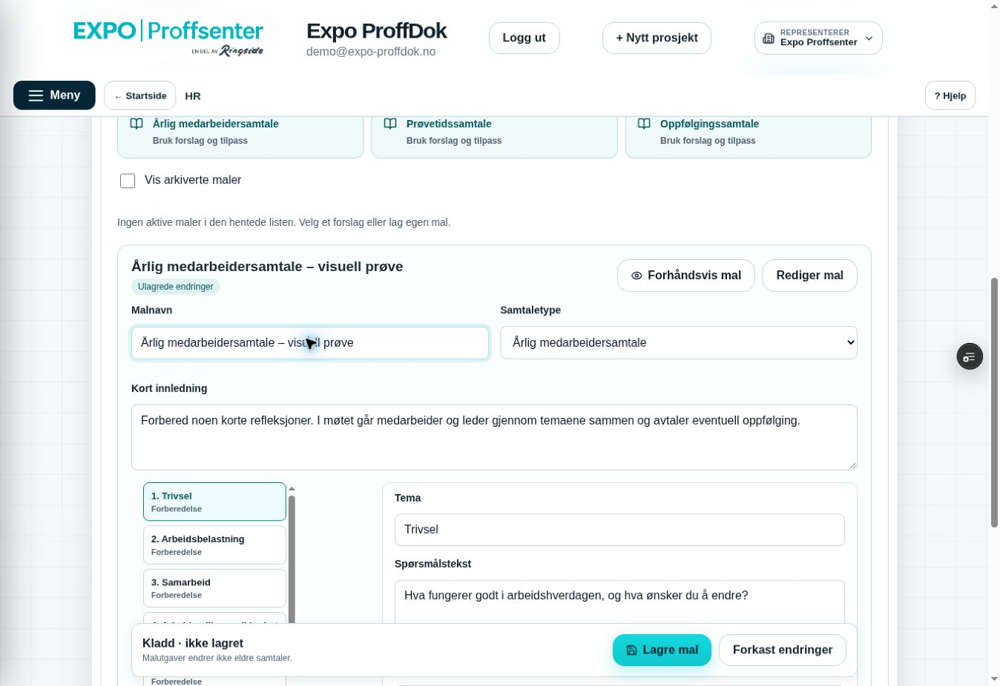

# Samtalemaler – første innholdsdel uten personreferater

Miljømål **BEGGE**. Levering bare feature/Preview og Sandbox `ppvircenkjizeiqdxphj`, draft PR #216. Baseline remote `50a27601ec716bfb261ed306b1410259466a79bd`, tree `0921d644890d7cbe70739c30195884322f8f9445`; main `155f6c4ac01f126c1db0c65da385cfd9305587d5`. Lokal checkout har samme tree, annen historie. Publisering må bruke faktisk remote parent og forventet-head lease, force=false.

## Scope før implementering

Neste konkrete scope er firmaadmins malbygger for medarbeidersamtale. Tre generelle forslag (årlig, prøvetid og oppfølging), egne spørsmål, forberedelse/felles møte, synlig lokal kladd og lagring, immutable utgaver, historikk og arkivering. Dette er generelle firmamaler; ingen medarbeiderkobling, ansattes svar, bekreftelser, fraværssak eller privat fil. Slik kan det avtalte samtalescopet få fremdrift mens H5-drifts-/restore-kravene fortsatt er uoppfylt.

Filer innen scope: nye `src/modules/hr/HrConversationTemplates.jsx`, `hrConversationTemplates.mjs`, `hrTemplateSession.mjs` og `hrTemplates.css`; ett administrativt inngangspunkt i `HrModule.jsx`; eksisterende HR-kapittel i Hjelp; én ny migrasjon med to private tabeller og avgrensede RPC-er. Nye kritiske/React/SQL-prøver og statusdokumenter. Eksisterende HR-register, privat innholdsport, purge-/fil-/manifestfunksjoner og org-kart skal ikke endres. Globale menyer, main.jsx, Sales, øvrige moduler, e-post, Production og main/demo er utenfor scope.

## Kontrakt og planlagt bevis

- Bare firmaadmin i aktivt firma med fersk HR-modul og aktivert register får lese/endre maler. HR-/KS-/systemrolle alene gir ingen malforvaltning eller personlig HR-innsyn.
- Generelt malinnhold har streng whitelist, typer og grenser; ingen svar-/medarbeider-/filfelt. Frie spørsmål kan ikke automatisk garanteres å være uten personopplysninger; brukerflaten ber om generelle spørsmål og ingen personreferater.
- Maks 50 maler, 24 spørsmål per mal. Maloversikt og utgavehistorikk pagineres. Hver endring får ny utgave; arkivering endrer ikke gamle utgaver. Senere samtaler skal bruke en fast malutgave, ikke lese den nyeste malen dynamisk.
- Forventet revisjon avviser samtidige/endret-data-skriv. Ny mal får klientgenerert UUID før første skriv, så et tapt svar ikke inviterer til duplikatoppretting.
- Ulagret kladd er bare midlertidig, firma-/aktørbundet minne; vises først etter ny autorisert lesing. Ingen lokal/offline lagring. Fokus-/arbeidsprofil-/tilgangsbytte rydder hentede data og avviser sene svar. Endret serverutgave sperrer lagring til eksplisitt valg.
- Tester: admin/leder/egen/ekstra leser/KS/system/annen firma/inaktiv/tilbakekalling, SQL/JSON-grenser og sen ugyldig spørsmålsrad med full rollback, immutable historikk/CAS/lost response/arkiv/paging, faktiske nye og berørte React-flyter, full critical/build, eksakt Preview og faktisk innlogget visuell prøve der tilgjengelig. Ingen samme B/C-/PDF-/ZIP-omtest.

## Faktisk miljøkontroll før endring

Sandbox: 1 firma, 1 medarbeider, 0 artifacts/filer/receipts, content_enabled=false og restore_quarantined=true. Eksisterende oppføring beholdes. Supabase-listen viser bare Production som hovedprosjekt og én aktiv Sandbox-branch; ingen separat isolert restore-ressurs er etablert. Det tidligere 403-avslaget på Blob-oppretting er ikke gjentatt. Eksisterende Vercel-lager-ID er ikke kjent, og tilgjengelig connector har ingen lagerlistefunksjon; ingen uavhengig varig lagringsløsning er dermed bevist. Disse begrensningene oppheves ikke av malbyggeren.

Supabase changelog/docs kontrollert 10. oktober; nyeste relevante breaking-change om Postgres minor-versjoner gjelder ltree/btree_gist/legacy pgcrypto, som denne migrasjonen ikke bruker. Private schema-/function-ACL-reglene følger eksisterende ferske HR-context. Ingen juridiske frister eller nye leverandørbiblioteker implementeres.

Utviklerbevis og publisering føres her etter kontroll. Privat kontakt/samtale/fravær forblir stengt til uavhengig manifest/automatisk ack og full isolert Supabase database-/Storage-restore er bevist.

## Faktiske utviklerbevis før publisering

- **91 faktiske rollback Sandbox-assertions PASS**, tilsvarende **91 PostgreSQL/PGlite PASS** med syntetisk plattformadapter. Testen lager bare egne tilfeldige firma/identiteter/maler i én transaksjon og ruller alt tilbake. Ingen aktive testdata endres. Første live prøve traff eksisterende profile-guard ved endring av egen syntetisk profil; prøvens aktørskifte ble korrigert etter H1-kontrakten. Ingen guard svekket. Ikke omtalt som en produktfeil.
- Faktiske React-komponenter PASS: forslag/redigering/flytt/forhåndsvisning skriver ikke; Lagre mal og endelig readback; ekte JSONB-nøkkelrekkefølge; dirty bytte/Forkast; fokus og remount etter autorisasjon; gamle utgaver/gjenbruk; arkivering/gjenåpning; simulert annen skriver/CAS/eksplisitt rebase; tapt opprettelsessvar uten duplikat; sene svar/unmount/revoke/admin-only. Transporten er syntetisk. Berørt HR-register, KS-meny og samlet Hjelp-React PASS.
- Permanent critical og full Sandbox build PASS. Ingen appdependency/lockfil endret. React-review: ubetingede hooks, cleanup/epoch, funksjonelle oppdateringer for delt liste, avgrenset minne, ingen offline/personpayload, etiketter/fokus/44px og mobilgrid. Ingen subagenter brukt.
- Sandbox migrasjon **20261010005833**, CLI **20261010004928**. Alle fem nye funksjoners MD5-er samsvarer med kildekroppene; owner postgres/tomt search_path. Bare fire offentlig eksponerte RPC-er har authenticated EXECUTE; privat validator, anon og service_role har ingen EXECUTE.
- Advisor gir forventede RLS-no-policy-INFO for to private tabeller uten direkte grants og fire authenticated-definer-WARN for ferskt admin-gated RPC. Ingen rå tabelladgang eller anon-grant. [Definer-varsel og hensikt](https://supabase.com/docs/guides/database/database-linter?lint=0029_authenticated_security_definer_function_executable), [privat policyfri RLS](https://supabase.com/docs/guides/database/database-linter?lint=0008_rls_enabled_no_policy). Ingen tilgangsvern endret for å fjerne disse varsler.
- Før/etter: 1 HR-firma, 1 medarbeider, 0 aktive maler/utgaver/artifacts/filer/receipts, ingen QA-firmaer. content_enabled=false / restore_quarantined=true. Eksisterende testdata beholdes.

Grønn lokal build er ikke CI-/Preview-/browserbevis. Nøyaktig publiseringskontroll føres nedenfor etter utførelse.

## Faktisk innlogget Preview og kodepublisering

**Faktisk mal-Preview-kontroll:** kode `70f12015b616e8e9b4c6e0efc06d82ab4e6df1ef`, Core Safety **38011669656 / jobb 114092844672 SUCCESS**, `dpl_6QTL7UM5H55ek25V7mrsqkEdyPys` READY med eksakt SHA/ref/prosjekt/fast alias. Direkte branch-env `EXPO_BACKEND_TARGET=sandbox`. Innlogget desktop: HR/admin, tre forslag, generisk kladd/redigering, tom forhåndsvisning, dirty bytte/Behold kladden, Oppdater maler med bevart kladd og Forkast PASS. Ingen testmal lagret. Ingen horisontal overflow; Lagre mal 44px. Lagret historikk/arkiv/CAS har SQL og React-bevis; mobil og separate samtidige browserøkter gjenstår.

Kodecommit er publisert på faktisk remote parent `50a27601ec716bfb261ed306b1410259466a79bd` med forventet head og force=false. Alle 21 blob-SHA-er er kontrollert mot lokalt Git-innhold; tree `d8126519e24b96f66f824e89f8273cb4df0ca2d1` er identisk. CI-jobben har grønn scope guard og full critical build. Fast Preview er [verifisert i samme innloggede økt](https://expo-proffdok-git-feat-kshms-foundation-ringside.vercel.app/?progressTest=safe). Ingen credentials/JWT lest eller ny innlogging nødvendig. Main fortsatt `155f6c4ac01f126c1db0c65da385cfd9305587d5`, PR #216 draft/åpen/umerget.

Originalt skjermbilde viser ulagringsstatus, redigering og sticky Lagre/Forkast. Etter bildet ble kladden forkastet; ny read-only Sandbox-kontroll viser **0 maler/0 utgaver, 1 firma/1 medarbeider**. Dette browserbeviset dekker generisk malutkast, ikke serverlagret brukerhistorikk eller mobil.

Sluttbevis-commiten endrer bare statusdokumenter og lagrer dette originale JPEG-bildet. Ingen ny appkode eller SQL. Endelig head/CI/Preview kontrolleres etter publisering og føres i PR #216; ingen main/demo/Production-release.
