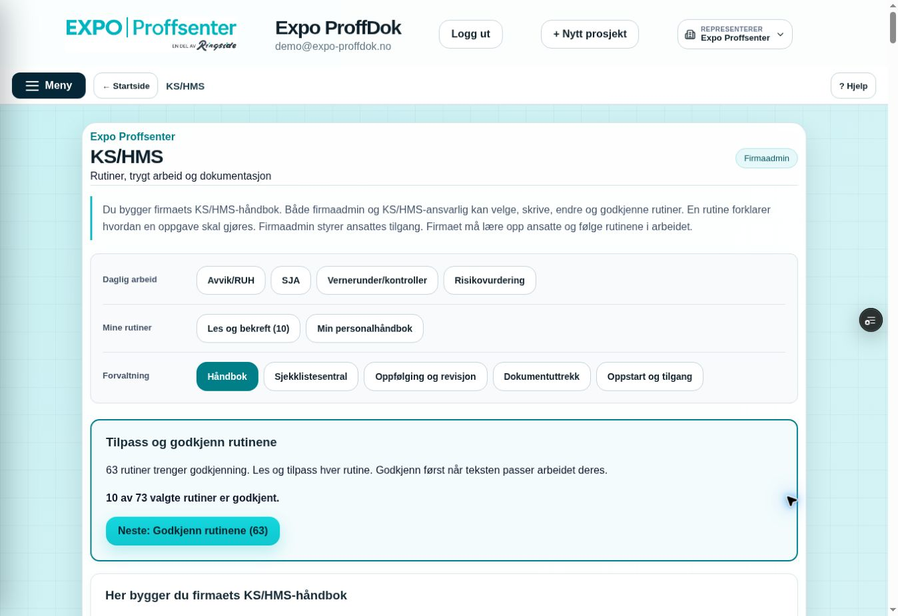
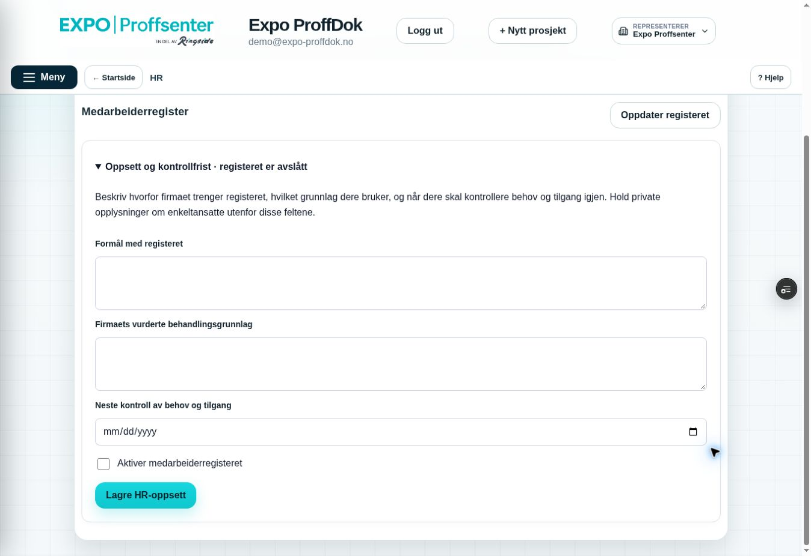

# HR-register og KS/HMS-meny – H2, 9. oktober 2026

Miljømål **BEGGE**, bare feature/Preview og Sandbox `ppvircenkjizeiqdxphj`. Remote feature før endringer: `a8c43aa28df55140402ba6ac46301e15b517e1e8`, tree `64c74f22753af8c5ba88c26a80decd57cc3f0933`; faktisk main `155f6c4ac01f126c1db0c65da385cfd9305587d5`. Lokal historikk er annerledes, men baseline tree er identisk. Draft PR #216 beholdes.

## Scope og kontrakt før kode

Kenneth ba om videreføring, egen skynettprøve og smartere KS/HMS-meny/layout. Scope: egne HR-komponenter/klient, smal `get_hr_context`-RPC og HR-relasjonsindekser; HR-integrasjon i main.jsx og global tab-fabrikk; KS/HMS-menymodell/komponent, lokal modulheader og CSS; relevante kritiske/React/SQL-prøver, Hjelp og prosjektstatus. Sales, auth/bootstrap, Startside, prosjekt-/portal-/rapportflyt, KS/HMS-RPC-er/Storage og e-postworker endres ikke av H2.

HR er et **administrativt register**, uten referat, fravær, samtaler, versjoner, private filer eller eksport. Tidligere H1-tilgang/sletting beholdes. Full gjenopptakbar purge av fremtidig innhold/versjoner/kladder/filbytes/eksporter og restore må leveres før sensitivt innhold åpnes. Ingen firma aktiveres av migrasjonen eller utviklerens live browserprøve.

| KS/HMS-gruppe | Rekkefølge |
|---|---|
| Daglig arbeid | Avvik/RUH → SJA → Vernerunder/kontroller → Risikovurdering |
| Mine rutiner | Les og bekreft (antall) → Min personalhåndbok |
| Forvaltning, bare ledelsen | Håndbok → Sjekklistesentral → Oppfølging og revisjon → Dokumentuttrekk → Oppstart og tilgang |

Alle eksisterende screen-ID-er, førsteinngang etter rolle/oppstart, e-post-/oppgavesnarveier og monterte arbeidsflater beholdes. Ingen ny automatisk navigasjon eller ommount ved et KS/HMS-menyvalg. Mobil har to knappekolonner med tekstbryting; grupper og aktiv knapp er navngitt for skjermleser og tastatur.

## HR-brukerflaten

- Eget **HR**-hovedvalg fra fersk serverkontroll, uavhengig av KS/HMS/systemadmin. Firmaadmin kan åpne oppsett før aktivering; andre aktive interne brukere får inngang når firmaets register er aktivt. Ingen HR-inngang i prosjekt/kunde/UE/portal.
- Firmaadmin beskriver formål, vurdert behandlingsgrunnlag og kontrollfrist, og aktiverer/avslår registeret uttrykkelig. Ingen automatisk juridisk konklusjon eller samtale/fraværsinnhold.
- Aktiv appbruker + valgfri registrert nærmeste leder. Ekstra leser krever valgt bruker og begrunnelse. Tildelingen viser granter, tidspunkt og grunn. Ved lederbytte med gammel særskilt rett kreves eget avkrysningsvalg for å fjerne den.
- Register og brukervalg hentes i sider på 100; flere hentes uttrykkelig. Manglende bruker i første side vises som uavklart, aldri som et oppdiktet navn. Ikke lasttestet for større utrulling.
- Medarbeideren får **Mine oppfølginger** og autoriserte registerrader. Tom tilstand forklarer hvem som registrerer leder og hva som kommer senere. Ingen virkningsløse samtale-/sykefraværsknapper.
- Åpning bruker H1-klientens doble ferske detaljkontroll. Før endring kontrolleres detaljen igjen; forventet revisjon beskytter samtidig lagring. Avslutning krever synlig bekreftelse av faktisk avsluttet arbeidsforhold/sletting; vanlig appkonto avsluttes ikke. Bekreftet serverhandling meldes lagret også hvis etterfølgende registerhenting feiler.
- HR lagres ikke i localStorage, sessionStorage eller IndexedDB. Bakgrunn/fokus, bruker/firma/tilgang og unmount rydder visning og forkaster sene svar. Seksti sekunders registerkontroll bevarer uendret lokal leder-/leserredigering; endret revisjon vises eksplisitt. Administrativt ulagret oppsett skal lagres før HR forlates. Dette endrer ikke eksisterende KS/HMS/Sales-kladdsikring.

## Sikkerhetsprøver bestemt før endring og utført

- Permanent faktisk HR-hook og klient: firma-/bruker-/rollebytte, inaktiv/avsluttet person, KS/systemadmin uten HR-rett, fremmed firma, offline, bakgrunn/fokus, sent svar og dispose. `get_hr_context` returnerer bare firmabundet menymetadata og `content_enabled=false`, aldri medarbeidere/innhold.
- **16 faktiske Sandbox-assertions PASS** i `hr-navigation-sandbox-check.sql`: admin før aktivering, fire ordinære/KS/systemroller uten bypass, aktivering, eget firma, fratredelse, deaktivert/ekstern profil, tom aktør, anon/service og tomt search_path. Alle syntetiske brukere/firma/HR-data rullet tilbake. Testen setter SQL request-claims bare i rollback-transaksjonen; dette er ikke browserinnlogging.
- Faktisk **React/Vite/JSDOM PASS**: menygupper/aktiv knapp, oppsett, brukerpaging, oppretting, lederbytte med eksplisitt fjerning av gammel leser, ekstra leser/revoke, fersk revisjonskonflikt, fokusrydding, sluttbekreftelse, commit/readback-feil, sent unmount og medarbeider-/revokeringsvisning. Syntetisk transport; ingen virkelige HR-personalsaker eller filbytes.
- Berørt eksisterende React-kildeforslagsflyt PASS med håndbokutkast, feil/retry og publisert historikk. Full critical Sandbox-build PASS. Tre strukturelle menykontroller følger nå faktisk menymodell og koblingen i hovedkomponenten; eksisterende krav til faner/roller/monterte utkast er beholdt, ikke svekket.
- Live RPC-kropp/ACL lest tilbake: tomt search_path, authenticated-only EXECUTE, H1 `require_actor` uten rollemetadata/supportbypass. Fem FK-indekser fra HR-advisor er lagt til og lest tilbake; ingen endring av rettigheter. Live Sandbox-migrasjoner: `20261009190543 hr_navigation_context` og `20261009190749 hr_relationship_indexes`. Sluttkontroll: 0 HR-firma/medarbeidere/lesere/slettesperrer, 0 QA-firma/brukere, 0 HR-objekter, worker enabled=false. Ny performance-advisor har ingen HR-FK-gap; INFO om ubrukte nye indekser er forventet for tomt register.
- Security-advisorens fire private RLS-tabeller uten policy og authenticated SECURITY DEFINER-varsel er tilsiktet: direkte tabelladgang stengt, eksplisitt aktørkontroll i RPC. [RLS-advisor](https://supabase.com/docs/guides/database/database-linter?lint=0008_rls_enabled_no_policy) · [RPC-advisor](https://supabase.com/docs/guides/database/database-linter?lint=0029_authenticated_security_definer_function_executable) · [FK-indekser](https://supabase.com/docs/guides/database/database-linter?lint=0001_unindexed_foreign_keys).

## Live Preview og rester

Skynettleseren fungerer igjen med én eksisterende innlogget fane. Før endring: gammel åpen appversjon feilet ved lazy import av en utgått fil; én ordinær reload hentet gjeldende app, innloggingen var beholdt og KS/HMS åpnet. Ingen auth-omgåelse eller reset-løkke. Etter publisering er ny gruppert meny, HR-oppsett og scroll-rettingen kontrollert i samme fane. Dette er nytt faktisk innlogget desktopbevis for H2; se detaljene og skjermbildene nedenfor. Eksakt siste publiserte SHA/CI/READY Preview føres i draft PR #216.

Faktisk mobilkamera/mobile viewport, HR-register med ekte personer, separate samtidige browserøkter, private filbytes, restore og isolert belastningstest er egne bevisgap. Tidligere Kenneth TEST OK og B/C/PDF/ZIP-bevis beholdes. Testmailen er fortsatt ikke sendt; ingen generell e-postaktivering, main/demo-merge eller Production-release.

Kort valgfri ny gjennomgang: KS/HMS viser tre grupper og åpner samme faner; HR viser firmaadmins registeroppsett. **Ikke aktiver eller legg til virkelige medarbeidere bare for å prøve menyen.** Neste avgrensede utviklingsscope er privat fil-/full slettekontrakt før samtaler og sykefraværsinnhold.

### Første faktisk innloggede H2-prøve og konkret layoutfunn

Funksjons-SHA `857f07559fa12616e65b15d537784fec4bbc1a29`, tree `05bacb1a9f566d35d147acb30623b8afc7b55305`: PR Core Safety `37978698101`, jobb `113983413831` SUCCESS inkludert scope/full build. Vercel `dpl_CkPydNTE5ttGrYkyYBDysLPDRozD` READY Preview, eksakt feature-SHA/fast alias og branch-env Sandbox. Innlogging beholdt etter reload. Hovedmeny → HR åpner firmaadmins tomme oppsett med avslått register, alle felter/knapper tilgjengelige og ingen horisontal overflow. Ingen aktivering eller registrering av virkelige personer.

Ved scrolling ble en reell layoutfeil funnet: appens globale header-regel ga HR-modulens egen overskrift `position:sticky;top:0;z-index:10`, over app-logoen. Lokal CSS for **bare HR-/KS/HMS-moduloverskrifter** setter static/auto; appens toppfelt endres ikke. Permanent regresjonsvern lagt til. Full critical Sandbox-build PASS etter rettingen. Endelig innlogget scroll-/menykontroll og skjermbilder er dokumentert nedenfor på den oppdaterte Preview-versjonen.

### Endelig faktisk desktopkontroll etter layoutrettingen

Testet kode-SHA **`e866aeefae45501231d70d4e0ef618b42a8036f6`**, tree **`f45a3962264b3a0388e92f87cb1564a4292c6135`**. [PR Core Safety 37979299893](https://github.com/ExpoProffsenter/expo-proffdok/actions/runs/37979299893) SUCCESS; jobb `113985433161` har grønn scope isolation og full critical build. Vercel `dpl_96qtHA6xN7ispqvQ3fuRih7dCfjd` READY Preview, eksakt SHA/feature-ref/fast alias. Direkte branch-env `EXPO_BACKEND_TARGET=sandbox`. Faktisk main fortsatt `155f6c4ac01f126c1db0c65da385cfd9305587d5`, PR fortsatt draft.

Én eksisterende innlogget Skynett-fane, vanlig reload, ingen credentials/JWT eller auth-omgåelse. Faktisk Hovedmeny → HR åpner tomt adminoppsett med avslått register. Ingen felt lagret, firma aktivert, person registrert, leser tildelt eller arbeidsforhold avsluttet i browser. HR-overskriften har beregnet `position:static;z-index:auto`; ved faktisk scroll 284 px er dens topp −85 px og app-logoen fri. KS/HMS-overskriften har beregnet `position:static`; ved scroll 936 px er dens topp −737 px. Ingen horisontal overflow i noen av modulene ved denne desktopbredden.

Faktiske menyvalg kontrollert: **Avvik/RUH** åpner avvikssentralen; **Les og bekreft (10)** viser egne ventende rutiner; **Oppfølging og revisjon** viser kildeoppdateringer, medarbeideroppfølging og håndbokrevisjon; **SJA** viser eksisterende signert sak og ny-inngang. Tilbake til **Håndbok** er de eksisterende 73 rutinene / 10 godkjente / 63 ventende beholdt. Ingen nye registreringer, publiseringer, signeringer eller lesebekreftelser. De tre gruppenes etiketter, rekkefølge og aktiv knapp er sett i den faktiske publiserte appen.

Skjermbildene er originale viewport-opptak fra denne kodeversjonen. De dokumenterer desktopmeny og rettet HR-scroll, ikke mobilkamera, ekte private filer eller flere samtidige økter. Den etterfølgende sluttføringsleveransen endrer bare dokumentasjon/bevis; siste remote head og tilhørende CI/Preview dokumenteres i PR.

## Mottatt brukergodkjenning

Kenneth ga «test ok, hvor er hr» i denne dialogen etter H2-meny-/layoutleveransen 9. oktober. Dette registreres som TEST OK for prøvd meny/layout, ikke som bevis på utestet HR-innhold, filer, restore eller produksjonsgodkjenning. HR ligger i hovedmenyen. H3 viderefører brukerens «kjør» og samler senere alle KS/HMS-/HR-veiledninger i Hjelp.
