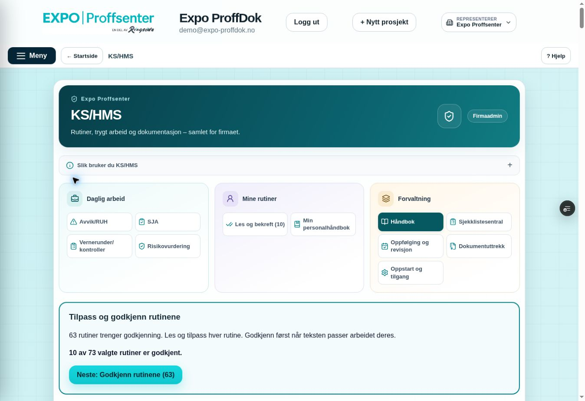
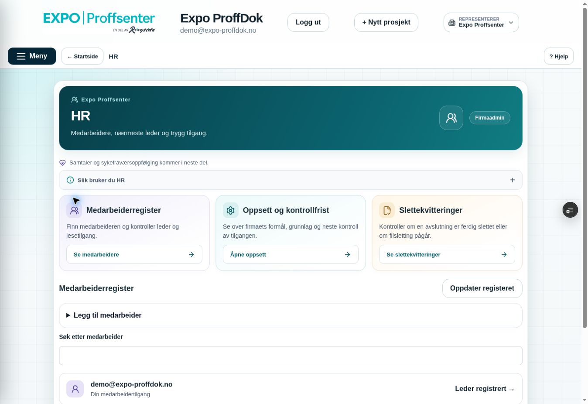

# KS/HMS og HR – samme visuelle retning som Min side, 10. oktober 2026

## Avklart scope før endring

Miljømål **BEGGE**, nå bare feature/Preview/Sandbox ppvircenkjizeiqdxphj. Faktisk remote feature **4e6a6710822b0171100be8459c180199ad4f6566**, tree **80ded9d1f204a41972fb242a0516ce0b3780be44**, main **155f6c4ac01f126c1db0c65da385cfd9305587d5** kontrollert før endring. Lokal historikk forskjellig, tree identisk; publisering på faktisk remote parent med expected-head lease. Draft PR #216.

Kenneth godkjente Min sides visuelle retning og ba om samme stil i KS/HMS og HR. [Varig designbeslutning og senere appvurdering](../architecture/UX_DIRECTION_20261010.md). Godkjenningen er Min side TEST OK, ikke bruker-PASS for de nye modulendringene.

Scope: ModuleHeading/moduleWorkspace.css, KshmsModule/KshmsNavigation/kshms.css, HrModule/hr.css, utvidet faktisk HR-/navigasjons-React og critical-hr-navigation, dette notatet, designbeslutningen og OVERSIKT/CONTINUITY/PLAN/QA/USER_TEST. Ingen main.jsx, globale menyer, tilgangshooks, RPC, SQL, Storage, e-post eller private innholdsporter endres. Ingen ny B/C/PDF/ZIP-omtest; tidligere tester og Kenneths TEST OK beholdes.

## Leveransen

Felles presentasjonskomponent gir statisk petrolfarget hero, eksplisitt hvit h2, firmanavn, ikon og eksisterende rolleetikett. Den tar bare visningsprops; ingen tilgangsavgjørelse. Personlig håndbok/HR inne i Min side beholder kompakt personlig topp og får ingen dobbel hero.

KS/HMS: samme rekkefølge **Daglig arbeid → Mine rutiner → Forvaltning** og samme skjerm-ID-er, rettigheter og lesetall. Tre kompakte kortgrupper, ikon på alle navigasjonsvalg og eksisterende valgt-status. Veiledningsavsnittet kan åpnes under **Slik bruker du KS/HMS**. Ingen skjema, lagring, påminnelse eller eksportlogikk endres.

HR: felles toppfelt, synlig melding om kommende samtale/fravær, åpnbart bruksavsnitt og rolletilpassede snarveier. Firmaadmin får register/oppsett/slettekvitteringer; leder får bare egne medarbeidere. Snarveiene fokuserer og ruller til eksisterende register/detaljer og åpner relevante details uten RPC-skriving. Medarbeiderlisten kommer før oppsettet. Slettekvitteringer har sann tomtilstand også før første avslutning; pending/complete/paging beholdes. Fersk kontroll og private gates uendret.

CSS er avgrenset til KS/HMS/HR og deres felles presentasjon. Mobilregler reduserer kortkolonner; min44px knapper, tekstbryting og synlig fokus. Faktisk mobil/kamera er ikke bevist av responsive kildekode.

## Relevante prøver

**Faktisk hr-register-react-check PASS** med syntetisk transport: hero/tre adminkort, register-snarveiens fokus, oppsett-snarveiens fokus, åpnet og ærlig tom slettekvittering, bare ett lederkort/ingen adminsnarveier, dekorativt ikon på hver eksisterende KS-navigasjonsknapp. Alle tidligere HR/Hjelp/meny/paging/leder/leser/revoke/revisjon/avslutning/pending-complete/fersk fokusretur/sene svar beholdt.

**kshms-source-updates-react-check PASS** på berørt faktisk foreldrekomponent: editor/kildesammenligning/utkast/feltbevaring/godkjenning/lesetildeling; syntetiske undermoduler i denne isolerte prøven. **personal-page-react-check PASS**: Min side/profil/kontakt/forslag/kladd/fokus og freshe gates. Permanent HR-navigation-critical og full **EXPO_BACKEND_TARGET=sandbox npm run build PASS**. git diff --check ren. Ingen live personer, oppsett eller rettigheter endret gjennom disse testene.

## Publisering og faktisk visuell kontroll

Eksakt publisert SHA, Core Safety, READY Preview og Sandbox-binding føres etter publisering. Innlogget browser-PASS påstås først etter faktisk kontroll av denne utgaven. Fast Preview: https://expo-proffdok-git-feat-kshms-foundation-ringside.vercel.app/?progressTest=safe

Relevant brukerprøve er utformingen under **Meny → KS/HMS** og **Meny → HR**, samt HRs tre snarveier. Ikke gjenta tidligere B/C-prøver uten konkret feil.

Privat HR fortsatt stengt; varig ekstern driftsbinding/ack og full isolert Supabase database-/Storage-restore gjenstår før åpning. Ingen Production, main/demo-merge eller e-postsending.

Første faktisk browservisning fant unødvendig høyde: HR-kort med ikon over tittel og store lukkede details skjøv medarbeiderlisten under skjermen. Konkret rettet til ikon/tittel på én rad, mindre lokal luft og kompakte lukkede sections; ny publisering og faktisk sluttkontroll følger. Ingen PASS påstås for første HR-registerplassering.

Faktisk KS/HMS-kontroll fant i tillegg uheldig linjebryting i to lange navigasjonsnavn ved desktopbredden. Justert lokal knappepadding/gap/skriftvekt for mer tekstplass uten å endre navn, ID-er, rekkefølge eller min44px høyde. Ny faktisk kontroll følger rettingen.

## Faktisk innlogget sluttkontroll og eksakt kode

Testet kode **427f0d2efb18de0f4806ca2cb0a2ed819cce89a0**, tree **83558075f93bf7a5b47ba7247c573c622f3f8896**. Core Safety **38000225285 SUCCESS**, jobb **114056229607**, scope guard og fullcritical/build grønne. Vercel **dpl_7qqUJk9xm3ChJsV5DQzwSp9Uqxun READY Preview**, eksakt SHA/feature-ref/prosjekt/fast alias. Direkte branch-env **EXPO_BACKEND_TARGET=sandbox** kontrollert. Faktisk remote parent/expected-head lease, alle blobs/tree kontrollert mot lokale Git-hasher; ingen blind push av lokal historikk.

**Faktisk Skynett-desktop PASS** på denne eksakte kodeutgaven, **1363×936**, eksisterende innlogget demokonto og én fane. Ordinær reload beholdt innloggingen. Både KS/HMS og HR har beregnet hvit **rgb(255,255,255)** h2 og **position:static** modulheader. Ingen horisontal overflyt (pageWidth1348). Originalbildene er visuelt kontrollert.

KS/HMS: tre kortgrupper i riktig rekkefølge, alle 11 navigasjonsvalg med ikon/tekst og minst44px høyde, valgt Håndbok tydelig og eksisterende neste handling synlig. Lange navn beholder hele ord; sammensatt navn får brudd ved skråstreken. «Slik bruker du KS/HMS» åpnet/lukket med full eksisterende veiledning. Avvik/RUH og Les og bekreft åpnet gjennom de nye knappene med riktig valgt-status/eksisterende innhold. Ingen registrering, godkjenning, arkivering eller bekreftelse utført.

HR: tre kort i én rad, ca. **349×176px**, eksisterende demomedarbeider fortsatt merket Din medarbeidertilgang/Leder registrert. Register kommer før oppsett, tre snarveier faktisk prøvd: register får fokus, oppsett åpnes/fokuseres, slettekvitteringer åpnes/fokuseres og viser sann tomtilstand. Eksisterende kontrollfrist **23.10.2026** bevart. Hvit overskrift og statisk header kontrollert også etter snarveiscrolling. Første arbeidsutgave hadde ca.1330px sidehøyde og registerstart983px; rettet utgave har ca.**1135px sidehøyde/registerstart864px**. Det er fortsatt litt vertikal scrolling; hele HR-siden er ikke erklært scrollfri. Responsive kildekode er ikke nytt mobil-/kamera-/flerkonto-bevis.

Ingen profil, HR-oppsett, person eller tilgang lagret/endrede i nettleseren. Ingen private filer, backendhandling, sletting eller mail. HR står igjen øverst med lukkede detaljer og meny, én fane. Ikkeadminbegrensning er bevist i faktisk React med syntetisk transport; ingen separat live lederkonto eller samtidige aktører påstås. Min side TEST OK fra Kenneth og tidligere B/C-/PDF-/ZIP-bevis beholdes.

To originale JPEG-er kopiert uendret til repoet:

| Fil | Byte | SHA-256 |
|---|---:|---|
| [kshms-workspace-verified-20261010.jpg](screenshots/kshms-workspace-verified-20261010.jpg) | 100042 | `c00b9910f929839c952d058cd8cfc8c37a7d42fecf39260585a03cba23e435c7` |
| [hr-workspace-verified-20261010.jpg](screenshots/hr-workspace-verified-20261010.jpg) | 96701 | `0ff9b659833ae0c29dc61e52b440d5e3848891beb5fa37e3900dac7c470516e8` |

Etterfølgende sluttcommit lagrer bare bevis/status og disse originalbildene; appkode/database uendret. Eksakt slutt-head/CI/Preview føres i draft PR #216. Main fortsatt **155f6c4ac01f126c1db0c65da385cfd9305587d5**. Ingen merge/Production, privat HR fortsatt stengt og autorisert one-shot-testmail ikke sendt.

## Kenneths godkjenning

10. oktober Oslo: «kjempefint, takk. kjør videre» mottatt som **TEST OK for levert KS/HMS-/HR-layout**. Tidligere Min side- og B/C-/PDF-/ZIP-TEST OK beholdes. Ingen merge-/Production-/e-postgodkjenning. Neste avgrensede arbeid er [H5a operator-adapter og gjenstående driftsbinding](HR_CLOUD_LEDGER_20261010.md), uten ny layoutomtest.
