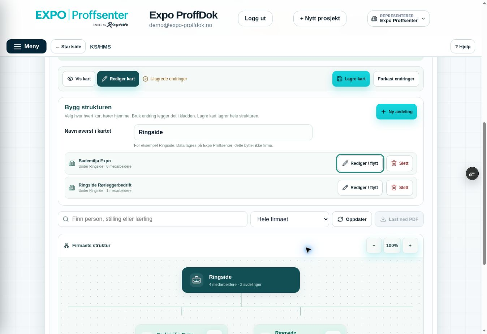
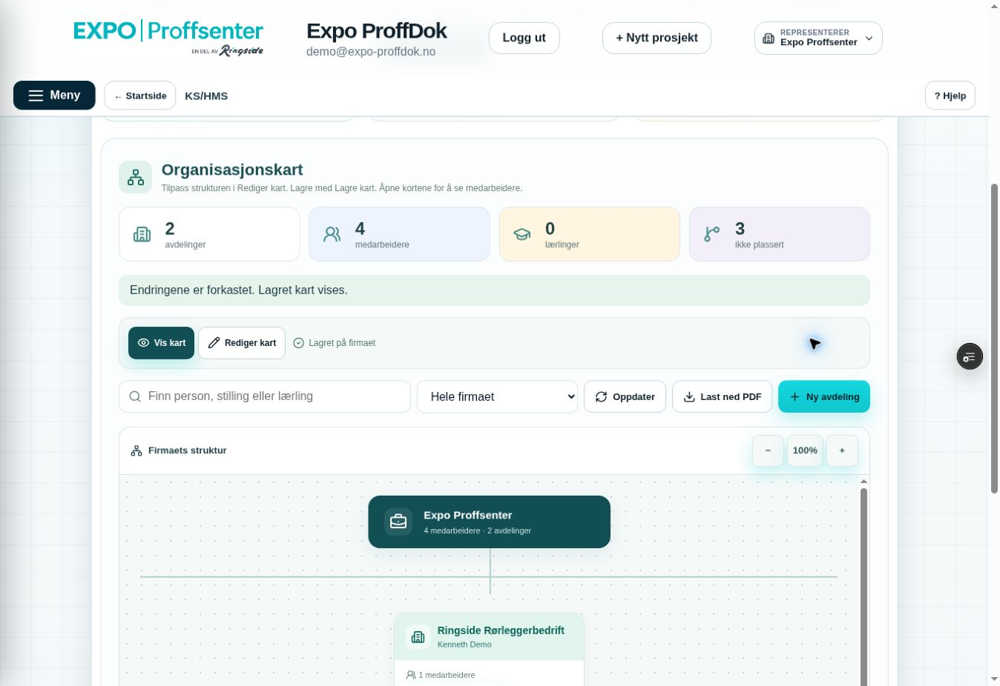

# Organisasjonskart O2 – tydelig redigering og samlet lagring

Miljømål BEGGE. Bare feature/Preview og Sandbox ppvircenkjizeiqdxphj. Draft PR #216; ingen main/demo/Production/e-post. Faktisk remote før endring a867e5bade801f8bf1d19866d1a0ce34f91e169b, tree e85ffeb8b7ea1345a2ed44b8ff29939ceb96ee35; main 155f6c4ac01f126c1db0c65da385cfd9305587d5. Lokal historikk avviker, tree identisk.

Kenneths faktiske bilde viser uklart lagringssted, skjulte redigeringsvalg og en utilsiktet underavdeling. Kravet er fritt toppnavn (Ringside), Styret som første nivå, deretter Ringside Rørleggerbedrift / Bademiljø Expo / Expo Proffsenter ved siden av hverandre, med egne ledere og personers frie stillinger. Dette er kart innen valgt firmatilgang, ingen ny konsern-/kryssfirmatilgang. Eksisterende teststruktur i feil firma flyttes/slettes ikke av agenten.

Scope før kode: src/modules/organization/{OrganizationChart.jsx,organization.css,orgModel.mjs,orgPdf.mjs}, avgrenset eksisterende KS-hjelpekapittel, én ny SQL-migrasjon for settings.chart_name, utvidet organization_state og egen admin-gated organization_save_layout. Eksisterende organization_command/HR-funksjoner/tilgangskjerne er fredet. Berørte org critical/React/PDF/local-SQL-prøver utvides, ny rollback SQL-prøve; status/PLAN/QA/USER_TEST/README oppdateres. Ingen globale menyer/main.jsx/andre moduler/offlinekjerne.

Kontrakt: Vis kart / Rediger kart. Firmaadmin kladder struktur/topptittel og lagrer samlet med Lagre kart. Dialogknappen Bruk endring legger bare endringen i kladden; tydelig Ulagrede endringer og eksport sperret frem til lagring/avbryt. Avdelingsleders etablerte avgrensede enkeltkortlagring beholdes. Medarbeiderplassering/lederkobling lagres separat gjennom eksisterende gated RPC, og er sperret mens strukturkladd finnes.

Ny RPC er firmaadmin-only, fersk KS/aktivt firma/aktør-kontroll før og etter samme HR-firma→company-lås, global CAS, strict whitelist/størrelse/100 enheter/12 nivåer/UUID/grenser, ingen privat HR-payload. Snapshot valideres fullstendig før atomisk upsert/flytting/sletting. Nye IDs må ikke tilhøre annet firma. Sletting krever eksplisitt boolean bekreftelse og nøyaktig liste av fjernede eksisterende IDs; medarbeidere flyttes til Ikke plassert, uten tap av stilling/nærmeste leder/HR/arbeidsforhold. Tomt kart krever samme bekreftelse. Tilgang fra slettede enheter forsvinner med enheten; ingen implicit HR-innsyn.

Kladd i komponent-/modulminne er bare strukturmetadata, firmabundet/aktørbundet, ingen payload-authority. Etter fokus/remount vises den først etter fersk autorisert state; konflikt kan ikke overskrives stille. Ingen localStorage/offline/credentials/signedURLs. Bevisst Forkast endringer fjerner kladden. PDF bruker lagret toppnavn og fersk kontroll før/etter motoren; kladd kan ikke eksporteres som lagret kart.

Relevante prøver før publisering: samlet lagring+readback, ekte rollback ved ugyldig sent element, stale/to-skriver CAS, feil firma/aktør/leder/systemadmin/KS-rolle/revoke/fratredelse, manager uten KS, manglende foreldre/loop/dybde/duplikat/foreign-ID/whitelist, eksplisitt hele-grenen-sletting med bevart person/HR-relasjon, tilbakeføring av kladd/fokus/remount/konflikt og bevisst avbryt, eksisterende head/medarbeider/HR-lederdialog uendret. Faktisk React og ny topptittel/Ringside-hierarki PDF. Skynett kun dokumentert når faktisk utført; gamle B/C/Kenneth TEST OK beholdes.

## Ny presisering: Ringside i Production

Kenneth har flere brukere med adgang til alle tre firmaene. Én appidentitet skal videreføres, ikke dupliserte kontoer. Før faktisk felles konsernkart kan åpnes i Production må firmaene knyttes uttrykkelig til ett Ringside-kart og samme person kunne plasseres i flere firmagrener. Dagens valgte-firma-RPC samler ikke brukere på tvers av firmaer. Dette er et nytt konkret flerfirma-scope før deres Production-kart, ikke en tillatelse til å utvide tilgang i denne O2-runden. Vanlige firmaer beholder ett firmakart. Felles navn/stilling/organisasjon gir aldri HR-innsyn på tvers. Ingen aktive firmatilganger eller data flyttes av agenten.

Utviklerreview fant et konkret konkurransehull i ny snapshot-upsert: UUID kan kollidere med et samtidig innskudd i annet firma etter første validering. Korrigerende migrasjon avgrenser ON CONFLICT selv til samme company_id og kontrollerer antall skrevne rader. Hele transaksjonen rulles tilbake ved kollisjon; intet fremmed firmas kort kan oppdateres. Første ny migrasjon var allerede anvendt i Sandbox, derfor beholdes den og egen korrigering brukes.

## Utviklerbevis

- **33 faktiske rollback Sandbox assertions PASS** for topptittel/Styret/tre peer-grener, admin-only/feil firma/roller, global CAS, sent ugyldig element uten delvis lagring, whitelist/UUID-kollisjon/parent/loop/13 nivåer/101 kort, bekreftet sletting og uendret HR/stilling/leder, gammelt enkeltkort med bevart topptittel, eksplisitt tomt kart og modulavslag. Alle egne fixtures rullet tilbake. Ingen browser-rollback-simulering påstås.
- Berørte tidligere **63 faktiske organisasjonsassertions PASS**. Samme 63+33 kjørt i fysisk PostgreSQL/PGlite med eksplisitt syntetisk plattformadapter. Ingen ny cloud-restore.
- Faktisk React PASS: Bruk endring skriver ingen RPC; Lagre kart lagrer full struktur/readback. Toppnavn, medarbeider-/eksportsperre ved kladd, strukturkladd over fokus og rights-remount etter fersk tilgang, konflikt som ikke kan overskrives, bevisst Forkast, gren-sletting og bevart leder, samt eksisterende avdelingsleder/medarbeider/revoke/sene svar/HR-bekreftelse PASS. Berørt HR/Hjelp/KS-meny React PASS, gamle 12+1 kapitler og rolleprøver beholdt.
- Faktisk jsPDF 2.5.1: **48 syntetiske personer, fem kort, fire A3-sider**. Ringside → Styret → tre likestilte virksomheter, egen lærlinggren. Alle sider rendret/visuelt kontrollert, alle 48 fulle navn og langt stillingsnavn tekstkontrollert, intet privat fixturefelt. Topptittel med i fingerprint/filnavn; fersk kontroll før/etter eksport inkl. endret toppnavn/revisjon/revoke/motorfeil PASS. [Eksakt syntetisk PDF](evidence/organization/synthetic-ringside-structure.pdf). Eldre O1-PDF/bevis beholdt separat.
- Ny og utvidet live RPC byteidentisk med original/korrigerende migrasjon. Tomt search_path, owner/authenticated-only, ingen anon/service_role. Faktisk Sandbox første migrasjon **20261010000241**, CLI **20261009235538**; korrektiv Sandbox **20261010000521** / CLI **20261010000503**. Ingen eksisterende HR-/org-enkeltkortfunksjon endret.
- Advisor: forventet authenticated-definer-advarsel for ferskt admin-gated privat-tabell-RPC, ingen ny org anon/search_path-feil. [Forklaring og avgrensning](https://supabase.com/docs/guides/database/database-linter?lint=0029_authenticated_security_definer_function_executable).
- Lesende Sandbox før/etter nye QA: **2 eksisterende org-kort / 1 plassering / 1 HR-medarbeider / 0 artifacts / 0 egne QA-firmaer**. Kenneths tester i feil firma beholdt; ingen aktiv struktur/firmatilgang/HR-person endret av agenten. Ingen mail sendt.

## Kort ny brukerprøve

1. KS/HMS → Organisasjonskart → **Rediger kart**. Endre **Navn øverst i kartet** og et kort via **Rediger / flytt**. **Bruk endring** viser Ulagrede endringer. **Lagre kart** skal vise Kartet er lagret og Vis kart.
2. **Rediger kart → Slett** viser berørte kort/medarbeidere. **Slett fra kladden** kladder slettingen; **Forkast endringer** lar lagret struktur stå. Lagre kart fullfører bare når du ønsker slettingen.
3. Kort som skal stå ved siden av hverandre får samme **Plasser under**, for eksempel Styret. Etter lagring kan medarbeidere plasseres separat med **Lagre plassering**, og **Last ned PDF** gir lagret struktur.

## Faktisk innlogget Preview-kontroll

Kode **512860dcfd8e2753789b97790e682a8003b10de9**, tree **fd6f9d9138ff875f7a9ae0469ab036da6f670f13**. PR Core Safety **38007754728 SUCCESS**, jobb **114080388321 SUCCESS**, scope guard og full critical build grønne. **dpl_3Z5PxtjxnXpi9P6geUP1iJuiKUSq READY Preview**, eksakt SHA/branch/prosjekt og fast alias. Direkte branch-env **EXPO_BACKEND_TARGET=sandbox**, target preview. Main ferskt uendret **155f6c4ac01f126c1db0c65da385cfd9305587d5**, PR #216 draft/unmerged. Ingen Production.

Faktisk innlogget Skynett, demo@expo-proffdok.no / Expo Proffsenter, én fane og lukket popup. Rediger kart viser Lagre kart (disabled uten endring), Forkast, toppnavn og synlige Rediger/flytt/Slett. Endret toppnavn og flyttet Bademiljø Expo til samme forelder som Ringside Rørleggerbedrift **bare i lokal kladd**: Ulagrede endringer, Lagre kart enabled, PDF disabled, peer-kort ved siden av hverandre. Dialogens første navnefelt får fokus. F6/Escape beholdt kladd og aktiv redigering. Slett-dialog forklarte ett berørt kort/én person; Slett fra kladden viste én avdeling/firetallet Ikke plassert. Forkast gjenopprettet eksakt tidligere to kort/én plassering/tre ikke plassert og Expo Proffsenter-toppen. Ingen browser-RPC med strukturskriving eller sletting, ingen endring i faktisk firmatilgang/HR/leder; live lagring/rollback dekkes av SQL, ikke ny aktiv browser-lagring.

Lagre kart/Forkast var 44 px høye og begge synlige samtidig med kompakt kortliste, viewport **1363×936**, sidebredde **1348** (ingen horisontal sidescroll). Noe vertikal scrolling og egen kartscroll er fortsatt nødvendig. Faktisk PDF lastet ned etter Forkast: **to A3-sider**, begge tekstkontrollert og rendret/visuelt kontrollert. Alle fire demonavn, faktisk gammel parent-relasjon og uendrede plasseringer med. Den er lokal QA; den syntetiske Ringside-PDFen er repo-bevis. Mobil, Windows screenshotverktøy, separate samtidige browserøkter og faktisk lagret tre-firma-kart er ikke påstått.

Originale skjermbilder, ingen rekonstruksjon:

Full lokal Sandbox critical/build PASS og scope guard/diff-check grønne før kodepublisering. Lokal historie avviker, alle 21 kodepubliseringsblobs og hele remote tree kontrollert identiske; force=false og forventet-head lease. Etterfølgende dokumentasjons-head/CI/READY føres i draft PR #216. Tidligere TEST OK og B/C-bevis beholdt.
