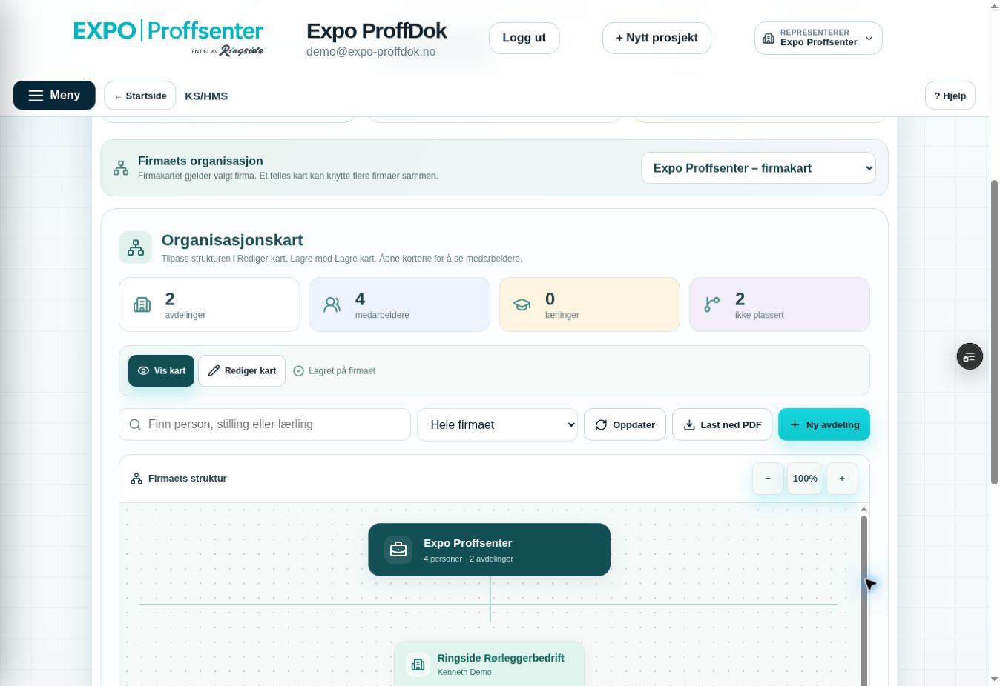

# O3 – felles organisasjonskart og én konto i flere firmaer

Miljømål BEGGE; bare feature/Preview og Sandbox ppvircenkjizeiqdxphj. Autorisert «ok kjør» etter O2. Remote bd4fde6cca608f6a14240807ad451b162e13b0a7/tree62c2c62c5447645f914cc9a46e7d2f5b5112b2b7 verifisert mot ren lokal tree; main155f6c4ac01f126c1db0c65da385cfd9305587d5 uendret, draft PR216. Ingen Production/main/demo/e-post.

Scope før kode: organization/{OrganizationChart.jsx,OrganizationGroups.jsx,orgModel.mjs,organization.css,orgPdf.mjs}; bare eksisterende organisasjonskapittel i helpToolsCore. Ny privat group-migrasjon/egne RPC-er, ingen endring i gamle org-/HR-/tilgangsfunksjoner eller aktive firmadata. Permanent org-check og berørte React/PDF/SQL utvides uten å fjerne gamle assertions; egne group SQL-/React-bevis. Status/PLAN/QA/USER_TEST/README. Ingen global meny/bootstrap/Sales.

Felles kart er separat fra eksisterende firmakart. Opprett navn og 2–10 firmaer; firmautvalg bare egne aktive KS-firmaer der aktøren er firmaadmin. Alle koblinger krever samme aktørs firmaadmin+KS i alle firmaene, kontrollert før og etter ordnede firma-låser. Automatisk Styret og en peer-gren per valgt firma. Firmaene er fast tilknyttet i denne første versjonen; strukturen og toppnavnet kan endres, hele felleskartet kan slettes med uttrykkelig bekreftelse. Firmaets brukere/opprinnelige kart/HR endres aldri av kartkobling eller sletting.

Hele felleskartet/listing/eksport krever fersk KS i ALLE koblede firmaer og aktiv valgt firmakontekst blant disse. Redigering krever firmaadmin i ALLE. Ingen system-/KS-ansvarlig bypass. Bruker med bare ett firma beholder eget firmakart; ingen navn fra utilgjengelige firmaer returneres. Gruppeplassering er (kart,firma,bruker), samme auth-identitet kan dermed ha forskjellig stilling/rolle i tre firmagrener. Aktivt medlemskap og avsluttet arbeidsforhold leses ferskt ved hver handling. Gruppeledere er bare kartmetadata: intet HR-lederbytte/innsyn/grant.

Strukturlagring har CAS, strict whitelist, 100kort/12nivåer, validering av firmagrense/foreldre/loop/UUID og eksplisitt eksakt fjerningsliste. Plassering krever aktiv person i eksplisitt firma og kort i samme firmagren. Globale fremmede UUID-er kan aldri oppdateres via UPSERT. Opprettelse/sletting trenger eksplisitt bekreftelse. private tables RLS/no direct ACL; public RPC authenticated-only/search_path=''; ingen anon/service_role. Bound 500 firmapersoner, maksimum20 tilgjengelige kart, fresh fingerprint inkluderer group/firmaer/medlemmer.

Kladd beholdes i volatile aktør/firma/kart-bundet minne over fokus/remount, vises bare etter fersk lesing. Konflikt låser lagring, sene svar og avslått tilgang rydder data/dialog/eksport. Bevisst kartbytte sperres ved kladd og forkaster ikke stille. Felles PDF viser firma ved personen og fullt navn/stilling; fersk kontroll før/etter motoren. Ingen private kontakter/fravær/HR-uttrekk.

Før publisering: faktiske PostgreSQL og Sandbox rollback-prøver for tre firmaer/samme bruker tre roller/firmaadmin-all/KS-all/ett utilgjengelig firma/revoke/firmaavslag/fratredelse/stale/to-skriver/foreignID/invalidlate/tree/firmagrense/egen sletting/HR urørt; ekte React for oppretting/kartvalg/gjenbruk gammel editor/kladd/fokus/revoke/late/placering; gammel enkeltfirma-flyt beholdt. PDF render/tekst/visuelt på syntetisk tre-firma-kart. Skynett først på eksakt SHA/READY/Sandbox, ingen aktive data endres. Kenneths TEST OK/B/C-bevis beholdt.

## Bruk av felles kart

1. Åpne **KS/HMS → Mine rutiner → Organisasjonskart**.
2. **Nytt felles kart** vises når du har firmaadmin og KS/HMS i minst to firmaer. Velg navn, for eksempel Ringside, og de tre aktuelle firmaene. Bekreft og velg **Opprett felles kart**.
3. **Velg kart** bytter mellom valgt firmas vanlige kart og tilgjengelige felleskart. Styret og én gren per firma opprettes automatisk. Bruk **Rediger kart**, **Rediger / flytt**, stillinger og egne underavdelinger; velg **Lagre kart** for strukturen.
4. Personen vises én gang per firma med firmaetikett. Velg riktig firmaoppføring, stilling og kort i samme firmagren. En konto kan være leder i ett firma og ansatt i et annet. Kartleder er bare en etikett i felleskartet, ikke HR-leder eller ekstra redigeringstilgang.
5. **Last ned PDF** eksporterer det lagrede kartet for manuell videresending. PDF sperres ved ulagret struktur. **Slett felles kart** sletter bare dette kartet etter tydelig bekreftelse.

Disse stegene beskriver de faktiske knappene. Dette krever ingen nye brukerkontoer for personer som allerede tilhører firmaene. Production-kartet bygges først ved senere autorisert Production-release. Vanlige kunder kan fortsette med firmakartet. Nye medlemmer/invitasjoner og betalt firmaavtale håndteres i eksisterende tilgangsadministrasjon; kartet setter aldri rettigheter.

## Utviklerbevis før publisering

- Faktisk Sandbox rollback-SQL: **64 assertions PASS**, egne fire syntetiske firmaer og auth-identiteter; ingen testrester. Oppretting/listing/all-KS/all-admin, samme konto i tre roller, branchbinding, read-only/partial/systemadmin-negative, tilbakekalling/fratredelse/firmaavslag, stale CAS/to-skriver, foreign UUID, strenge typer/nøkler/100kort/12nivåer, ugyldig sen rad/atomic rollback, kartleder uten global tilgang og eksplisitt gruppe-/kort-sletting med HR/firmakart urørt.
- Fysisk PostgreSQL/PGlite: **63 gamle +33 O2 +64 O3 PASS**, faktisk DDL/RLS/ACL og samme rollback-scenarioer, uttrykkelig syntetisk plattformadapter. Live O1/O2-bevis beholdes fra tidligere runder.
- Faktisk React/jsdom: nye oppretting/bekreftelse/firmautvalg/kartvalg, samme konto i tre firmarader, bare egen firmas plassering/no HR-payload, lagring/readback, kladd sperrer kartbytte, fokus/remount, forkast og tilbakekalt gruppetilgang PASS. Gamle organisasjons- og berørte HR/meny/Hjelp-prøver beholdt og PASS. Transporten er syntetisk, ikke separate innloggede browserkontoer.
- Full critical Sandbox build PASS; separat Vite-build bekrefter Sandbox-only binding, 2352 moduler og ferdige bundler med ny felleskart-UI. React-sjekkliste: faste hook-rekkefølger, avgrenset kontekst/kart-identitet, avregistrerte events og generation-vern mot sene svar, ingen nye dependencies/offline-autorisasjon eller global JSX/endret meny.
- Faktisk jsPDF **2.5.1**, **49 syntetiske personer /51 firmaplasseringer /fire A3-sider**. Ringside → Styret → tre sideordnede firmaer, samme leder i tre roller, egne arbeidere/lærlinger. Alle fire sider tekst-/visuelt kontrollert; firmaetiketter/fullt navn/stilling bevart, ingen private felt. [Syntetisk felleskart-PDF](evidence/organization/synthetic-group-chart.pdf). Fersk firma-/kart-fingerprint før/etter motoren avviser endring/revoke. Gammel fire-siders enkeltfirma-PDF og eksportvern beholdt.
- Sandbox faktisk migrasjon **20261010002710**, CLI **20261010001921**. Alle ni nye funksjonskropper MD5-identiske med migrasjonen, SECURITY DEFINER/empty search_path, fem private helpers owner-only og fire nye RPC authenticated-only. Fire private tabeller har RLS og ingen direkte PUBLIC/anon/authenticated/service_role-grants. Ingen gamle SQL-/HR-funksjoner eller triggers endret.
- Live security-advisor: fire forventede authenticated SECURITY DEFINER WARN for de nye kontrollerte RPC-ene ([0029](https://supabase.com/docs/guides/database/database-linter?lint=0029_authenticated_security_definer_function_executable)); RLS uten policy på bevisst private tabeller er INFO ([0008](https://supabase.com/docs/guides/database/database-linter?lint=0008_rls_enabled_no_policy)). Manager-FK-indeks har unused-index INFO etter syntetiske rollback-prøver ([0005](https://supabase.com/docs/guides/database/database-linter?lint=0005_unused_index)); beholdt for FK-arbeid. Ingen nye org anon-/search_path-/FK-indeksfunn.
- Lesende sluttmåling: **0 aktive felleskart**, **2 eksisterende firmakort**, **2 eksisterende firmaplasseringer**, **1 HR-medarbeider**, **0 HR-artifacts**, **0 egne prøvefirmaer**. Plasseringstallet endret fra 1 til 2 mens Sandbox var i aktiv bruk; ingen av våre migrasjoner eller rollback-prøver skrev til aktive firmakart. Ingen eksisterende testdata flyttet, slettet eller overskrevet.
- Supabase Postgres breaking-changes/changelog kontrollert før DDL; ltree/legacy PGP/btree_gist NaN/egne operators brukes ikke.

Innlogget Preview-kontroll utføres først etter eksakt READY/Sandbox. Ingen utvidelse av aktiv demo-brukers firmaroller/avtaler for å skape et browserbevis. Mobilkamera, separate samtidige browserøkter, restore og lasttest er fortsatt egne åpne bevis. HR-innholdsporten og KS-e-posttransport beholdes stengt.

## Faktisk innlogget Preview og kodepublisering

Kode **d4b5270e916dc06a764fbd35af36a8db6f238470**, tree **4acc8a01954ac7a8435aa8f0c60da98193612899**, parent **bd4fde6cca608f6a14240807ad451b162e13b0a7**. Alle 21 blobs og remote tree identiske med lokal Git-tree; annen lokal historie ikke pushet. Fersk feature/main/draft verifisert før expected-head lease/force=false. Main **155f6c4ac01f126c1db0c65da385cfd9305587d5**. PR draft/unmerged.

[PR Core Safety 38009716896](https://github.com/ExpoProffsenter/expo-proffdok/actions/runs/38009716896) **SUCCESS**, jobb **114086648809**, scope guard og full critical build grønne. **dpl_GKkbK6sdQd5si4yqYpeEd44NomJx READY Preview**, eksakt kode-SHA/feature-ref/prosjekt/fast alias. Direkte branch-env **EXPO_BACKEND_TARGET=sandbox** kontrollert. Bare Sandbox-migrasjon; ingen Production/main/demo eller e-post.

Faktisk Skynett på eksakt READY kode-SHA, eksisterende demo-innlogging og én fane:
- **KS/HMS → Mine rutiner → Organisasjonskart** og den nye **Velg kart** virker. Vanlig firmakart laster eksisterende to kort og fire personer/to plasserte. Ingen aktive kart-/person-/rettighetsdata lagret eller slettet.
- **Nytt felles kart** er riktig skjult i den eksisterende demokontoen uten minst to kvalifiserte firmaer. Ingen modulavtaler eller medlemskap ble utvidet for prøven. Faktisk innlogget flerfirma-oppretting/redigering/sletting er derfor **ikke** et browserbevis; disse flytene er SQL/React-verifisert ovenfor.
- 1363×936 desktop, 44px kartvelger, petrol/lyse kort/ikoner, ingen horisontal side-overflow. KS-header krever fortsatt noe vertikal scrolling, kartet har egen rulleflate. Ingen mobil- eller Windows screenshotverktøy-PASS.
- F6/Escape beholder valgt organisasjonsfane/kart uten fanehopp. Popup lukket. Ny oppdatering krever ikke ny innlogging.
- Faktisk **Last ned PDF** gir 18 888 bytes/**to A3-sider**, alle fire demonavn og gjeldende to plasseringer bevart. Begge sider tekst- og visuelt kontrollert, SHA-256 **b7f2b07ab6f5904989c0c11745503ce775ddda8ec95f7970835b87f7ac89eebd**. Det er firmakart-PDF, ikke innlogget flerfirma-PDF.

Sluttbevis-/statusoppdateringen endrer bare dokumentasjon og dette originale JPEG-et etter kodekontrollen; appkode/DB uendret. Eksakt siste remote head/CI/Preview kontrolleres ved publisering og registreres i PR #216. Tidligere O2/O1/Kenneth TEST OK/B/C-bevis beholdes som historikk.
