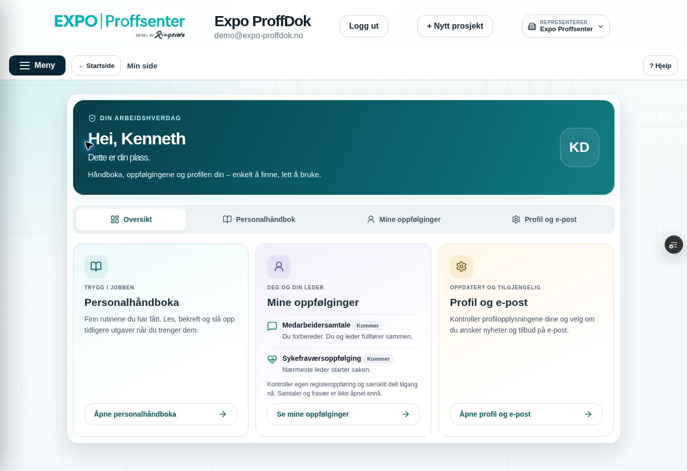
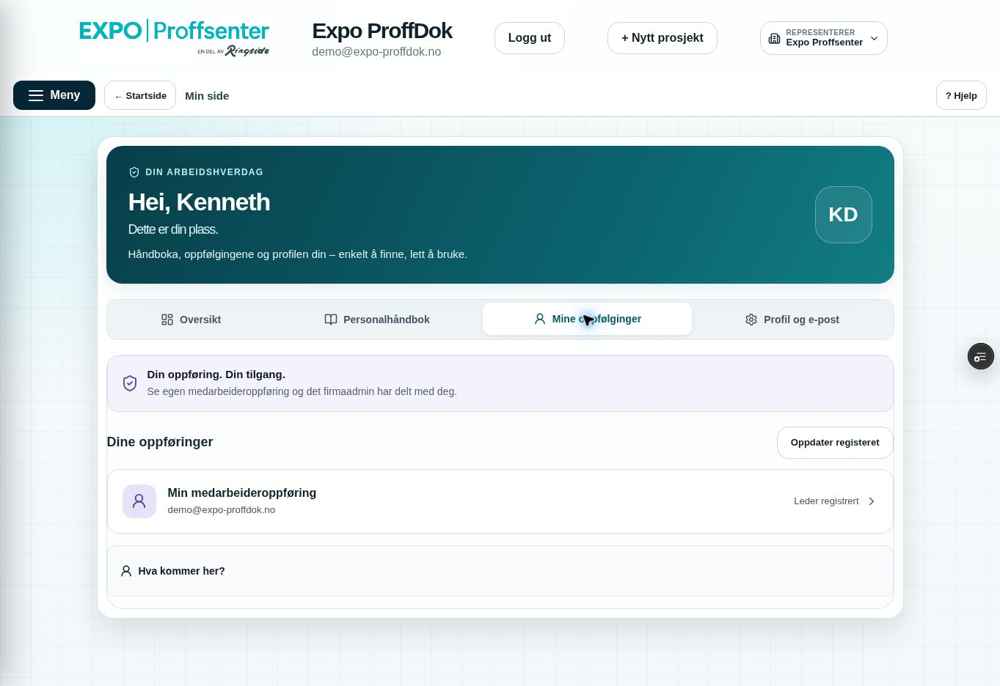

# Min side – utforming og stabil faneretur, 10. oktober 2026

## Avklart scope før endring

Miljømål **BEGGE**, bare feature/Preview og Sandbox ppvircenkjizeiqdxphj. Faktisk remote feature **a1cc7b2004762da6e46d7c53dac90ab732ddd5b0**, tree **6cc7291c76480220ce288467d966f104f6023d68**, main **155f6c4ac01f126c1db0c65da385cfd9305587d5** kontrollert før endring. Lokalt tree identisk, historikken forskjellig. Draft PR #216.

Kenneth rapporterer hopping ved screenshot/fanebytte og ønsker en mindre kjedelig Min side. Begge opplastede bilder er lest: egen demo-oppføring, merket Din medarbeidertilgang, ingen uvedkommende medarbeider synlig. Min side beholder egen oppføring og uttrykkelig delt lesetilgang; lederens team/firmaets register ligger under HR. SQL-kontrakten endres ikke.

Scope: PersonalPage/personal.css, HrModule/hr.css, avgrensede personal-critical og faktiske personal-/HR-React-prøver, dette notatet og prosjektets OVERSIKT/CONTINUITY/PLAN/QA/USER_TEST. Ingen main.jsx, global-/prosjektmeny, tilgangshooks, backend/migrasjon, database, e-post eller innholdsåpning endres.

## Rotårsak og ny kontrakt

Tilgangshooks nullstiller kontekster ved fokus/bakgrunn for fersk kontroll. PersonalPage tolket dette som profilfallback og åpnet rapportdetaljene. HR ble avmontert; registerdetaljen forsvant. Dette gav et synlig profilsprang før den valgte fanen kom tilbake.

Ny kontrakt: bare ikke-sensitive navigasjonsvalg (bruker-/firmascope, valgt fane, valgt oppførings-ID og fanenes visuelle skall) beholdes i komponentminne. Ingen tilgangskontekst, oppføringsdata eller kontaktverdier lagres som autorisasjonscache. **Ferske rights gate-er hver KS/HR-modul.** Null/pending viser kontrollstatus på valgt fane, ikke profilfallback. Identitets-/firmabytte nullstiller den gamle oppføringsnavigasjonen; prosjekt/support uten egen authUser får ikke husket skall. Null/undefined-oppstart er fortsatt dekket.

HR invalidaterer fortsatt straks ved fokus/bakgrunn, og skjuler gamle rader og detaljer. Etter fersk liste får bare en fortsatt listet valgt oppføring to ferske get-lesninger med samme revisjon før detaljen kommer tilbake. Feil/tilbakekalling/sent svar gir ikke gamle data tilbake. Bare valgt ID beholdes; admin-/HR-utkast får ingen ny lagrings-/gjenopprettingskontrakt. Ingen persistent/offline HR-cache, signed URL eller filtilgang.

Den tidligere React-assertionen krevde at detaljen forble lukket også etter vellykket fersk kontroll. Den er erstattet med strengere hendelsesbevis: hold fersk lesning pending → gammel payload borte → autorisert dobbel lesning → samme valgte oppføring tilbake. Risikoen er å vise data før autorisering eller gjenåpne gammel firmscope; nye negative prøver dekker begge. Ingen tilgangstest fjernes eller hook-sperre svekkes.

## Utforming

Personlig velkomst med egne kontoinitialer, mørk petrolbakgrunn og korte tekster. Tre egne fargetoner for håndbok, oppfølging og profil; ikoner på alle interne faner og tydelige handlingsknapper. Ingen illustrasjonslast, oppdiktede oppgaver, framdrift eller prestasjonsscore.

Personlig HR mister dobbel overskrift og stor introduksjon. Egen rad heter **Min medarbeideroppføring**, med kontoens e-post under; andre serverautoriserte rader merkes **Delt med deg · ekstra lesetilgang**. Søk vises bare ved flere oppføringer. Kommende samtale/fravær er ærlig samlet under **Hva kommer her?**. Firmaadmin-/lederregisterets layout og handlinger beholdes. Profil-/rapport-/e-postkomponentene forblir montert ved interne visningsbytter; private pårørendefelter fortsatt stengt.

Responsive CSS er avgrenset til personal-page/hr-personal; desktop tre kort, små skjermer én kolonne/to faner per rad, minst 44 px handlinger, fokusmarkering og tekststatus i tillegg til farge. Ingen skjermbredde simulert i live nettleser før faktisk bevis.

## Utviklerbevis

Faktisk utvidet personal-page-react-check **PASS**: tom auth-oppstart, tre kort, to kommende typer, egen/delt oppføring, ingen dobbel HR-header, pending tilgang uten profilhopp/utvidede rapportdetaljer/gamle HR-rader, fersk gjenåpning, fokus og bakgrunn, tilbakekalling, firma-/aktørbytte, eksisterende kontakt-/e-postkladd og egne konto-/kontakt-CAS-/forslagsprøver. Syntetisk transport, håndbokinnholdet stubbet i denne isolerte routing-prøven; ingen virkelige profil- eller personendringer.

Faktisk berørt hr-register-react-check **PASS**: eksisterende Hjelp/meny/register/paging/leder/leser/revoke/revisjon/avslutning/slettekvitteringer beholdt; ny pending/autorisasjon/valgt-ID-prøve. Permanent personal-critical og full **EXPO_BACKEND_TARGET=sandbox npm run build PASS**. Ingen ny SQL- eller B/C-/PDF-/ZIP-omtest fordi backend og eksport uendret. Tidligere 59 SQL assertions og Kenneths TEST OK er historiske bevis, ikke nye tester av denne UX-runden.

## Publisering og faktisk Preview

Publisert eksakt SHA, grønn Core Safety, READY Preview og direkte Sandbox-binding føres i draft PR #216; innlogget visuell kontroll og originale bilder følger etter publisering. Ingen browser-PASS påstås i dette notatet før faktisk kontroll. Fast Preview: https://expo-proffdok-git-feat-kshms-foundation-ringside.vercel.app/?progressTest=safe

Kort relevant brukerprøve: **Meny → Min side → Mine oppfølginger**, åpne **Min medarbeideroppføring**, bytt nettleserfane og gå tilbake. Samme interne fane og autorisert oppføring skal komme tilbake; gamle persondata skal ikke vises under kontroll. Visuelt vurder velkomst/kort og personlig HR. Ingen gjentatt B/C-test.

Privat innhold fortsatt stengt; varig ekstern driftsbinding/ack og full isolert Supabase database-/Storage-restore gjenstår. Ingen Production, main/demo-merge eller testmail sendt.

## Faktisk innlogget sluttkontroll

Rettet kode **5e2be88b1bee67963027ddd9d578fe7de2a20d4d**, tree **dee6bbe4a6df012a5d3f62c440c57b0481d99967**, parent **ce059e8dec61019784ef6b9eca96c31e01257cde**. Core Safety **37997879229 SUCCESS**, jobb **114048436996**, scope guard/fullcritical grønne. Vercel **dpl_3cam6F9TVUS2nqHWebsRm4ZHGX6L READY Preview**, eksakt SHA/ref/prosjekt/fast alias, direkte branch-env **EXPO_BACKEND_TARGET=sandbox**. Første UX-kode ce059e8 hadde grønn CI **37997723212** / jobb **114047910028**, men faktisk browser viste mørk global h2-farge på mørk hero. Rettet med eksplisitt scoped hvit h2-farge og permanent critical-vern, deretter faktisk ny reload og visuell kontroll. Ingen visuell PASS på den første kontrastfeilen.

**Faktisk Skynett-desktop PASS** på rettet kode, innlogget eksisterende demokonto, én fane og vanlig reload uten ny innlogging. Oversikt ved **1363×936**: tre kort i én rad, ca. **349×384 px**, pageWidth=1363/pageHeight=936, ingen side-/høydescroll. Målt h2-farge **rgb(255,255,255)**; hele skjermbildet visuelt kontrollert.

Personlig HR: egen **Min medarbeideroppføring** med demo-kontoens e-post og Leder registrert, ingen dobbel header eller unødvendig søk ved én oppføring, ingen scrolling på denne oversikten. Egen detalj åpnet. **F6 → Escape** (nettleserens fokusbytte og retur) beholdt Mine oppfølginger og åpen egen oppføring; dette er ikke faktisk Windows screenshotverktøy, separat nettleserfane/annen konto eller mobil-dvale. Pending/revokering og selve dobbelget-kontrakten er bevist i faktisk React med syntetisk transport, ikke målt som live HTTP-sekvens.

Adresse og nærmeste pårørende åpnet og viste ærlig lukket port/riktige lesere, uten private inputs. Profil og e-post viste uendret fullt navn, mobilfelt, lesbar konto-e-post og deaktivert kontaktlagring. Rapportopplysninger og e-postvalg åpnet med eksisterende rapportnavn/-rolle, frivillig avkrysning false og deaktivert e-postlagring. **Ingen profil, e-postvalg, HR-oppsett, personer eller rettigheter lagret/endrede i browseren**. Ingen database-/fil-/mailhandling. UI står igjen på Min side Oversikt, meny lukket, én fane.

To originale JPEG-er kopiert uendret til repoet:

| Fil | Byte | SHA-256 |
|---|---:|---|
| [Skjermbilde](screenshots/min-side-design-verified-20261010.jpg) | 109216 | `b65a0f27b9515e362df8d100a7e3cb2013298610a86ba25b8de18c4eb10ec6c0` |
| [Skjermbilde](screenshots/min-side-hr-verified-20261010.jpg) | 89384 | `6484a3d7c92cd6a6b9f594e3fb6d003a1951455b184182c2e6f0d9705ed07ba4` |

Siste bevis-/statuscommit endrer bare dokumentasjon og lagrer disse originalene; appkode/database uendret. Eksakt slutt-head/CI/READY-SHA føres i draft PR #216. Tidligere Kenneth TEST OK beholdes; ingen B/C/PDF/ZIP-omtest eller ny Production-godkjenning.
