## Publisert PDF-/ZIP-forklaring – innlogget kontroll

Tekst-/TEST OK-oppfølging publisert på **085336ade9be3a9778a3c5d00ad7c58c7dc0a98a**, tree **ecbbd5aa8be7fd6ccdc72e6eb254da104cc724ba**, identisk med lokal testcommit 496c73e25026d070bf38e2b8f72da7acc03d30f4 (bevart). Alle 11 blobber/tree og faktisk publisert git-objekt hashkontrollert, expected-head 359dac0e og uten force. READY **dpl_8wuuYDCorLQwMaZde1QL39pihcCs**, eksakt SHA og samme faste Sandbox-alias; Core Safety **37862362107**, jobb/full critical build **113600849615** completed/success. Lokal full Sandbox build og faktisk React/ZIP PASS. PR #216 fortsatt draft/main uendret 155f6c4ac01f126c1db0c65da385cfd9305587d5. Bare to apptekstfiler og ni dokumenter i denne slice; ingen handler/format/backend-endring. Etterfølgende beviscommit er bare dokumentasjon/skjermbilde.

Innlogget samme skyfane (4), bevart demoøkt etter reload: Dokumentuttrekk forklarer nå PDF og ZIP før valg. Valgt eksisterende Voldsløkka-vernerunde ga begge vedlegg (178896/200131 byte), hensiktstekst for separate filer/arkiv og forklaring av mappen vedlegg/manifest.json. ZIP-knappen er sperret før egen bekreftelse og aktiv etter. Det ble ikke lastet ned eller skrevet noen ny sak i denne tekstkontrollen. [Skjermbevis](zip-clarity-proof.jpg). Valg/omfang deretter tømt, null dialoger; én fane beholdt. Godkjent ZIP-nedlasting skal ikke gjentas bare fordi teksten er presisert. Hensikt og manifest er forklart direkte i chatten; TEST OK 9. oktober kl. 01:55 gjelder to-bilders nedlasting/innhold, øvrige åpne prøver består.

---

## TEST OK – ZIP med to bilder og filoversikt, 9. oktober kl. 01:55

Kenneths TEST OK er presisert **9. oktober 2026 kl. 01:55 Europe/Oslo**: ZIP fra Voldsløkka-vernerunden er lastet ned og åpnet, med **to bilder i vedlegg og én JSON-fil**. Skjermbildet viser åpnet «KS-HMS vedlegg – test omfang», mappen «vedlegg» og «manifest.json». Dette bekrefter innlogget ZIP-nedlasting/innhold på publisert head **359dac0ed2df86ab43cb545ece6716161f9bdc87** (funksjon 42a38e91), etter PDF-/ZIP-avklaringen kl. 01:51–01:53. Tidligere TEST OK beholdes. Ingen ny mobil-, flerbruker-, privat RUH-original-/prosjektkontrollfil- eller Production-/merge-/e-postgodkjenning følger.

Brukerens «det var ikke selvsagt» følges opp med avgrenset tekst i Dokumentuttrekk og HJELP: PDF og ZIP har hver sin nedlasting; ZIP-knappen vises etter Vis vedleggslisten; manifest.json forklares som filoversikt som beholdes med vedleggene. Brukerens oppfølgingsspørsmål kl. 01:57 presiserer hensikten: ZIP sparer enkeltvis henting og gir separate filvedlegg til arkiv eller sammen med rapporten; PDF er rapporten. Ingen handler, eksportformat, backend eller knappnavn endres. Miljømål BEGGE, først samme feature/Sandbox. Neste faglige B/C-punkt er fortsatt øvrig vedleggsdekning og versjonerte underskjema; deretter påminnelser/kildeoppdatering før HR. Gjenværende prøver videreføres uten å gjenta godkjent ZIP-nedlasting.

---

## Publisert ZIP-del – READY

Funksjonskode **42a38e91** / tree **96ed970e**, READY **dpl_HY7SG3fjVEMjYJtV4JR8nkYnMvKa**, Core Safety **37860831491** / full critical build **113595879925** success. Innlogget ZIP med to allerede lagrede Voldsløkka-bilder + manifest (381240 byte) PASS: CRC, JPEG-er, riktige dokument/revisjon/punkt og SHA-256 kontrollert. Bekreftelse, tomt omfang, nullstilling og RUH uten vedlegg PASS. Publisert HJELP kontrollert. Eksisterende samle-PDF med SJA/signatur og begge vernerundebilder fortsatt PASS (5 sider). Én fane, alle popup lukket, ingen lagrede data mutert. Eksakt bevis/handoff i CONTINUITY. ZIP-nedlasting/innhold TEST OK 9. oktober kl. 01:55. Private RUH-originaler/prosjektkontrollvedlegg innlogget, mobil/flere brukere gjenstår.

---

## Vedleggspakke – neste avgrensede B/C-leveranse

Kenneth ga **TEST OK 9. oktober 2026 kl. 01:29 Europe/Oslo** for samlet dokument-/tilsynsuttrekk på publisert head `c5e128c6fde2d0fb1368accb78a9414c05f0c81d`. HJELP, architecture og README var oppdatert ved godkjenningen. Tidligere TEST OK beholdes, inkludert egen SJA-PDF kl. 00:59. Dette er ingen Production-/merge-/e-postgodkjenning.

Ny levering: **Dokumentuttrekk → Vis vedleggslisten → Last ned vedlegg (ZIP)**. Valgte lagrede RUH-originaler, vernerunde-bilder og prosjektkontrollvedlegg med manifest, filstørrelser og SHA-256. Egen bekreftelse; endring av omfang/valg tømmer listen. ZIP-nedlasting/innhold TEST OK 9. oktober kl. 01:55. [Scope og QA](ATTACHMENT_ARCHIVE_20261009.md). Øvrig vedleggsdekning, versjonerte underskjema, påminnelser og kildeoppdatering følger før HR. Ingen ny backend eller sending.

---

## Samlet dokument-/tilsynsuttrekk – utviklerbevis

Ny permanent critical-check er koblet inn i eksisterende KS/HMS/build-kjede, uten svekkede eksisterende krav. PASS: eksplisitt valg av åtte dokumenttyper, uttømmende RUH-historikk over flere sider, private Storage-bilder, sperre ved endrede snapshots/utgaver/tilgang, sent firma-/brukerbytte og unmount, ingen kommando-RPC eller lekkasje av utkast/ansattbekreftelser/tokenlenker. Faktisk React/Storage/jsPDF gir to samle-PDF-er (15 sider med alle åtte typer, 14 uten rutine); innhold, langtekst, signaturer, bilder, matrise, manifest og sidegrenser er kontrollert, også visuelt. Eksisterende RUH React/PDF og fem rutine-/mal-/prosjektkontroll-PDF-er PASS. Full `EXPO_BACKEND_TARGET=sandbox npm run build` PASS exit 0. Funksjonskode 8d045d0c/tree ded14b7d er READY på dpl_FpiuDdxSxd5yaauYXkSgpKfDcmC3; Core Safety 37858562063/jobb 113588549210 full critical build success. Innlogget samle-PDF med seks dokumenter (12 sider) og uten valgt rutine (10 sider) PASS, inkludert faktisk signatur, hele RUH-historikken, to lagrede vernerunde-bilder og manifest. Valg/søk/tømming/omfang/bekreftelsessperre og eksisterende egen RUH-PDF (2 sider) PASS. Ingen data mutert, popup lukket, én fane. Eksakt bevis og avgrensning i CONTINUITY. Innlogget privat RUH-bilde, mobil og flere reelle brukere gjenstår; syntetisk Storage-test er ikke bevis for disse prøvene. [Scope](INSPECTION_EXTRACT_20261009.md).

---

## Publisert rutine-/sjekkliste-PDF – READY

Funksjonskode **64143a3a4a982f442bbafcacaf40d535073751a8**, tree **86813dd63f72714995ea88bf71d26bd7b72cb571**. Hver publisert blob og samlet tree er identiske med lokal testet commit bb4b0053. Git-push manglet skriveinnlogging; GitHub-koblingen publiserte samme tree med expected-head aea7e766 og uten force. Ingen lokal branchhistorikk er slettet.

Fast Sandbox Preview er **READY** på **dpl_83H3TYNf6vdiwWqZuRU8LTT3m5WV**, eksakt funksjons-SHA og alias expo-proffdok-git-feat-kshms-foundation-ringside.vercel.app. **PR Core Safety 37846961060**, jobb **Core safety + critical build 113550101731**, completed/success. Endelig lokal full Sandbox critical/build PASS exit 0. Branchbinding EXPO_BACKEND_TARGET=sandbox, target preview, gitBranch feat-kshms-foundation er kontrollert. PR #216 er open/draft; main er uendret **155f6c4ac01f126c1db0c65da385cfd9305587d5**. Samlet branch-diff etter funksjonscommit: 196 filer; ny avgrenset slice: 20 filer.

Neste er bare den nye korte rutine-/sjekkliste-PDF-prøven i USER_TEST.md. Fem faktiske React/jsPDF-uttrekk, tre berørte eksisterende React-flyter, permanent critical og visuell PDF-kontroll PASS. Transport/innlogging var simulert; innlogget bruker-/mobilprøve er ikke hevdet. Tidligere TEST OK og separate åpne oversikts-/kontroll-/risiko-/popup-prøver beholdes. Ingen ny database-/Production-/main-/demo-endring, e-postaktivering/sending eller HR. Øvrige B/C-punkter består. Etterfølgende ren dokumentcommit lagrer dette beviset uten funksjonsendring.

---

## Rutine- og sjekkliste-PDF – avgrenset B/C-del, 8. oktober 2026

Utgangspunkt feature-head `aea7e76672380e8e914a234d8cc9ae9b629434c3`, main `155f6c4ac01f126c1db0c65da385cfd9305587d5`. Miljømål BEGGE, bare samme feature/Sandbox nå. Tidligere TEST OK og åpne nye delprøver beholdes. PR #216 er draft. Ingen HR, Production/main/demo-release, databaseendring eller ekte e-postsending.

Egne PDF-er fra godkjente rutineutgaver, publiserte sjekklistemaler og lagrede prosjektkontroller er implementert. Rutine viser R-nummer/utgave, firmaets lagrede tekst, godkjenner/kilder og ID/hash. Egen ansattbekreftelse og andre ansattes opplysninger eksporteres ikke. Historiske kontooppslag merkes når navnesnapshot mangler. Sjekklistemal er tydelig tom mal; upublisert kladd tas ikke med. Prosjektkontroll viser eksakt lagret mal-ID, kontroll/revisjon, svar, kommentarer, bilder og eventuell lagret fullføringsidentitet/tid. Utkast merkes under arbeid; kontrollens fullføring lukker ikke avvik. Filvedlegg er navngitt med tydelig beskjed om at originalfilen ikke følger PDF-en. Ingen automatisk rapport-/portaldeling.

Eksisterende lesende RPC-er og firmaprofil brukes. Tilgang og samme utgave kontrolleres både før og etter PDF-/bildeinnlasting. Prosjektkontroller beholder eksisterende prosjekttilgang uten krav om personlig KS/HMS-grant. Nye/ulagrede kontroller og redigerte svar sperres. Manglende bilde stopper eksport; manglende logo gir firmanavn og synlig beskjed. Filadresser/token kommer ikke i PDF-en. Profil-, bruker-, skjerm-/dokumentbytte stopper sene uttrekk. Ingen automatisk save/publish/sign/complete.

Utviklerprøver: permanent ny document-PDF-critical PASS; fem faktiske React/jsPDF-uttrekk PASS med simulert RPC, inkludert rutine i Les og bekreft/Min personalhåndbok, mal ved endret utkast, fullført kontroll og utkast. Langtekst, logo/bilde, ikke-bekreftelse, ulagret sperre, nyere revisjon, tilgang tilbakekalt etter bildefremhenting og sent brukerbytte er prøvd. Tre eksisterende React-flyter for sjekklistesentral/prosjektpopup/workspace PASS; lagring/gjenåpning/fullføring/historikk/kladd/konflikt/legacy er bevart. Poppler-layout kontrollert på lang rutine (7 sider), mal (1 side), fullført kontroll/utkast (3 sider). Ingen kutt/overlapp; sider og originalbilder er beholdt. Endelig full Sandbox critical/build etter hjelpeoppdatering PASS, exit 0. Eksisterende bundle-size-advarsel består. Ingen ny innlogget mobil-/flere-konto-PASS hevdes.

Publisering/CI/READY er bekreftet i beviset ovenfor. Neste er kun den korte nye PDF-prøven i USER_TEST.md. Øvrige B/C-punkter (full vedleggsdekning, versjonerte underskjema, RUH-bilder/historikk, tilsynsuttrekk, påminnelser/kildeoppdatering) gjenstår før HR. Samme faste Preview; ingen gamle TEST OK gjentas automatisk.

---

# Oppfølging 8. oktober – popup og ansvarse-post

TEST OK kl. 21:04 for prosjekttillegget er registrert. Ny popup-/varselendring: 36 nye + 45/54/73/93 relevante rollback-SQL-kontroller PASS; faktisk React/DOM for gjennomføring/prosjekt/oppgaver/SJA/rutine/revisjonslenker PASS; permanent seks-typers mailer/lenke/konfigurasjon/fencing-prøve PASS; full Sandbox critical/build PASS exit 0. Signert SJA/rutineutgaver uendret. Mailer v4 ACTIVE, check HTTP503 mangler api_key og sender, enabled=false. Ingen innbokslevering hevdet. [Detaljer](NOTIFICATIONS_20261008.md).

---

# Prosjekttillegg 8. oktober 2026 – bekreftet grønn leveranse

Funksjonskode `8bce982fb75bf105ee614601e604e438f89a78bc`, tree `ed17f78782d6a49944bd55be6b008d0ef29995e9`. Fast Sandbox Preview er READY på `dpl_4gwb3VsRp7Wf2GWmRrxFNre8DY87`, med samme feature-alias og eksakt SHA. PR Core Safety `37827572425` og jobb Core safety + critical build `113484256816` er completed/success på samme SHA. Lokal og publisert tree er identiske.

44 faktiske nye Sandbox SQL-assertioner med full rollback PASS. Faktisk React-prosjekt/varsel/dialog med simulert RPC og reell CSS PASS, inkludert prosjektkladder, rutineutgave, ansvarligs åpning, varsel ved offline/tapt readback, retry, 24 × 24 avkrysning, minimal tilgangsbeskjed og uendrede avviksvarsler ved begge fullføringer. Utvidet critical prøver den faktiske varseleffekten med sene svar, firma-/brukerskifte, synlighet, revokering og cleanup. Eksisterende berørte React-prøver og siste full Sandbox critical/build PASS. Begge migrasjonsfilers MD5 samsvarer med Sandbox-historikken. Signert SJA og rutineutgaver har identiske før/etter-fingeravtrykk.

Ingen ny innlogget mobil-/flere-kontoprøve eller bruker-TEST OK hevdes. Se PROJECT_EXECUTIONS_20261008.md og øverste korte USER_TEST.md-prøve. Main/Production/demo er uendret.

---

# Gjeldende nye utviklerbevis – vernerunder og 5×5-risiko, 8. oktober 2026

54 faktiske Sandbox SQL-kontroller med full rollback, reell React-/dialogflyt med simulert RPC og ny permanent kritisk prøve PASS. Bevis og grenser står i [EXECUTIONS_20261008.md](EXECUTIONS_20261008.md). Signert SJA og 10 rutineutgaver har uendrede fingeravtrykk. Kenneths prosjektrapportprøve er TEST OK kl. 14:48; tidligere delprøver skal ikke gjentas uten konkret feil. Bare den nye prøven øverst i USER_TEST.md gjenstår. Full Sandbox critical/build PASS; Samme Preview er READY på 829ae35315d5e09d4f4e18d7f231f4a2826b8915 / dpl_6nK5QuRTshRSYX5ZAbd3MMPNYBAg og Core safety + critical build success. Se leveransenotatet. Ingen Production-godkjenning.

---

## Historiske utviklerbevis

# KS/HMS QA – trinn A

## Gjeldende liten prøve – popup og tekst som beholdes, 7. oktober 2026

Denne statusen erstatter tidligere minimumsgrenser 5/10/10. Brukerens årsak/tiltak/egen kontroll kan være «OK». Rotfeilen er bevist i faktisk Sandbox-RPC: vanlig save tømte control_note. Migrasjon 20261007163024 er anvendt bare i Sandbox og bevarer teksten; lukking validerer ikke-blanke felt, ansvarlig og egen kontroll som før.

| Kontroll | Resultat og grense |
|---|---|
| Målrettet faktisk serverprøve | PASS, 14 kontroller i rollback; vanlig lagring/bevart note, separat save bevarer tidligere note, «OK» i direkte close, blanke felt/ukontrollert/annen aktør avvises, historikk og varsel følger bekreftet lukking |
| Permanent critical-avvikscheck | PASS, faktisk editor/task-handler, korttekst, teksttap ved readback avvises, kladd ved gjenåpning, save/feil/retry/close |
| Faktiske React-komponenter med avgrenset RPC-stub | PASS i jsdom: eksisterende sak i popup, portal, gjenfunnet tekst, samme popup/scroll etter vanlig save, beholdt popup/tekst ved feil og lukket popup etter bekreftet close |
| Full critical QA og Sandbox-build | PASS; etter siste fokustilpasning også ny Sandbox Vite-build PASS |
| Tilgang/worker | Anon EXECUTE false, authenticated true, tom search_path; bevisst SECURITY DEFINER med firmatilgang og ansvarligkontroll vurdert. Worker disabled. Ingen sending |
| Innlogget visuell Preview-prøve | Gjenstår hos bruker på samme faste adresse; ingen ny full skynettleserrunde er startet |
| Production/main/demo | Uendret; ingen ny TEST OK/merge |

Dette er avgrensede utviklerbevis. Tidligere faktiske skjermprøver nedenfor beholdes som historikk, ikke som test av denne popup-endringen. Mobil og to faktiske brukerøkter gjenstår. Se CONTINUITY.md og USER_TEST.md for gjeldende fortsettelse.

## Siste dialogprøve – 7. oktober 2026

Funksjonskode d73cd78935ab769b36c37ae4721934f586f05d27, READY dpl_G5pZJCaMa4pQwNyu1DcakbXt4AiA, PR Core Safety 37644638589 success. Full Sandbox critical build PASS. Faktisk egen skynettleserprøve passerer stor dialog, valgt bruker, kladd etter reload, bekreftet prosjektkilde/KS-sak, riktig sak direkte, omfordeling/egen lukking, varsel bort og Lukket tilbake i prosjektet etter faktisk reload. Eksisterende Test-prosjektavvik åpnes bare for koblingsinspeksjon og er uendret. Se [AVVIK_DIALOG_20261007.md](AVVIK_DIALOG_20261007.md) for eksakte case-ID-er, skjermbevis og grenser. Ingen mobil-/to-konto-/e-postmottak-PASS eller ny A2-godkjenning.

## Tidligere innloggede Sandbox-prøver – kontrollhistorikk

[UI_TEST_20261007.md](UI_TEST_20261007.md) dokumenterer faktisk innlogget desktopflyt på READY-deployment `dpl_DB3wi9z7fTnfnuVGCo1357NVCNvZ`, head `3c51dc5edea1da0fb52e31ae204bfaf9f8342793`. PASS med én demo-konto: seks kapittelvalg/73 forslag, registrering med riktig ansvar/frist, fast varsel etter lesing og navigasjon/ny fane, beholdt sakskladd og lagret egen lukking med aktør/tidspunkt/historikk og varsel bort. SQL bekrefter resultatet; arbeider deaktivert, ingen e-postforsøk. Den lukkede syntetiske saken er beholdt som kontrollspor.

Supplerende faktisk prøve etter brukerbestilt nettlesernullstilling: READY `dpl_56BPxK5WNcbpWv1qJqV5wKZMd3m5`, head `b53fa201e76612e548d7d370b4e8991094e1b0c0`. PASS: nytt eget prosjektsjekkpunkt lagret i UI → riktig KS/HMS-skjema/stabil kildekobling → sperrede direkte status-/lukkekontroller → Åpne i KS/HMS → ansvarligs egen lukking → Lukket avvik tilbake i prosjektet → faktisk reload med bevart innlogging og lagret lukking. Sak `bbaa4b37-48d3-49d1-99d8-96da49e73cbf`, closed revision=2, aktør/tid og prosjektsnapshot bekreftet i SQL. Eksisterende ukoblede avvik og firmaets håndbokutgaver er bevart. Worker disabled, outbox pending/attempts=0/sent_at=null. Se testloggen for skjermbevis og nøyaktig grense.

GJENSTÅR etter siste dialogprøve: to separate brukerøkter, full ukoblet legacy-lukking/gjenåpning, toppfanens teller for egne sjekkpunkter, full-app-mobil og reelt e-postmottak. Den tidligere native tittelprompten er erstattet av en React-dialog som er faktisk prøvd. Tidligere getJsDialog-/andre-fane-grenser er kontrollhistorikk; de ble ikke omgått. Toppfanens egne sjekkpunktantall er ikke rettet eller gradert PASS. Ny A2-TEST OK, merge og Production-godkjenning er ikke gitt.

2026-10-05. Branch `feat-kshms-foundation`, baseline main `155f6c4`. Miljømål BEGGE. Kun Supabase Sandbox er endret. Trinn A er ikke full KS/HMS eller produksjonsgodkjent.

Siste brukerstatus: TEST OK er mottatt for den prøvde versjonen 2026-10-06 kl. 18:56 Europe/Oslo. Ordlyd om «frivillig» presiseres som valg av tidspunkt for påkrevd egen gjennomgang. Kontrollhistorikken under beskriver tidligere teststatus; Production-godkjenning er fortsatt ikke gitt.

## Verifikasjonskontrakt

Firmaadmin eller KS/HMS-ansvarlig etablerer → tilpasser → godkjenner → ansatt leser og bekrefter. Utpekt ansvarlig reviderer og signerer eksakte publiserte versjoner. Navigasjon/auth og eksisterende prosjekt-/salgssikkerhet skal fortsatt virke.

| Kontroll | Resultat og grense |
|---|---|
| Kildekapitler og rutiner | 125 sporbare rader; 105 kvalitetsoppføringer/88 personaloppføringer, 16 underemner og 4 metadatarader; 148/127 sider og begge filhash registrert. Alle 275 sider dekket av kildeintervallkontrollen. |
| Krav/kilder og produktvalg | Registrert i PLAN og de 12 selvstendige standardutkastenes referanser, kontrollert 2026-10-05. Dette er ikke ferdig forfatting av alle kildetemaer. |
| Preview-miljø | Branch-spesifikt `EXPO_BACKEND_TARGET=sandbox` verifisert via Vercel. Feature `dpl_DjdWNA3MuAWkLXtjyMzQ7DPwa7p4` READY, kode-SHA `f88eb975a541ee875f50eef233cb1e09245c44ac`. Publisert `workProfileClient-BeVSXbh6.js` inneholder Sandbox-URL og ingen Production-URL. Dette er første feature-deploy; gjeldende branch-Preview og siste deploy-status følger PR #216. |
| Migrasjon | Håndbokfundament og avgrensede reparasjoner anvendt på Sandbox `ppvircenkjizeiqdxphj`. Ingen Production-endring eller blind branchmerge. Git-migrasjonene inneholder den endelige funksjonsdefinisjonen. |
| Database/API | `scripts/kshms-sandbox-check.sql` PASS mot faktisk `authenticated`-rolle og ferske syntetiske auth-identiteter. Alle testdata rulles tilbake. Ingen faktisk ansatt eller håndbok bekreftet. |
| Klient og eksisterende kritiske flyter | Full `EXPO_BACKEND_TARGET=sandbox npm run build` PASS med hele eksisterende critical-kjeden og ny KS/HMS-kontroll. Vite-build PASS. Eksisterende advarsel om store bundle-chunks beholdes. |
| Desktop-komponentflyt | PASS med faktisk React-modul og syntetiske RPC-svar: standardutkast, kilder/type/kontrolldato, firmatilpasning, publiseringsforhåndsvisning, godkjenning, ansattbekreftelse, ansvarlig revisjon/historikk og vesentlig ny versjon. V1-bekreftelsen beholdes; V2 vises som manglende. |
| Mobil komponent | PASS i iframe med 390 px ramme / 375 px innvendig viewport. Ingen horisontal overflow; synlige tekstfelt og knapper har minst 44 px høyde. Mobil rutinekladd beholdes ved skjul/åpning av appfane. Dette er ingen fysisk enhetstest. |
| Nettleserfeil | Ingen app-/React-feil observert i komponentflyten. Nettleserutvidelsen logger egne metadatafeil; disse er ikke appfeil. |
| Git-scope/dokumentasjon | PASS mot hele committede endringen og `origin/main`. Første kodepublisering brukte verifisert tree `694b78ce0c497c9708ed77e80238fe5723bc7a3e`; senere rettelser gjennomgår samme lokal/API-tree-kontroll. Ingen QA-fixture eller demo-overlay i feature-PR. GitHub Actions-status følges separat. |
| Innlogget full-app Preview / bruker TEST OK | Bruker meldte TEST OK 2026-10-06 kl. 18:56 Europe/Oslo for Preview-head `6dfb74dad244ff9bd0e416a08f0a34bc88da3c3a`. Det er ikke oppgitt en ny detaljert rolle-/enhetsprøve; utviklerens komponentkontroll og faktiske SQL-prøve beskrives separat. |
| Merge / Production / main → demo | IKKE GODKJENT / IKKE UTFØRT. |

SQL dekker deaktivert modul; systemadminaktivering uten automatisk innholdsinnsyn; firmaadmin grant; KS-ansvarlig kan redigere og publisere, men ikke arkivere, tildele tilgang eller utpeke ny revisjonsansvarlig; ansatt ser bare egne tildelinger uten utkast/roster; kryssfirma og feil forventet arbeidsfirma; tilbakekalt tilgang; deaktivert/ekstern bruker; stale oppstart/utkast; gamle versjoner/bekreftelser; ny versjon krever egen bekreftelse; serveravledet identitet/tid; idempotent tildeling; uforanderlige versjoner/bekreftelser/revisjoner; eksakt revisjonssnapshot, stale snapshot, ettårsgrense og avvisning av tom aktiv håndbok; kildekontrolldato i fremtiden avvises; direkte tabell/private helper/anon-adgang avvises.

Klientkontrollen dekker faktiske hook-racer ved grant-/arbeidsprofilbytte, auth-identitetsbytte før effekter, nettfeil, unmount og listener-opprydding; eksplisitt bruker-/firmabundet kladd med opprinnelig revisjon; global navigasjon bak grant, uendrede prosjektfaner; flerfaglig relevans og publisert versjonssnapshot.

## Review-Preview og PR

[Draft PR #216](https://github.com/ExpoProffsenter/expo-proffdok/pull/216). [Faktisk feature-Preview](https://expo-proffdok-git-feat-kshms-foundation-ringside.vercel.app/?progressTest=safe) er åpnet i nettleser og viser eksisterende innloggingsflate. Brukeren har prøvd oppstart og rapportert avvik som er rettet nedenfor. Utviklerkontrollen omfatter komponent med syntetiske svar og faktisk authenticated SQL-scenario; full innlogget appflyt og brukerens nye TEST OK gjenstår. Utvikleren har ikke aktivert et eksisterende firma eller endret reelle ansattilganger.

Før innlogging logger eksisterende arbeidsprofilklient «Innlogging er ikke klar ennå». Samme melding, samme `workProfileClient-BeVSXbh6.js` og fungerende innloggingsflate er observert i uendret main-baseline i Sandbox QA-Preview. Dette er et eksisterende oppstartsloggfunn, ikke rettet som sideendring i denne PR. Det hevdes derfor ikke null appfeil i hele Preview. Innlogget kontroll skal avklare at arbeidsprofilen lastes etter autentisering.

## Nettleserbevis og avgrensning

Komponentkontroll i isolert QA-branch `test-kshms-handbook-ui`: desktop `dpl_2PAw3RxR6T84MXA2tnnSNxy673XD`, mobil `dpl_GZsRvceK7f8HFVLETD7dEiAAbK57`, begge READY. QA-branchens statiske fixture/telefonramme ligger **ikke** i feature-PR eller main og skal aldri merges derfra. Den inneholder bare syntetiske navn/identiteter og mock-klient; ingen reell Supabase-innlogging eller sending. Desktopbildet viser tydelig dette og forskjellen mellom gammel bekreftelse og ny versjon:

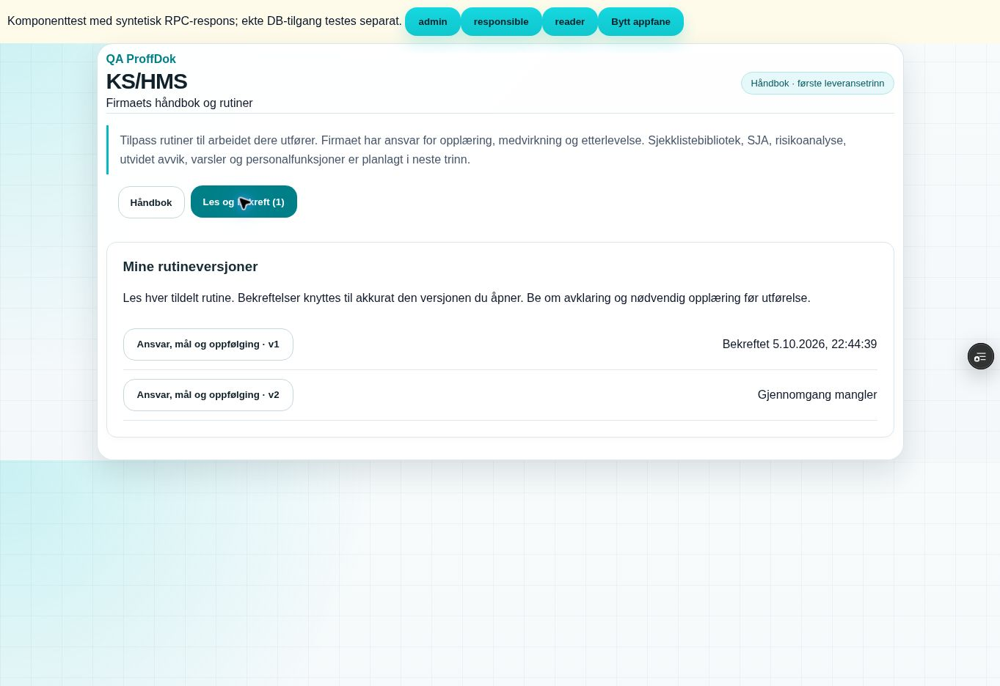

## Sikkerhetsrådgiver

Supabase advisors rapporterer tilsiktet INFO [RLS aktiv uten policy](https://supabase.com/docs/guides/database/database-linter?lint=0008_rls_enabled_no_policy) og WARN [authenticated SECURITY DEFINER-funksjon](https://supabase.com/docs/guides/database/database-linter?lint=0029_authenticated_security_definer_function_executable) for RPC-modellen. Direkte tabellprivilegier er fjernet; funksjonene har tom search_path, privat hjelpe-schema og eksplisitte auth-/firmaskope-/grant-/rollevern. Avslagene testes med faktisk authenticated-rolle, ikke bare som databaseeier. Det hevdes ikke at advisors har null funn. Legacy-funn ligger utenfor denne PR.

## Test som gjenstår før merge

Systemadmin aktiverer kun testfirma i feature-Preview/Sandbox. Firmaadmin gir ansvarlig/leser grant og lagrer flerfaglig oppstart; tilpasser og publiserer rutine. Leser bekrefter; utpekt ansvarlig reviderer. Vesentlig endring publiseres, og ny bekreftelse mangler mens gammel historikk beholdes. Kontroller også faktisk appfanebytte, arbeidsprofilbytte og tilbakekalling. Ingen faktisk e-post sendes.

HR-tilgang, private storage-filer, SJA-signering, rapport-PDF, varselutsending og kontrollert avvikslukking er fortsatt krav i senere trinn og rapporteres ikke som testet i A. Persondatautlevering/sletteservice gjenstår før produksjonsklar full modul. AGENTS krever ny eksplisitt bruker TEST OK før merge, deretter Production-verifisering og main → demo/preflight.

## Rettelser etter oppstartstest (2026-10-05)

Brukeren meldte uklar oppstartstekst, ønsket VVS uten pilotnavn, mistet arbeidsbilde ved nettleserfanebytte og manglet egen firmaadmin i ansvarliglisten. `installWorkProfileUx` henter arbeidsprofil på fokus og publiserer også uendret firma. KS-hooken nullstilte da kontekst og unmountet modulen. Den permanente runtime-kontrollen gjenskapte tap av oppstartsvisning/lokale felt før rettelsen, og passerer med samme-firma-prinsippet fra eksisterende Sales `syncWorkProfileScope`. Ingen ny recovery-motor, timere, reload eller endring i Sales/bootstrap er introdusert. Reelt firmascopebytte, tilbakekalling, identitetsbytte og gamle RPC-svar beholder avslagene.

Feltforklaringene er varige, med selvstendige VVS-eksempler og tilgjengelig `aria-describedby`; eksemplene skriver ikke firmaets data. Ansvarliglisten inkluderer aktive firmaadministratorer, også egen bruker merket «deg». Ny funksjonsmigrasjon `20261005212145_kshms_firmaadmin_appointment.sql` er anvendt kun på Sandbox og lar firmaadmin utpekes uten ekstra grant. Server krever fortsatt eksplisitt utpeking før revisjonssignering. Utvidet authenticated-scenario PASS: egen utpeking/signatur med eksakte versjoner, ingen automatisk grant, erstattet ansvarlig mister signering, annen firmaadmin og vanlig leser kan ikke utpekes på feil grunnlag. Alle syntetiske data rullet tilbake. Advisors viser samme tilsiktede RPC/RLS-funn omtalt over. Full `EXPO_BACKEND_TARGET=sandbox npm run build` PASS etter rettelsen. Desktopkontroll i `dpl_HkQocyvBf1rhcaDmQ4Jc74Qt2pQy` / QA-SHA `5956f3910723edd66c99a5cb8dd8c5eb89766839` PASS: tre ulagrede felt og oppstartsvisning overlever samme-firma-event og skjul/åpning, og egen firmaadmin kan velges og lagres. Mobilkontroll av samme komponent/hook i 390 px ramme PASS: 375 px innvendig viewport, scrollWidth 375, alle tre textarea 126 px høye, tilknyttede feltbeskrivelser og bevart tekst etter profiloppfriskning. Ingen app-/React-feil observert; utvidelsens metadatafeil er separat. Dette er syntetisk komponentkontroll, ikke reell innlogget full-app-verifikasjon eller fysisk mobiltest.

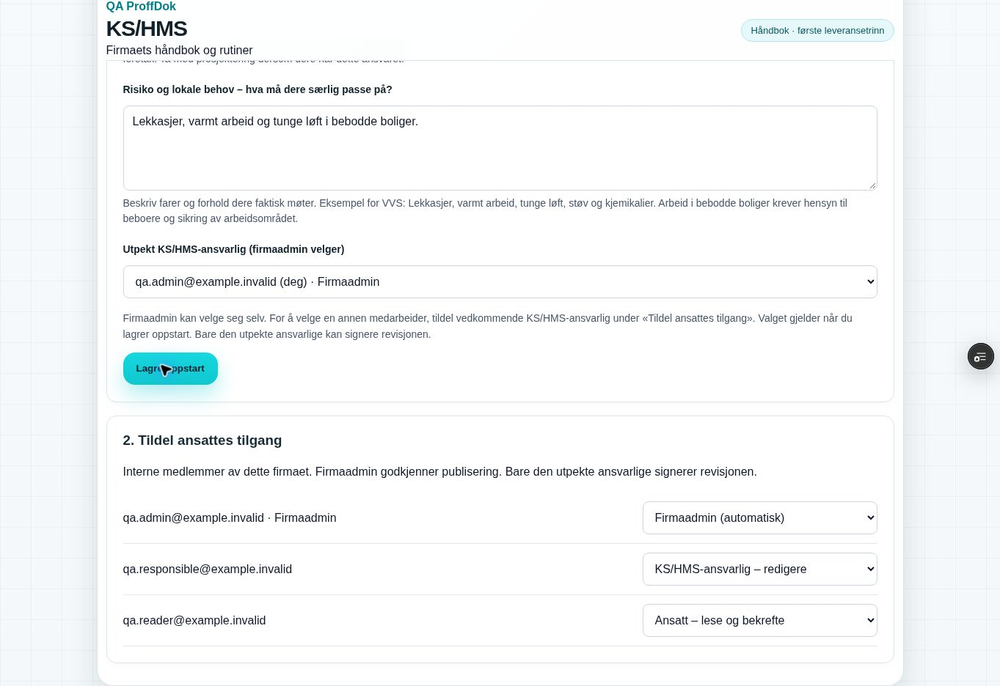

## Rutinebibliotek: flervalg og tydelig innlegging (2026-10-05)

Brukerens skjermbilder viste kort som så ut som et utvalg, men hvert klikk åpnet ett standardutkast i samme ulagrede editor. Bare det siste utkastet var derfor synlig; klikkene lagret ikke flere rutiner. Biblioteket har nå native avkrysning, «Valgt», samlet antall og «Disse rutinene legges inn» med alle valgte titler. «Legg inn» lagrer hver rutine som kladd med eksisterende save-RPC. Lagrede rutiner viser «Lagt til» og «Rediger her». Firmaets kapitteloversikt viser antallet rutiner og bruker samme redigeringsflyt. Godkjenning og tildeling skjer fortsatt separat.

| Kontroll | Resultat og grense |
|---|---|
| Permanent runtime-regresjon | `critical-kshms-check` PASS: ti utvalgte rutiner lagres én gang hver; dupliserte valg fjernes; de resterende to kan legges inn uten å overskrive eksisterende firmatekst. Feil ved tredje lagring og tapt svar etter commit testes med nytt forsøk uten duplisering. Feil firmascope avvises og unmount stopper videre kommandoer. Eksisterende hook-/fanereturkontroller beholdes uendret. |
| Desktop med faktisk React-modul | PASS i isolert QA `dpl_8N4125uLdZpz6JAYpjbSmYjQQcbz`, SHA `6db78418c4ba71156bc456c81b67c9f9d1afef43`: ti valg vises både i kort og samlet liste; filterskifte beholder utvalget; alle ti finnes som egne firmakladder etter innlegging. En åpen ulagret rutine/tekst beholdes gjennom valg, innlegging, samme-firma-refresh og skjul/åpning av appfane. «Rediger her» åpner og fokuserer riktig kladd; tilpasning lagres, publiseres og vises i ansattens eksakte v1. Leseren har ingen rutinebibliotek/editor; v1-bekreftelse vises registrert. |
| Mobil med samme komponent/hook | PASS i 390 px iframe med 375 px innvendig viewport: ti valg beholdes gjennom KS-visningsbytte, samme-firma-refresh og appfanebytte. Ti kladder legges inn; redigert mål beholdes ved ny faneretur. scrollWidth 375; knapper minst 44 px, avkrysningsetiketter minst 55 px. Dette er ikke en fysisk mobiltest. |
| Sluttkode og opprydding | Full `EXPO_BACKEND_TARGET=sandbox npm run build` PASS etter at også busy/progress nullstilles når en ny tilgangskontekst lastes. Et avbrutt gammelt utvalg låser dermed ikke den nye arbeidsflaten. Oppdatert fixture `dpl_DD8xmNPGWkgDeg41mPuYEYkX3rDr`, SHA `966573bb5ee689bf17c5bb67cd8eb3aea5aa9e18` PASS: alle 12 valg beholdes ved samme-firma-refresh og legges inn som 12 egne kladder; «Les standardutkast» åpner kun leseforhåndsvisning, uten ny editor eller ekstra rutine. Gjeldende feature-SHA/deploy følger PR #216. |
| Database, tilgang og historikk | Ingen ny migrasjon, tabellrettighet, direkte klientlagring, publisering, signering eller tilgangsregel introdusert av flervalg. Tidligere authenticated SQL-verifikasjon gjelder uendrede serverfunksjoner og er ikke gjentatt uten ny DB-endring. Samtidig innlegging fra to administratorer er ikke en ny garantert atomisk/idempotent operasjon. |
| Full-app / Production | Ny innlogget brukerprøve i feature-Preview gjenstår. Syntetiske UI-svar er ikke bevis på full-app-innlogging eller virkelig firmainnhold. Ingen merge eller Production-endring; ingen ny TEST OK. |

Skjermbildene viser samme utvalg før og etter innlegging i den syntetiske komponentkontrollen:

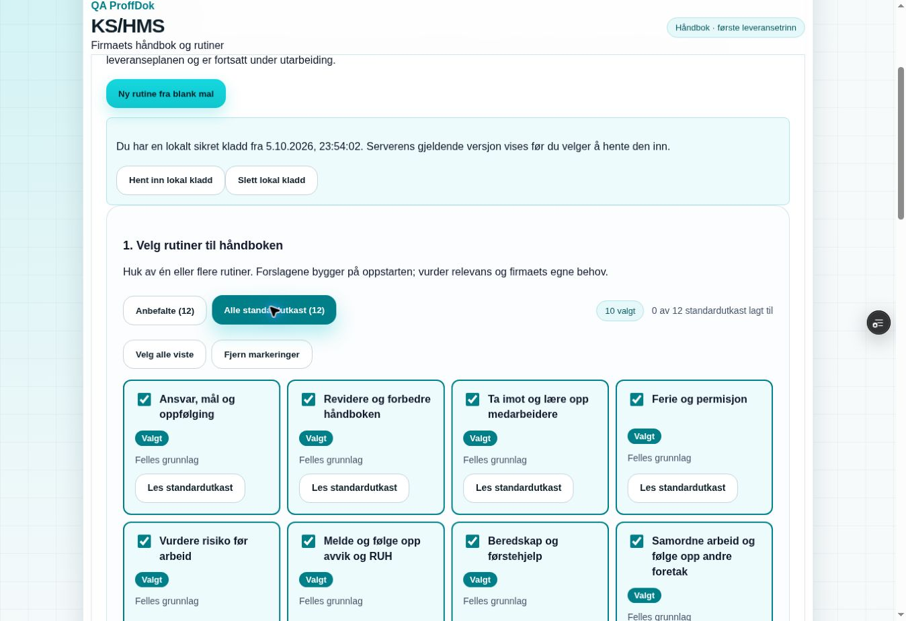

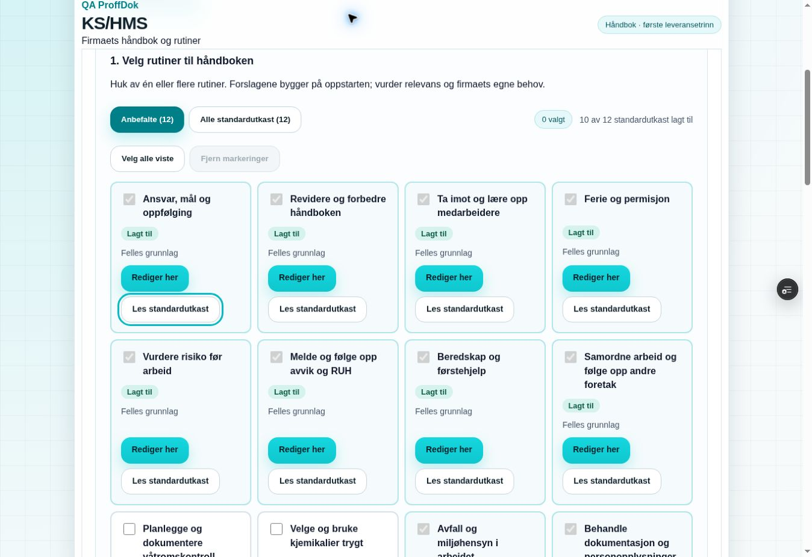

## Enkel veiledning og fast testlenke (2026-10-06)

Hver fane forklarer nå hva brukeren gjør der og neste steg. Håndboken viser fire korte trinn: velg, legg inn, tilpass og godkjenn. Utkast, versjon og revisjon forklares. Rutinefeltene har konkrete hjelpeord og varige feltbeskrivelser. Godkjenning, lesing og oppfølging bruker samme knappnavn som [brukertestlisten](USER_TEST.md) og Hjelp. AGENTS krever fremover en konkret testliste med handling og forventet resultat, enkel veiledning og samme stabile Preview-adresse.

| Kontroll | Resultat og grense |
|---|---|
| Klient og build | Full `EXPO_BACKEND_TARGET=sandbox npm run build` PASS med uendret critical-kjede. Etter én siste statisk presisering om å lese alle tildelte rutiner er Vite-build PASS. Ny GitHub Actions-kontroll av publisert HEAD følges i PR #216. |
| Desktop med faktisk React-modul | PASS i isolert QA `dpl_9WVR6ougoH43haYw7KFQxwc4cuKu`, SHA `8cbc8eeddd10e579782973e457aa901c06c4d009`: egen firmaadmin velges og lagres; to rutiner vises som Valgt og i samlet liste; filterskifte beholder begge; begge legges inn. Rutinefeltene viser tilknyttede forklaringer. Redigert mål beholdes ved samme-firma-refresh og skjul/åpning av appfane, lagres og vises i publiseringsvisningen. Begge rutiner godkjennes. Leser får begge eksakte v1, bekrefter dem og tas ut av listen over manglende bekreftelser. Oppfølgings- og revisjonsfeltene forklarer ansvar og neste steg. Ingen ny revisjonssignering er utført for denne tekstendringen. |
| Mobil med samme komponent/hook | PASS i 390 px iframe: 375 px innvendig viewport og scrollWidth 375; de fire trinnene står under hverandre. KS/HMS-knapper er minst 44 px høye. Dette er ikke en fysisk mobiltest. Ingen app-/React-feil observert i komponentkontrollen; nettleserutvidelsens metadatafeil er separat. |
| Innlogging og fast adresse | Vercels eksisterende branch-alias brukes videre. Appens eksisterende Supabase-klient og registrering er uendret; installert klient bruker vedvarende økt og automatisk tokenoppfriskning. Ny kode på samme adresse krever normalt ikke ny innlogging. Brukerens faktiske innloggede økt er ikke verifisert av komponenttesten. Oppfriskning på samme adresse/nettleser er derfor første brukertest. Ny adresse, nettleser, privat vindu eller avsluttet økt kan kreve innlogging. |
| Uendrede regler | Ingen migrasjon, auth-løsning, RPC-argument, tilgangsregel, firmascope, innholdsversjon eller signaturregel endret. Den eksakte ansattbekreftelsen og revisjonsbekreftelsen er uendret. Tidligere authenticated SQL-kontroll er ikke gjentatt uten DB-endring. |
| Leveransestatus | Håndbokfundament A; resten av minimumsomfanget er fortsatt planlagt. Ny innlogget brukerprøve/TEST OK gjenstår. Ingen merge, main/demo-endring eller Production-godkjenning. |

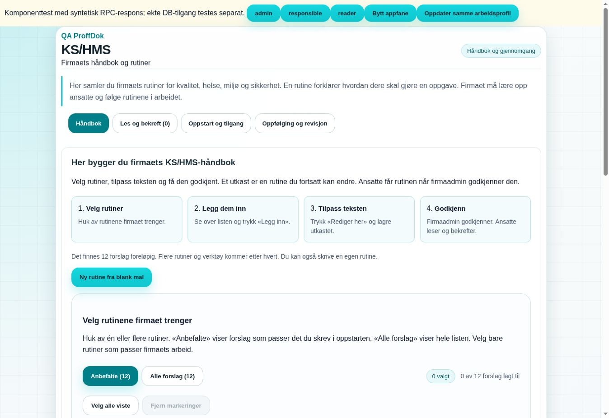

## Godkjenning og tydelig ansattvisning (2026-10-06)

Brukerens bilde viste en aktiv **Godkjenn publisering** på rutinekortet og et tomt vurderingsfelt med inaktiv **Godkjenn og publiser** lenger opp. Den første knappen åpnet bare panelet uten å flytte fokus/scroll; derfor kunne klikket se ut til å gjøre ingenting. Den heter nå **Åpne godkjenning** og følger editorens eksisterende fokusprinsipp. Gjentatt åpning av samme rutinerevisjon viser panelet igjen og beholder vurderingen; en annen rutine starter med tomt felt. Publiseringsknappen er grå ved tom/kort vurdering. Forklaring, fremdrift og serverfeil vises ved godkjenningen. Vellykket publisering viser navn og versjon og fokuserer rutineoversikten.

Produkteier har uttrykkelig endret første krav om firmaadmin som eneste godkjenner: firmaadmin og aktive interne KS/HMS-ansvarlige kan nå publisere. Ny serveravledet `administer` beholder firmaadminstyrt ansattilgang, utpeking og arkivering. Årlig revisjon krever fortsatt den eksplisitt utpekte personen. Ansatte starter direkte i **Les og bekreft**, med egne tildelte versjoner, antall som gjenstår og registrert tidspunkt. De får ingen oppstarts-, redigerings-, publiserings- eller andre ansattes oppfølgingsverktøy.

| Kontroll | Resultat og grense |
|---|---|
| Permanent runtime-kontroll | `critical-kshms-check` gjenskapte manglende synlig godkjenningsåpning før rettelsen. PASS etterpå: åpning publiserer ikke; tom vurdering avvises; gjentatt åpning fokuserer og beholder tekst; neste rutine nullstiller vurderingen; korrekt rutine-ID/revisjon/vurdering publiseres; navn/versjon og fokus i oversikt etter suksess; busy-vern. Tidligere grant-/profil-/faneretur- og bibliotekscenario er beholdt. |
| Faktisk database/API | Sandbox-definisjoner var identiske med tidligere committet migrasjon før endring. `20261005225124_kshms_responsible_publication.sql` erstatter bare eksisterende kontekst-/command-funksjoner; kun Sandbox er migrert. Oppdatert `authenticated`-scenario PASS med rollback: responsible publiserer v1, firmaadmin publiserer v2, riktig godkjenneridentitet registreres, reader/tom vurdering/tilbakekalling/kryssfirma avvises; responsible kan ikke tildele modulgrant, arkivere eller utpeke ansvarlig. Eksisterende immutable-/revisjons-/modulgate-/tenant-/anon-/direkte ACL-kontroller passerer. Ingen ekte håndbok eller ansattbekreftelse endret. |
| Desktop med faktisk React-modul | PASS i isolert QA `dpl_5f3PWzqmVnTPvNpMbyMoLSUj7Krj`, SHA `67aff6196fdb650f7d27521b8deea5ab9506da25`: to kladder, synlig fokusering på korrekt godkjenning, tom vurdering og grå knapp, samme rutine beholder tekst, firmaadmin publiserer første rutine. Responsible åpner neste med eget tomt felt og kan publisere. Syntetisk nettfeil vises ved felt/knapp; vurderingen beholdes og nytt forsøk lykkes. Responsible har ingen modultilgangsliste, aktivt ansvarligvalg eller arkiveringsknapp. Leser starter direkte i Les og bekreft med begge v1, ingen managerverktøy; én egen bekreftelse gir registrert tidspunkt og antall 2 → 1. |
| Mobil med samme komponent | PASS i 390 px iframe / 375 px innvendig viewport: godkjenningspanelet fokuseres ved åpning og vises ca. 90 px fra toppen; tom vurdering gir inaktiv knapp, 52 px høy. scrollWidth 375. Dette er ikke en fysisk enhetstest. |
| Klient og build | Full critical-kjede og Vite-build PASS etter rolleendringen. Etter siste avhengighets- og tekstpresisering passerer målrettet KS/HMS-kontroll og Vite. Siste statiske presisering skiller firmaadminens tilgangsliste fra responsible-veiledningen. Den endrer ingen handling eller ansattvisning. Eksakt publisert HEAD testes av GitHub Actions; status og feature-deploy føres i PR #216. |
| Advisors og nettleser | Samme tilsiktede RPC-only RLS/SECURITY DEFINER-funn; ingen null-funn-påstand. Ingen app-/React-feil observert i den syntetiske flyten; metadatafeil fra nettleserutvidelsen er separat. |
| Fast Preview og brukerprøve | Eksplisitt branch-mål `EXPO_BACKEND_TARGET=sandbox` kontrollert på nytt. Samme branch-alias beholdes. Ny innlogget brukerprøve, bruker TEST OK og Production-godkjenning gjenstår. Syntetisk UI beviser ikke ekte innlogging eller brukerens faktiske økt. |

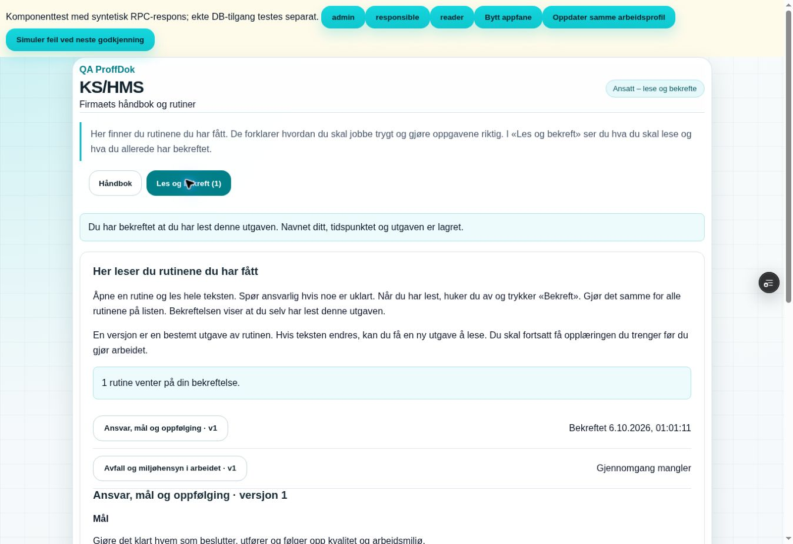

## Oppstart, reell godkjenningsstatus og neste handling (2026-10-06)

Faktisk Sandbox-kontroll fant Expo Proffsenter med 10 rutinekladder, ingen publiserte versjoner og ingen lagret oppstart. Brukerens siste bilde viser dessuten tomt vurderingsfelt og grå publiseringsknapp. «Lagt til», en låst avkrysning og en deaktivert knapp var lette å tolke som godkjenning. UI viser nå utkast/lagrede endringer/godkjent utgave hver for seg, faktisk godkjent-antall og neste handling. Firmaets rutiner er hovedlisten, og forslag ligger under «Legg til flere rutiner».

| Kontroll | Resultat og avgrensning |
|---|---|
| Status/versjoner i klienten | PASS: objektets nøkkelrekkefølge endrer ikke status; tekst/kilder/arrayrekkefølge gjør det. Utkast → v1 godkjent → nye endringer → v2 godkjent; feil rutineversjon og arkiv ekskluderes. v1 beholdes. Ulagret tekst stopper publisering/neste. |
| Faktisk setup-handler | PASS: eksisterende access før settings ved nødvendig grant; egen firmaadmin uten ekstra grant; ukjent medlem og manglende admin avvises; settings-feil beholder valgene og forklarer gitt tilgang/uavklart lagring; unmount stopper videre settings. |
| Reell authenticated Sandbox | PASS med rollback: fire aktive interne firmamedlemmer finnes; access→settings lagrer riktig utpekt demoansatt og gir publish/responsible. Annet firma og en ansatt uten eget grant får avslag. Første testassert leste settings-commandens tomme svar som en settingsrad; kontrollen er rettet til faktisk get_state og passerer. Ingen rutiner, bekreftelser eller revisjoner i firmaet ble endret av kontrollen. |
| Sandbox-fixtures | Tre tydelig syntetiske `.invalid`-brukere er opprettet i auth/profiles. Eksisterende profiltrigger lager vanlig ansattmedlemskap i Expo Proffsenter. Første transaksjon forsøkte også medlemsinsert, traff samme nøkkel og rullet helt tilbake (verifisert 0 fixturebrukere); riktig triggerflyt er deretter brukt. Alle tre er approved/aktive/ansatt, uten KS-grant. Tilhører bare riktig Sandbox-firma. Ingen utsending, passorddeling, Production-data eller fixtureseed i core-PR. |
| Desktop, faktisk komponent/hook | PASS i separat QA-Preview `0b8799af0f64381f848878469a4a2b10a2807166`, `dpl_DtMm31WqBjZxctd6wH3QAbJ6BsX3` READY. Oppstart først med aktiv medarbeider uten tidligere grant og valgfrie blanke felt; to rutiner innlagt som utkast. Begge managerroller publiserer. Feilsimulering beholder vurdering og utkast. Siste godkjenning viser Håndboken er klar og Neste: Ansattes gjennomgang, som fokuserer faktisk oppfølging (90 px fra toppen). Ansatt starter i egen lesing; bekreftelse reduserer 2→1. Endring/lagring åpner ny vurdering, og ansatt ser fortsatt v1 før v2. Gamle bekreftelser beholdes. Appfanebytte og samme arbeidsprofil beholder editor/tekst. |
| Mobil, samme komponent/hook | PASS i 390 px iframe / 375 px innvendig viewport. Egen firmaadmin velges, fag lagres med blanke valgfrie felt; forslag/innlegging/godkjenning/neste-flyten virker. Tom vurdering gir deaktivert knapp. Ferdig håndbok og oppfølging fokuseres ved 90 px; neste-knappen er 44 px høy. clientWidth = scrollWidth = 375. Ikke en fysisk mobiltest. |
| Eksisterende kritiske flyter | Full `EXPO_BACKEND_TARGET=sandbox npm run build` PASS etter flytendringen. Påfølgende presisering av lagringsmeldinger, sentral rolleforslagstekst og Hjelp kontrolleres målrettet med KS/HMS-check og Vite; eksakt publisert HEAD får også repoets CI. Eksisterende bundle-/modultype-advarsler er bevart. Komponentens nettleserutvidelse logger metadatafeil separat fra appkode. |
| Innlogget full-app / Production | Ny innlogget brukerprøve og TEST OK GJENSTÅR. Komponenttesten med syntetisk RPC er ikke bevis på faktisk innlogging/øktsbevaring. Samme branch-Preview beholdes; endelig SHA/CI/READY/miljøbinding føres i PR #216. Ingen ny Production-godkjenning eller merge. |

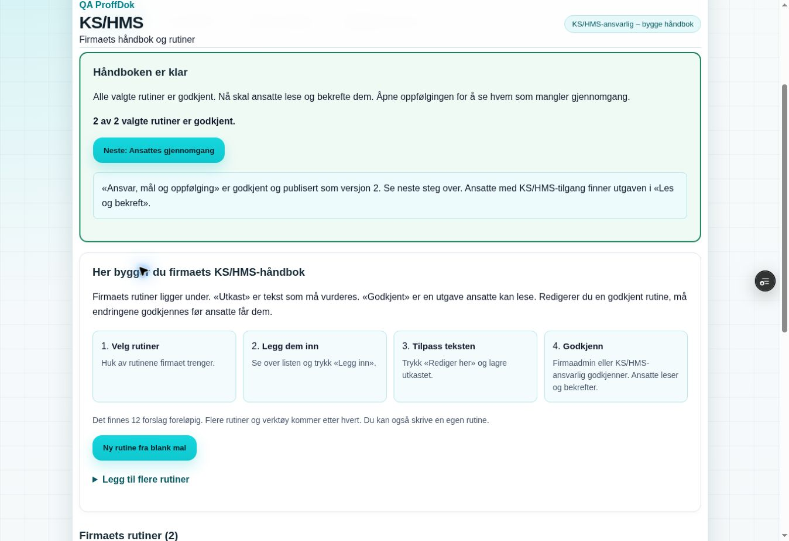

Verneombudsveiledningen er kontrollert i Arbeidstilsynets primærkilde 2026-10-06. Firmastyrt KS/HMS-utpeking er et produktvalg og er ikke et verneombudsvalg. Utpekte ansvarlige og firmaadmin kan bygge/godkjenne; arbeidsgiverens plikter og arbeidstakernes medvirkning består.

## Ansattilgang uten teksttap, skrivehjelp og søk (2026-10-06)

Brukeren mistet oppstartstekst ved valg av neste ansatts tilgang. Rotårsaken var at KS-hooken behandlet en annen ansatts grantendring som en endring av egen tilgang og unmountet arbeidsflaten. Rettelsen bruker eksisterende managed-access-event med `userId` og `companyId`. Serverkonteksten kontrolleres fortsatt etter hvert valg. Egen eller uavklart tilgangsendring, nytt firma, identitetsbytte og feil i tilgangskontrollen skjuler fortsatt innholdet. Firmaadmins automatiske tilgang vises som låst valg; utpeking av samme bruker som KS/HMS-ansvarlig er fortsatt mulig.

| Kontroll | Resultat og avgrensning |
|---|---|
| Permanent tilgangsregresjon | PASS med faktisk access-hook og simulert mount-gate: to andre ansattes grantendringer beholder oppstarts-/rutinetekst, vurdering og søk. Egen/unscoped endring sperrer straks; sent svar kan ikke gjenåpne tilbakekalt tilgang. Nettfeil og reelle scopebytter beholder avslagene. Begge KS-handlere publiserer målbruker og firma. Ingen ny auth-/recovery-motor eller endring av global navigasjon. |
| Tekstforslag | PASS: bare tomme oppstartsfelt fylles lokalt; lagret firmatekst og revisjon beholdes. Flere fag påvirker bare urørte forslag. Egen tekst og bevisst tømt felt beholdes ved fagvalg; eksplisitt «Fyll tomme felt» virker. Ny rutine med forslag har tom påkrevd tittel og ingen oppdiktede kilder. Blank mal forblir blank. Vurdering ved publisering og revisjonsfunn fylles ikke automatisk. Skrivehjelp ligger utenfor lagret rutineinnhold. |
| Søk og tilgang | PASS: navn, kapittel og flere ord i tekst; norsk tegnnormalisering; manager finner utkast/gjeldende utgave. Leser finner bare egne tildelte publiserte versjoner, også når testdata bevisst inneholder andre ansattes versjoner og managerutkast. Bibliotekets flervalg beholdes gjennom søk. Ingen nye tabell-/RPC-rettigheter. |
| Desktop, faktisk React-modul/hook | PASS i isolert syntetisk QA `dbbd9581885e5277c5c0d26792941bb838bf1c5a`, `dpl_HursMSvV7x5oZZLJ197C3dx3E2vW`: egen tekst overlever to tilgangsvalg og flere fag; bibliotekets to valg beholdes på tvers av søk og legges inn som separate utkast. Rutineeditorens egen tekst og håndboksøk beholdes ved bytte til tilgangslisten, to grantvalg og retur. Godkjenningspanelet viser innhold uten skrivehjelp; tom vurdering sperrer publisering. Publisert førstehjelpsrutine leses av ansatt uten editor/tips; søk etter upublisert ferierutine gir ingen treff. |
| Siste UI-presisering og mobil | PASS i QA `ca4f87489b2547aae14f17364ad47fc9173d1f99`, `dpl_3u1wMBcNs4PESqk4kUUKSuC1Cbhr`: søk har eksakt tilgjengelig navn, hint er separat. Firmaadmins automatvalg er låst. I 390 px ramme beholdes egen tekst ved to grantvalg; egen firmaadmin velges og oppstart lagres. Ny rutine har redigerbare forslag. `clientWidth = scrollWidth = 375`; ingen vannrett overflow. Desktopbilde fra samme QA viser skrivehjelpen og de utfylte feltene. Dette er komponentkontroll med syntetisk RPC, ikke fysisk mobil eller innlogget full-app-test. |
| Kritiske eksisterende flyter/build | Full `EXPO_BACKEND_TARGET=sandbox npm run build` PASS etter tilgangs-/forslags-/søkendringene og låst adminvalg, inkludert eksisterende Sales recovery/hydration, firmaskille, profil og øvrige critical-checks. Siste faglige tekst/kildepresisering etter UI-testene: målrettet KS/HMS-kontroll og Sandbox Vite-build PASS. Eksakt publisert feature-HEAD skal i tillegg ha grønn CI og READY på samme Preview-alias; identifikatorer føres i PR #216. Eksisterende module-type/proxy-/chunk-advarsler er beholdt. Observerte konsollfeil kommer fra nettleserutvidelsens metadata, separat fra appkode. |
| Fagkilder og firmatilpasning | Fire sentrale tekstforslag er selvstendig omskrevet uten «fyll inn»-instruksjoner i rutinebrødteksten. Internkontroll §§4–5, arbeidsmiljøloven (bl.a. §3-1 og kapittel 2 A), ferieloven §6 og arbeidsplassforskriften §3-10 kontrollert 2026-10-06. Varslingskanaler skal ikke begrenses til nærmeste leder; fortrolige saker skal ikke i ordinært avviksregister. Førstehjelpsforslaget har direkte forskriftsreferanse. Bare disse fire rutinenes kildekontrolldato fornyes. Firmatekst og publiserte versjoner overskrives ikke; nye sentrale forslag må vurderes manuelt i firmaets utkast. Dette er ikke en full fagvalidering av hele biblioteket. |
| Omfang og kapasitetsvurdering | Ny `CONTENT_STATUS.md` registrerer status for samtlige 125 kildereferanser. 12 startutkast har tematisk kobling til 51 av 121 innholdstemaer; kobling er ikke dokumentasjon på fullført dekning. Full selvstendig forfatting er eget neste A2-trinn. Samlet avvik/RUH, tildelt ansvar og vedvarende innloggings-/e-postoppgave, tilsynsdokumentasjon og avgrenset supportmodus er konkretisert med ferdigkrav i PLAN. `CAPACITY.md` beskriver arkitekturtiltak og foreslått isolert 100-firma-lastprøve; kapasiteten er ikke målt eller godkjent. |
| Faktiske miljøer og gjenværende brukerprøve | Ny read-only miljøkontroll: begge databaser rapporterer `max_connections = 60`; dette er ikke bruker-/firmaantall. Production er frisk PG17.6 og har ingen KS-tabeller; Sandbox har modulens åtte tabeller. Sandbox-managementmetadata fant ikke branch-ID, mens SQL virket; dette rapporteres ikke som driftsstans. Ingen migrasjon, reseed, ekte grant-/håndbok-/signaturendring, Production-endring eller faktisk e-post i denne leveransen. Innlogget test av brukerens økt, ny TEST OK og Production-godkjenning GJENSTÅR. Tekst som gikk tapt før rettelsen, gjenopprettes ikke av denne endringen. |

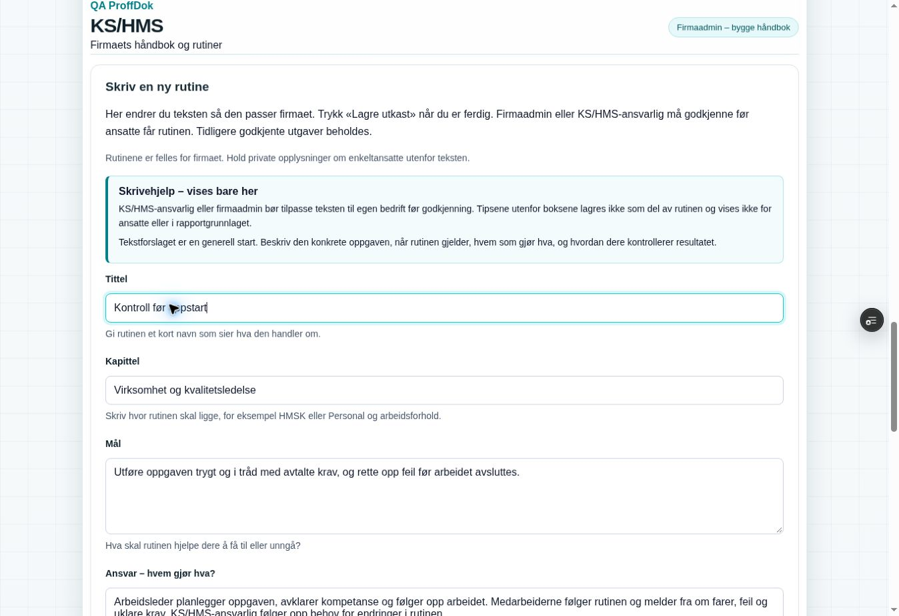

De fire prioriterte brukertestene står øverst i `USER_TEST.md`. Architecture, README, Hjelp og release-status er oppdatert. Modulen er fortsatt trinn A, ikke et komplett KS/HMS-system.

## Automatisk neste rutine og fullføring nederst (2026-10-06)

Brukerens tre nye bilder viser godkjenningspanelet, venteteksten og en håndbok med ti av ti godkjente rutiner. Den tidligere kontrakten fokuserte neste-kortet øverst etter publisering. Produkteier ber nå om at neste rutine åpnes automatisk, både ved publisering og ved egen lesebekreftelse, og om Neste-knapp nederst etter siste godkjenning. Den permanente kontrollen er derfor endret til denne uttrykkelige kontrakten. Vurdering og avkrysning må nullstilles for neste utgave; et klikk kan aldri godkjenne eller bekrefte flere utgaver. Feil, tilbakekalt scope og bevisst navigasjon skal fortsatt stoppe automatisk fremdrift.

| Kontroll | Resultat og avgrensning |
|---|---|
| Faktisk status før endring | GitHub feature/PR #216 hadde head `47a5955ecb92846abff76eb42b807a6af742424d`, åpen draft, ikke merget. Main `155f6c4ac01f126c1db0c65da385cfd9305587d5` og demo `67f336f5a111ac6d997fa66c572e1b2e084390e8` kontrollert på nytt. Fast feature-alias viste READY `dpl_3zZvHBWQRTLhcmhTvmqDsY6sG2QL` med samme feature-SHA. Gamle bilder/chat er ikke brukt som deploybevis. |
| Permanent publiseringsregresjon | PASS med faktisk kildeuttrukket handler: to kladder, én publish per klikk, fersk autorisert state, neste tomme vurdering, siste bunnfokus, uendret eldre versjon. Søket tømmes bare når neste ellers skjules. Feilet publish eller kontrolllesing beholder vurdering/panel. Sen respons etter inaktivt scope eller feil firma/identitet gir ingen fremdrift; valgt appfane overstyres ikke. Eksisterende åpning, vurderingskrav, busy-/dirty-vern og korrekt revisjonspayload beholdes. |
| Permanent egen bekreftelse | PASS: bare egne påkrevde tildelte utgaver inngår; andres bekreftelser/tildelinger, manglende versjons-ID og senere informasjonsutgaver styrer ikke egen kø. Hver ack bruker eksakt åpnet versjons-ID og uendret ACK-tekst. Egen ack må finnes i fersk state før neste åpnes. Neste starter med avslått avkrysning. Siste gir fullført-kort; feilet ack/lesing beholder utgave og avkrysning. Tidligere bekreftelser beholdes. Inaktivt/feil scope stanser responsen, og bevisst appfanebytte reverseres ikke. |
| Desktop, faktisk React-modul/hook | PASS i separat QA-branch `test-kshms-handbook-ui`, SHA `cab34766606f567908aad5be7eb6ee2ab0786cf9`, READY `dpl_9BypnRDoQaG8x8WWnfVGvRKcysbY`. To syntetiske rutiner innlagt og publisert separat. Feilet publisering beholder tekst; retry åpner neste med tom vurdering, deaktivert knapp og fokus ca. 90 px fra toppen. Siste viser topp- og bunnknapp, fjerner venteteksten og fokuserer bunnkortet. Bunnknappen åpner eksisterende oppfølging. Ansatt bekrefter egne to utgaver: feil beholder avkrysning, retry åpner neste med avslått avkrysning og tømmer skjulende søk, siste viser fullføring og begge tidspunkter. Ingen ekte database eller brukerdata inngår i komponentresponsene. |
| Mobil, ti rutiner | PASS i 390 px iframe / 375 px innvendig viewport. Ti syntetiske rutiner lagt inn; ti eksplisitte publish-klikk oppdaterer 0→10, med neste tomme vurdering og fokus ca. 90 px. Siste gir fokusert bunnkort, ti av ti og 44 px høy Neste-knapp. Venteteksten er borte; bunnknappen åpner oppfølging. Syntetisk ansatt bekrefter de ti utgavene, én om gangen: 10→0, avslått avkrysning hver gang, siste fokusert fullføringskort uten checkbox. `clientWidth = scrollWidth = 375` i begge flyter. Dette er ikke en fysisk mobil- eller innlogget full-app-test. |
| Eksisterende kritiske flyter/build | Full `EXPO_BACKEND_TARGET=sandbox npm run build` PASS etter handler-/kontrollendringene. Eksisterende Sales recovery/hydration, firmaskille, profil, navigasjon, modulbinding og øvrige critical-checks er beholdt. Siste Hjelp-/dokumentasjonspresisering kontrolleres målrettet; eksakt publisert feature-HEAD får også CI, Core Safety og dokumentasjonsguard. Eksisterende chunk-/modultype-advarsler består. Konsollens observerte metadatafeil kommer fra nettleserutvidelsen, separat fra appkode. Endelig feature-SHA/CI/READY føres i PR #216. |
| Tilgang, data og videre test | Ingen SQL-migrasjon, ny RPC, RLS/Storage-/authendring, modulgateendring, grant, reell godkjenning/bekreftelse, utsending eller main/demo-merge i denne rettelsen. Brukerens ti godkjenninger er ikke rørt og trenger ingen ny godkjenning. Fullførte håndbøker får bunnknappen fra eksisterende serverstate. Faktisk innlogget brukerprøve, TEST OK og Production-godkjenning GJENSTÅR. Den faste feature-adressen beholdes; tidligere innloggings-/firmascopevern er uendret. |

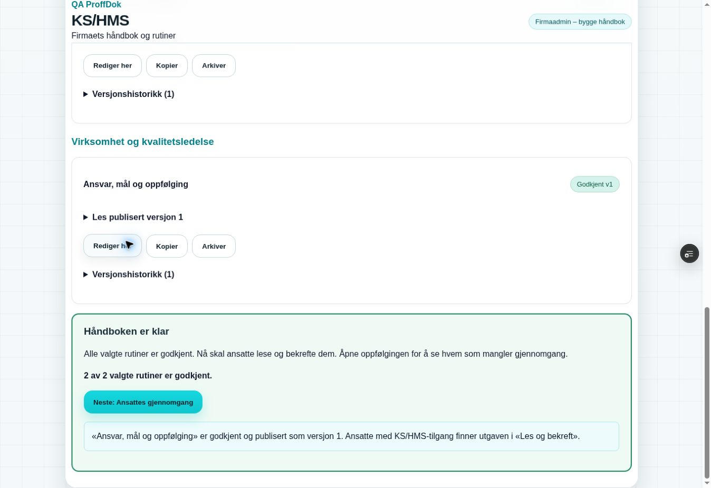

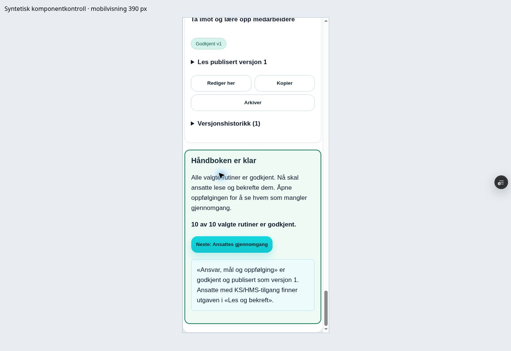

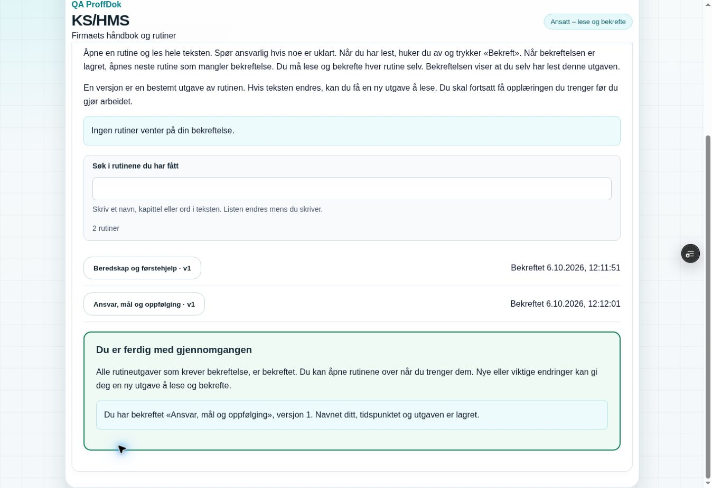

Tre avgrensede brukerkontroller står nå øverst i `USER_TEST.md`. README, Architecture, Hjelp og release-status beskriver samme automatiske neste-flyt. Hele minimumsomfanget i planen består; dette fullfører ikke de senere KS/HMS-trinnene.

## Kompakt oppfølging per medarbeider (2026-10-06)

Produkteier meldte at 40 ubekreftede tildelinger ga en lang liste etter publisering av ti rutiner. Ny visning samler de samme utgavene per medarbeider, med detaljer ved åpning. Dette endrer visningen og første neste-steg-tekst, uten ny bekreftelses-, tilgangs- eller signeringsmekanisme. Tildeling til nye medarbeidere og årlig revisjon ligger i egne sammenfoldede områder.

| Kontroll | Resultat og avgrensning |
|---|---|
| Faktisk status før endring | GitHub feature/PR #216: `5760bbefd0520a29a4d520f7e13822383513cf2d`, åpen draft og ikke merget. Main `155f6c4ac01f126c1db0c65da385cfd9305587d5`, demo `67f336f5a111ac6d997fa66c572e1b2e084390e8` og fast feature-alias READY `dpl_FfzBxQ41NKkL6xb6JpQgm7UNwoy6` på samme feature-SHA kontrollert på nytt. Eksisterende branch-diff mot main vurdert før endring. |
| Permanent fremdriftsregresjon | PASS: fire personer × ti påkrevde utgaver gir fire grupper og 40. Én egen bekreftelse gir 39, bare egen fremdrift endres, eksakt versjon og tidspunkt beholdes. Ferdig medarbeider er fortsatt synlig med ti bekreftelser; nye vesentlige utgaver gir nytt krav uten å omskrive historikk. Duplikater, ukjente versjoner og senere informasjonsutgaver øker ikke antallet. Tom/all-bekreftet state og uendrede inngangsdata kontrollert. |
| Permanent tildeling/tilgang | PASS: allerede tildelte gjeldende utgaver gir ingen tomme rutinevalg. Ny medarbeider uten modultilgang tilbys ikke tildeling; kvalifisert ny medarbeider tilbys de ti utgavene, og tildeling av én etterlater ni valg. Manager-utledning og manager-visningsgate består. Eksisterende scope-/grant-, auto-neste-, versjons-/bekreftelses-, søk-, feil- og sen-responskontroller er fortsatt grønne. |
| Desktop, faktisk React-modul/hook | PASS i isolert syntetisk QA `test-kshms-handbook-ui`, SHA `e9d9840ef1311ed47eec4efb3a8c9786b7ddab04`, READY `dpl_3nRtCGjmg4Syackv2gnArq3KdJCE`. Ferdig håndboks bunnknapp åpner fire lukkede medarbeiderrader og 40. Åpning viser ti v1-utgaver; medarbeidersøk viser to treff og tømming alle fire. Én egen ack åpner neste med avslått checkbox, og oppfølging viser 39 samt eget tidspunkt/1 av 10. Bare egen rad endres. Ingen tomme tildelingsbokser. Én tildeling til syntetisk ny kvalifisert medarbeider bruker eksisterende handling, gir ny 0 av 1-rad og fjerner det gjeldende valget. Ansattrollen starter i egen lesing uten manageroppfølging. |
| Revisjon og faneretur | PASS: neste dato 2027-10-06 er synlig med lukket skjema og uendret avtaleregel. Åpning viser eksisterende ti-utgavers kontroll, felt, utpeking og signeringskrav. Syntetisk skrevet funn/oppfølging beholdes ved lukking, ny åpning og to appfanebytter. Revisjon ble ikke signert. Neste-steg-teksten forklarer at ansatte leser etter publisering; revisjon er ikke en ekstra port. |
| Mobil | PASS i 390 px ramme / 375 px innvendig viewport: fire lukkede medarbeiderrader og 40, sammenfoldet tildeling/revisjon, synlig kontrolltidspunkt. Åpnet medarbeider viser alle ti eksakte utgaver. `clientWidth = scrollWidth = 375`, også ved åpne detaljer. Radens summary er minst 79 px i denne rammen, over 44 px målet. Dette er komponentkontroll, ikke fysisk mobil eller innlogget full-app-prøve. |
| Eksisterende kritiske flyter/build | Full `EXPO_BACKEND_TARGET=sandbox npm run build` PASS etter kode/kontrollendringene, inkludert Sales recovery/hydration, arbeidsprofil, firmascope, navigasjon og øvrige critical-checks. Siste Hjelp-/dokumentasjonsendring kontrolleres målrettet. Eksakt publisert feature-HEAD skal også ha grønn CI, Core Safety, dokumentasjonsguard og READY på fast Sandbox-alias; identifikatorer føres i PR #216. Eksisterende chunk-/modultype-advarsler beholdes. Observerte metadata-konsollfeil kommer fra nettleserutvidelsen, ikke appkoden. |
| Data, miljø og gjenværende test | Ingen SQL/RPC-, RLS/Storage-, auth-, modulgate- eller rolleendring, reell tildeling/godkjenning/bekreftelse/revisjon, utsending eller main/demo-merge. Testresponsene inneholder bare syntetiske `.invalid`-personer. Brukerens ti godkjenninger og alle faktiske versjoner/bekreftelser beholdes. Samme Preview-adresse brukes. Innlogget brukerprøve, ny TEST OK og Production-godkjenning GJENSTÅR. Fullt minimumsomfang er fortsatt registrert, ikke fullført av denne UX-rettelsen. |

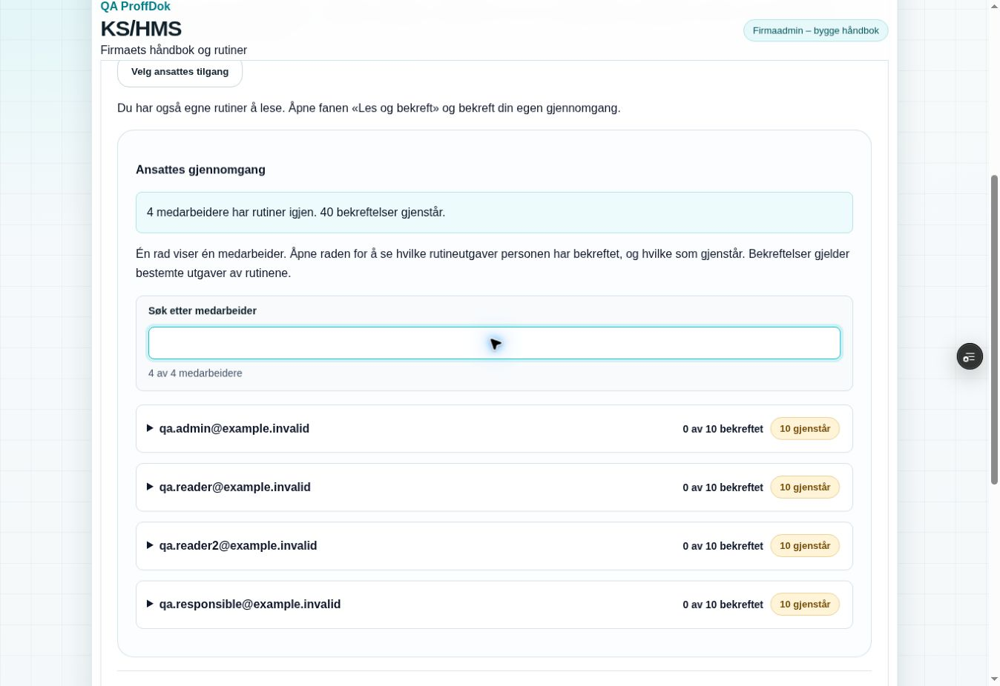

README, Architecture, Hjelp og release-status beskriver samme visning. Tre konkrete brukerkontroller står øverst i `USER_TEST.md`.

## Min personalhåndbok, identitet og samlet egen bekreftelse (2026-10-06)

Produkteier ber om søkbart personlig oppslag, også for firmaadmin, og om å unngå to egne gjennomganger av samme publiserte utgave. Ny visning gjenbruker tildelinger, versjoner, bekreftelser og eksisterende leseflyt. Firmaets publisering og medarbeiderens egen gjennomgang er fortsatt to dokumenterte handlinger; de kan utføres samlet etter et uttrykkelig frivillig valg. Systemadmin antas ikke å være firmagodkjenner.

| Kontroll | Resultat og avgrensning |
|---|---|
| Faktisk feature før endring | Kompakt oppfølging publisert på feature-head `2dfda43d04d4222066267f8fe4d6b80b36f3dc50`, tree `275d898f916686e993fc33997d1b0d212312f371`, CI `37474908180`/jobb `112307675305` SUCCESS, fast Sandbox-alias READY `dpl_G1jBtyD5DERTaKTj59xKoBS7f2aX`. Faktisk importgraf ga `KshmsModule-CilCPK9Z.js`; arbeidsprofilklienten viste Sandbox-URL, ingen Production-URL. Main/demo og Production var uendret. PR #216 fortsatt åpen draft. |
| Permanent personlig lesemodell | PASS: bare egne eksakte tildelinger, også ved bevisst bred managerrespons med andre firmaers/brukeres utgaver, managerkladder og andres bekreftelser. Flere tildelte utgaver grupperes; tidligere utgave og eget tidspunkt beholdes ved ny versjon. Søk finner innhold også i eldre tildelt utgave, arkiv er merket, tom state håndteres, inngangsdata endres ikke. Eksisterende grupperte 40-bekreftelser, tilgang, søk, auto-neste, feil og sen-responsvern passerer fortsatt. |
| Permanent faktisk publish-handler | PASS: normal publisering uten valget beholder eksisterende payload og lager ingen egen bekreftelse. Uttrykkelig valg sender eksakt statement, kontrollerer egen eksakte ack i fersk state og starter neste rutine med valget avslått. Ingen ekstra signeringsmotor eller automatisk historisk bekreftelse. Scope-, busy-, dirty-, rolle-, versjons- og godkjenningskrav beholdes. |
| Sandbox-migrasjon | `20261006141916_kshms_personal_handbook_identity.sql` anvendt bare på `ppvircenkjizeiqdxphj`, management returnerte success og migrasjonsloggen samme versjon. To nullable jsonb-kolonner og privat helper; eksisterende get_state/command oppdatert uten bredere tabell-/RPC-rettigheter eller rolleendring. Nye navn/e-post/ID avledes på serveren; metadata er bare etikett. Gamle poster backfilles ikke. Production `dqffxflaoyarbxyiyhop` urørt. |
| Reell authenticated databaseprøve | PASS både som migrasjonstrial med rollback og mot anvendt Sandbox-migrasjon. `scripts/kshms-sandbox-check.sql` bruker syntetiske auth/profil/firma-fixtures og ruller hele prøven tilbake. Riktig firmagodkjenner og egen ack-identitet; publisering uten valg gir ingen ack, gyldig frivillig valg gir én egen ack og ingen for andre. Ugyldig/manglende statement og ikke-boolsk valg avviser hele publiseringen. Klientforfalsket annen bruker/tid overstyrer ikke auth.uid/serverens tid. Aktiv rolle/modul/firma, UE/eksternavslag, tilbakekalt grant, anonym-/direkte tabellavslag, stale revisjon, immutable versjoner/bekreftelser, kontrollert revisjon og eksisterende funksjons-ACL passerer. Privat helper er ikke callable for authenticated. |
| Identitet og eldre poster | PASS: etter at syntetisk kontonavn endres, beholder nye publiserings-/ack-snapshot navnet ved handlingen. Legacy-fixture med null-snapshot viser dagens kontoetikett med `source: current_account` uten generell medlemsliste for ansatt; de lagrede snapshot-kolonnene forblir null, og gamle versjoner/hash/tidspunkt/ack endres ikke. Første ekstra legacy-test var ved en feil plassert etter eksisterende rollback og traff tom fixture-ID før ekstra insert. Rollback er flyttet til slutten av samme scenario; hele korrigerte prøve PASS. Dette endret ingen faktiske firmadata. |
| Desktop, faktisk modul/hook | PASS i isolert syntetisk QA-branch `test-kshms-handbook-ui`, head `2704094cc7c61de97898b132001518ac7ed6b5bf`, READY `dpl_Bcf4AhDkLgJ4NgiderWSuyDugv52`. Firmaadmin og ansatt kan søke/åpne egen Ferie og permisjon v1 med faktisk demo-godkjenner. Ansattens egen bekreftelse åpner neste med avslått checkbox; retur til Min personalhåndbok beholder søket og viser samme rutine med Bekreftet, eget navn og tidspunkt. Ingen managerfaner i ansattvisningen. Ny syntetisk rutine starter med frivillig valg avslått. Feilsimulering beholder vurdering og valgt egen gjennomgang; retry publiserer én utgave og én egen ack. Firmaadmin ser begge handlinger med eget navn/tid og ingen ny egen bekreftelsesknapp; ansatt ser samme utgave fortsatt Må bekreftes. De ti eldre firmaadmin-tildelingene er fortsatt ubekreftet. |
| Mobil og faneretur | PASS i 390 px ramme / 375 px innvendig viewport: egen personalvisning, søk og åpnet utgave viser godkjenner og egen status. `clientWidth = scrollWidth = 375`; summary er 71 px høy, over 44 px målet. To appfanebytter bevarer Min personalhåndbok, søket «ferie» og åpne detaljer. Samme eksisterende monterings-/scopeprinsipp, ingen ny recovery eller authflyt. Dette er komponent-QA, ikke fysisk mobil eller innlogget full-app-prøve. |
| Kritiske flyter/build | Full `EXPO_BACKEND_TARGET=sandbox npm run build` PASS etter kode-/migrasjons-/kontrollendringene, inkludert eksisterende Sales recovery/hydration, arbeidsprofil, firmascope og øvrige critical-checks. Faktisk QA-komponentbuild PASS. Siste Hjelp/dokumentasjon kontrolleres målrettet før publisering; eksakt feature-HEAD får CI, Core Safety og releaseguard. Eksisterende chunk-/modultypeadvarsler består. Observerte browser-metadatafeil kommer fra nettleserutvidelsens URL, ikke appkode. Endelig feature-head/CI/READY og faktisk Sandbox-binding føres i PR #216. |
| Sikkerhetsrådgiver | Eksisterende RPC-only KS-tabeller får fortsatt INFO [RLS uten direkte policy](https://supabase.com/docs/guides/database/database-linter?lint=0008_rls_enabled_no_policy), og de fem eksisterende offentlige autoriserte security-definer-RPC-ene får WARN [authenticated execute](https://supabase.com/docs/guides/database/database-linter?lint=0029_authenticated_security_definer_function_executable). Direkte tabell-/anon-tilgang er sperret, hvert RPC-kall har eksplisitt contextkontroll, og scenarioets ACL/rolle-/modulavslag passerer. Privat helper introduserer ikke ny executable-finding. Dette dokumenterer funksjonsmodellen; rådgiverfunnene kalles ikke borte. |
| Data, omfang og brukerprøve | Ingen reell publisering, bekreftelse, revisjon, ny grant, e-post, Storage, betaling eller main/demo-merge. Brukerens ti godkjenninger og gamle signaturer er urørt. Samme Preview-adresse beholdes. Felles HR-rutiner er oppslagsinnhold; individuelle medarbeidersamtaler/kompetanse/oppfølging er fortsatt senere med egen tilgang og bevaringsregler. Ny innlogget brukerprøve, TEST OK og Production-godkjenning GJENSTÅR. Hele PDF-/KS/HMS-minimumsomfanget består og er ikke fullført av denne leveransen. |

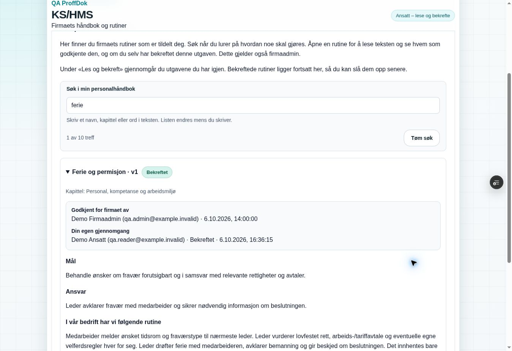

README, Architecture, Hjelp, plan og release-status beskriver den samme flyten. Tre konkrete kontroller står øverst i USER_TEST.md; tidligere godkjenninger skal ikke gjentas bare for prøven.

## Presisering av påkrevd gjennomgang og mottatt TEST OK (2026-10-06)

Bruker meldte «test ok» og presiserte at signering av rutiner er et krav før arbeid i firmaet. Dette registreres for faktisk prøvd feature-head `6dfb74dad244ff9bd0e416a08f0a34bc88da3c3a`, READY `dpl_B8Vn551uVzGFZ3D1aHnJTDTZhD9W`. GitHub feature/main/demo og åpen draft PR #216 er kontrollert på nytt; main/demo er fortsatt `155f6c4ac01f126c1db0c65da385cfd9305587d5` / `67f336f5a111ac6d997fa66c572e1b2e084390e8`. Meldingen innebærer ikke Production-godkjenning eller at hver ansatt faktisk har bekreftet.

Bare ordlyd i KS/HMS-publisering, Les og bekreft, personlig oppslag, oppfølging, Hjelp og tilhørende dokumentasjon endres. «Valgfritt» ved egen gjennomgang er fjernet. Alle, også firmaadmin/KS-HMS-ansvarlig, skal lese og bekrefte etter firmaets arbeidsregel før arbeid. Valget gjelder bare «ved publisering eller etterpå». Ingen automatisk bekreftelse, fritak eller signering på vegne av andre. Dette er firmakrav, ikke en generell lovpåstand om signatur.

| Kontroll | Resultat og avgrensning |
|---|---|
| Uendrede handlinger | Publish-/ack-/auto-neste-/scope-/versjonsfunksjoner og kravflagg er uendret. Manglende egen avkrysning gir fortsatt ingen ack og ingen sletting av påkrevd tildeling; egen gjennomgang står fortsatt i kø og manageroppfølging. Eksisterende permanente runtime-scenario PASS, inklusive feil/retention, eksakt egen identitet, ingen andres ack, fire rader/40 og gamle utgaver. Ingen nye speiltester for tekst. |
| Read-only Sandbox | Faktisk metadata: ti publiserte førsteutgaver, null informasjonsutgaver og null registrerte ansattbekreftelser ved kontrollen. Ingen data/signatur/grant/migrasjon er skrevet. Brukerens ti firmagodkjenninger står urørt. TEST OK er ikke brukt til å opprette noen egen bekreftelse. |
| Målrettet bygg | KS/HMS-critical PASS og Sandbox Vite-build PASS etter UI-/Hjelp-tekstene; diff-check PASS. Hele feature-PR følger eksisterende Core Safety/dokumentasjonsguard og CI på eksakt publisert head. Full database-/desktop-/mobilprøve fra godkjent funksjonsversjon beholdes; de gjentas ikke for samme mekanisme ved ordlydsendring. |
| Faktisk arbeidsadgang | A registrerer og følger opp bekreftelser. Den innfører ingen automatisk sperre av prosjektarbeid i andre moduler. Ledelsen følger opp firmaets arbeidsregel. Et teknisk arbeidsadgangsvilkår må spesifiseres senere før beskyttede prosjekt-/tilgangsflyter endres; teksten fremstiller ingen slik sperre som levert. |
| Ny tekstkontroll | På samme Preview: åpne Les og bekreft eller Min personalhåndbok og se kravet før arbeid. Publiseringspanelet forklarer tidspunktet ved neste faktiske godkjenning. Ingen ny signering, ekstra rutineversjon eller gjentatt full funksjonsprøve trengs bare for teksten. Endelig head/CI/READY registreres i PR #216. Production og permanent demo er uendret. |

## A2 – gjenoppretting og testgrenser

| Kontroll | Resultat og grense |
|---|---|
| PDF-er og innhold | Begge originaler gjenfunnet/lest; 148 + 127 sider. Alle 125 referanserader bevart. 73 egne forslag dekker 121 innholdstemaer; fire metadata håndteres separat. Firmatilpasning/godkjenning gjenstår. |
| Sandbox-kontrakt | 73 PASS i kshms-deviations-sandbox-check.sql, alle syntetiske data rullet tilbake. Trond → Eli; oppgave bare for ansvarlig, lesing, feil/egen lukking, revisjoner, involvert innsyn/private filer, kryssfirma/UE, revoke/reopen, lenket prosjekt/sjekkpunkt og urørt ukoblet legacy. Mail-dedup/retry/lease/fencing/undertrykking og NOLOGIN/private worker-vern inngår. Ingen HTTP/providerkall. |
| Eksisterende håndbok | kshms-sandbox-check.sql PASS etter ansvarlig-lukkemigrasjonen. Immutable versjoner/ack/reviews, firma/roller/utpekt signer består. |
| React-handlere | Faktiske editor-/task-effect og legacy-handler-scenario lokalt PASS før siste transportvern. Feilet close beholdt fylte felt/avkrysning; bekreftet retry installerte lukket snapshot/event. Out-of-order/offline/cleanup og lokal recovery inngår i permanent critical-kshms-deviations-check. Hele testkjeden inngår også i ny Vercel-build. |
| Mailer v3 | Deployet på Sandbox. Autentisert health: transport_safe=true, api_key_configured=false, sender_configured=false, configured=false, HTTP 503. Ingen mail sendt; enabled=false. Stubbet transport dekker 429/retry/tapt finish/idempotens og feil/manglende sikkerhetskontroll. Faktisk mottak krever oppsett. |
| pg_net | Plattformen eier grants; REVOKE-forsøk hadde ingen effekt og gir ingen ACL-PASS. Støttet API-grense bekreftet gjennom faktisk HTTP406/PGRST106 i worker. Anon/authenticated er NOLOGIN; privat worker/settings er utilgjengelige. Betrodde SQL-roller må behandles som administrativ tilgang. |
| Nettleser | Lokal UI-server bygget, men Cloud Browser kunne ikke åpne localhost/127.0.0.1 (ERR_BLOCKED_BY_CLIENT). Separat syntetisk ekstern QA-publisering ble avvist av automatisk godkjenningskontroll som utenfor fast Preview-scope, og ble ikke utført. Innlogget full-app og mobilvisning er ikke gradert PASS. USER_TEST har faktiske knapper/forventninger. |
| Recovery | Lokalt exec-verktøy mistet forbindelsen. Full implementasjon var lagret i Git-checkpoint 9e88f4c; siste avgrensede rettelser/tester/dokumentasjon ble gjenoppbygget fra dette gjennom Git-API. Feature-head ble kontrollert uendret mot 712e3ce før lease-bundet publikasjon. |
| Produksjon | Ingen main-merge, Production-migrasjon eller demo-synk. Tidligere TEST OK gjelder bare prøvd håndbokhead 6dfb74d. |

Sluttbuild/CI og deployment verifiseres etter publisering. Kildegrunnlag for pg_net-grensen: https://supabase.com/docs/guides/database/extensions/pg_net og https://supabase.com/docs/guides/troubleshooting/revoking-access-to-pg_net-objects-has-no-effect-0bbc16 .

## Bekreftet sluttkontroll for kodehead 6bf84204 (2026-10-06)

- Hele critical build PASS i Vercel, inkludert actual editor/task/legacy/mail-stub-scenario i critical-kshms-deviations-check. Ny katalog- og eksisterende håndbokkontroll PASS; miljø-/navigasjon/Sales/tilbuds-/rapport-/profil-/Cordel-vern inngår i uendret kjede.
- GitHub PR Core Safety run 37526599994, job 112485065961: completed/success. Scope isolation, release-doc guard og full critical build var grønne.
- Feature-Preview READY: dpl_DyJEcTbmRETSNCWMB8UYJompaF8r, kode-SHA 6bf84204db9c7869bebafb19c034dc02f53f25ca. Fast alias expo-proffdok-git-feat-kshms-foundation-ringside.vercel.app. Vercel bekreftet branch-spesifikk plain EXPO_BACKEND_TARGET=sandbox for preview/feat-kshms-foundation.
- 73 Sandbox-kontroller PASS med rollback, outbox etter QA=0. Mailer v3 ACTIVE; autentisert health bekreftet transport_safe=true, begge e-postkonfigurasjoner false. enabled=false.
- Production er fortsatt READY på 155f6c4ac01f126c1db0c65da385cfd9305587d5/dpl_9wsjTrEVzvAF6jf7f9HgvzskYP5z. Ingen produksjonsmigrering/merge/demo-synk.
- Full-app/visuell nettleserkontroll gjenstår. Cloud Browser mistet exec-server-forbindelsen (environment_offline). Uautentisert web-oppslag kunne ikke hente siden. Vercels fetch-verktøy ble avvist av automatisk godkjenningskontroll fordi det kan opprette autentiseringsomgåelse/share-lenke, som ikke var autorisert. Ingen tilgangslenke eller bypass ble opprettet. Deployment/alias/bygg er verifisert via autorisert Vercel-API; det er ikke bevis på innlogget skjermflyt.

Ingen ny TEST OK er gitt for A2. Følg USER_TEST.md; e-post må konfigureres sikkert før faktisk mottak kan prøves. Denne kontrollregistreringen endrer bare dokumentasjon; kodehead over identifiserer den testede funksjonen.

## Avviksdialog – 7. oktober, ny brukerfeil

Se AVVIK_DIALOG_20261007.md. removeChild gjenskapes før rettelsen med faktisk React DOM-renderer/adapter og passerer etter rettelsen. Utvidede avvik-/navigasjonschecker tester konkret kilde/readback/ansvarlig, gamle bilder og andre prosjektfelt. Full EXPO_BACKEND_TARGET=sandbox npm run build PASS etter siste kodeendring. Ny Preview-UI og serverhistorikk PASS innen eksplisitt desktop-/enkeltkonto-scope. Alle tre eksisterende prosjektavvik er uendrede; mailworker deaktivert og ingen sendehendelse. Tidligere 73 SQL-kontroller gjentas ikke uten ny grunn.

## Historikk: read-only gjenopptakelse før endelige dialogbevis

Notatet under er bevart fra 65f3aa51. De konkrete case-ID-ene, siste readback og skjermbevis er siden lagret i AVVIK_DIALOG_20261007.md; se gjeldende status øverst. Arbeidsmåten med korte Preview-prøver beholdes.

Uavhengig read-only kontroll: kodehead d73cd78935ab769b36c37ae4721934f586f05d27; PR #216 open/draft; main 155f6c4ac01f126c1db0c65da385cfd9305587d5; PR Core Safety 37644638589 completed/success; Vercel dpl_G5pZJCaMa4pQwNyu1DcakbXt4AiA READY og fast alias samsvarer. Nye lokale builds, SQL-migrasjoner, databaseprøver og skynettleserrunder er ikke kjørt.

Siste desktopresultat er bevart fra brukerens innlimte assistentstatus, med tydelig proveniens i CONTINUITY.md og AVVIK_DIALOG_20261007.md. Ikke oppgrader manglende siste omlastingsreadback, to-konto-økt, mobil eller e-postmottak til PASS. Bruker tester nå skjermflyten i Preview, og utvikler gjør korte relevante kontroller. Gamle beståtte kontroller beholdes, ikke kjøres automatisk på nytt for denne dokumentendringen. Ingen ny TEST OK/Production-godkjenning er gitt.

## Lukkefelter og kompakt varsel – kort utviklerkontroll 7. oktober

Arbeid fra 67efa37616a779559b7004c9f40e8c61df0015c2; appscope er de fire KS/HMS-filene for editor, task-banner, validering og CSS. Ingen SQL/RLS/e-post/endring av lukkerettighet. Bevis fra tidligere dialogrunde beholdes; nye tester er avgrenset til brukerens melding.

- critical-kshms-deviations-check PASS: utfylt årsak markeres ikke som manglende, bare tiltak/kontroll vises, første manglende felt fokuseres og ufullstendig lukking sender ingen skrive-RPC. Tekst/kladd beholdes. Eksisterende feil/retry og bekreftet serverlukking/varsler passerer.
- critical-kshms-check PASS: håndbok, roller, identitet, versjoner og bekreftelser består.
- EXPO_BACKEND_TARGET=sandbox vite build PASS, exit 0; faktisk JSX/CSS kompilerer. git diff --check PASS.
- Bannerens oppfriskning/retention er uendret. Forklaring/listen er lagt i en foldbar visning, og selve baren har mindre padding/typografi. Faktisk viewporthøyde, mobil og brukerens lukkingsprøve er ikke gradert PASS av kildekode eller build.
- USER_TEST.md starter med én kort prøve av eksisterende åpne sak og lavere varsel. Ingen ny full skynettleserrunde, databaseprøve eller e-postsending er kjørt. Ingen ny TEST OK/Production-godkjenning.

## Sjekklistesentral – 7. oktober 2026

Kenneth TEST OK for popup/direktelukking ca2f er registrert. Ny sentral: permanent critical-kshms-checklists-check PASS; faktiske React-komponenter med avgrenset RPC-stub PASS (builder, fanebytte/kladd, retry, publisering, personlig ugrantet prosjektbruker, fast gammel prosjektkopi, generell ordre Sjekklister uten Fag/utstyr og Ok/Avvik). Sandbox SQL: 27 kontroller PASS med rollback. Migrasjoner 20261007170928 og 20261007171313 anvendt bare i Sandbox. RPC-privilegier, tom search_path og advisor kontrollert. Den nye handleren bevarer eksisterende avvik, svar/bilder, signaturer og installasjoner. Eksakt scope/bevis/gjenstående begrensninger står i CHECKLIST_CENTRAL_20261007.md; kort brukerprøve står øverst i USER_TEST. Innlogget ny Preview-flyt og ny PDF er ikke gradert PASS. Hele B–E består.

## Overtakelse etter sjekklistepopup-avbrudd – 7. oktober 2026

Kodeutgaven dba4ee3a/tree 207d8051 var allerede publisert av forrige kjøring. Recovery bruker en isolert arbeidsmappe og bevarer denne utgaven. Utvidelse i denne oppfølgingen er ekstra kontrollscenarioer og dokumentasjon, ikke en ny app-/databaserelease. Full critical QA/Sandbox-build PASS; sentral-/popup-/workspace-React-prøver PASS. 35 faktiske SQL-kontroller PASS med alle syntetiske transaksjonsrader rullet tilbake. Den varige browserprøven bruker bare et nytt, tydelig merket syntetisk punkt i demoordren, med to fullføringer; ingen reelle brukerdata eller gamle avvik er slettet.

Faktisk browser→RPC→database→readback: Lagre beholder popupen; reload beholder svar/kommentar; fullføring lagrer aktør/tid; ny kontroll starter tom; andre fullføring beholder første snapshot; historikken åpner første versjon skrivebeskyttet. Eksakte prosjekt-/gjennomførings-ID-er og begrensninger står øverst i CONTINUITY.md. Skjermbevis: checklist-popup-history-proof.jpg. To browseridentiteter, mobil, kamera, ny rapport/PDF og UE-portal er ikke gradert PASS. Ingen ny TEST OK, main-merge eller Production-endring.

## Gjenopptakelse 8. oktober – kontroll-/risikokladd

Funksjonskode cdac7cf1 er READY på samme faste Preview, deployment dpl_7ViZBuSk1G3bjNJ8vUfozN2u8Qhn. PR Core Safety 37788569184 og Core safety + critical build 113349595488 er completed/success. Publisert tre og lokalt tre er identiske. Skynettleserens eksisterende fane åpner innloggingssiden; innlogget brukerprøve gjenstår. Ingen ny DDL, main-merge eller Production-endring.

54 rollback SQL-assertioner PASS uten ny migrering. Faktisk ny React/DOM-prøve PASS etter rettelse av uttrykkelig servervalg: den forkastede lokale kladden ryddes og kommer ikke tilbake etter lukking/gjenåpning. Full remount/offline-kladd, idempotent retry, kollegakonflikt, historisk mal/identitet og sen firma-/brukerrespons er også kontrollert. Eksisterende SJA-parent og sjekklistebygger/innhenting PASS. Full Sandbox critical/build PASS. Dette er simulerte transportscenarioer og separate faktiske databaseprøver, ikke nye faktiske brukerøkter. Opprinnelig READY-bevis og fingeravtrykk er bevart i EXECUTIONS_20261008.md.

ZIP-leveransens endelige lokale full `EXPO_BACKEND_TARGET=sandbox npm run build` PASS exit 0. PR-scope/release-docs-guard PASS mot faktisk main. Berørt eksisterende samle-PDF React/Storage/jsPDF PASS: begge faktiske PDF-er, innhold/signaturer/bilder/manifest, fjerning av valgt dokument og sent kontekstbytte. QA-foto er større enn forrige testfoto, så sideantallet endret seg; dette er ingen tap av felter. Innlogget ny ZIP/nedlasting vurderes etter publisering, ikke gradert PASS her.

Tekstoppfølging: faktisk React/ZIP med fem syntetiske vedlegg, eksisterende permanent ZIP/PDF-check og full Sandbox critical/build PASS. Transport/filformat uendret; ingen ny brukernedlasting kreves for å beholde allerede godkjent ZIP-prøve. Publisert tekst/eksakt head følges opp i PR #216 og innlogget nettleser.
